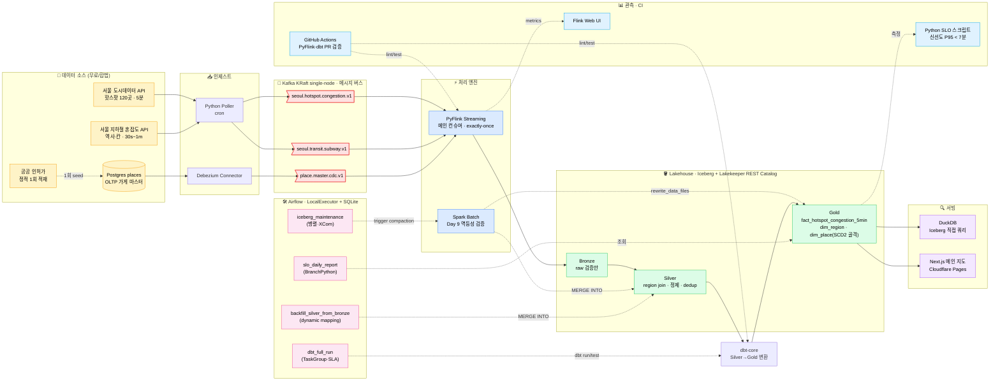
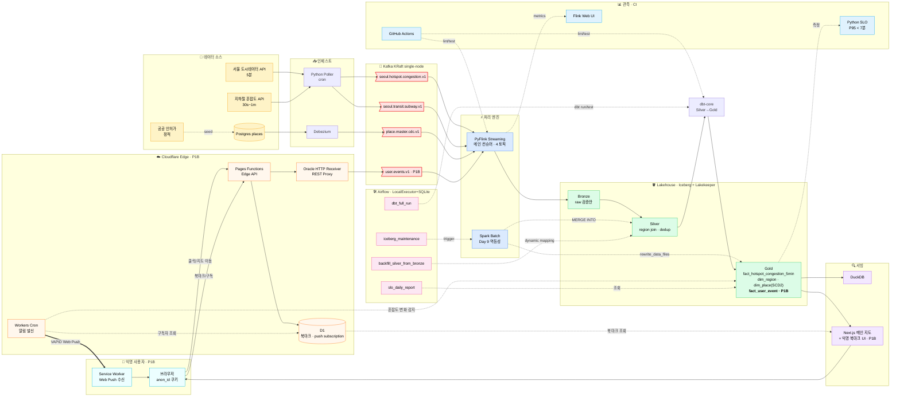

# 서울 도시데이터 플랫폼 — 데이터 파이프라인 아키텍처

> 본 문서는 CLAUDE.md §5 와 `docs/superpowers/specs/2026-04-30-seoul-citydata-platform-phase1-design.md` §4 의 시각 보조 자료입니다.
> 의사결정 단일 출처는 design.md, 본 문서는 그림만 담습니다. 변경 시 양쪽을 함께 갱신하세요.

## 1. 다이어그램 1 — Phase 1A (Day 1~10) 데이터 플로우

**범위**: 공공 실시간 API 2종 + 공공 인허가(정적) + Postgres CDC → Kafka 메시지 버스 → PyFlink streaming + Day 9 Spark batch 보조 → Iceberg(Bronze/Silver/Gold) → DuckDB / Next.js 메인 지도. Airflow 본진 4 DAG 가 batch 운영을 담당.

**핵심 의도**

- **streaming = Flink, polling = cron, batch ops = Airflow** 3계층 분리 (CLAUDE.md §3) 가 시각적으로 드러남.
- Day 9 Spark batch 는 점선(`-. .->`)으로 일시 기동 + 보조 역할임을 표시.
- `dim_place` 는 P1A 에서 SCD2 **골격** 만 (P2 에서 다출처 머지로 본격화).
- 운영 중 Airflow 4 DAG 가 dbt/compaction/backfill/SLO 를 각각 담당 — 1번 포트폴리오의 "cron 대용 Airflow" 약점 closure.

---

## 2. 다이어그램 2 — Phase 1A + 1B 통합 최종 아키텍처

**P1B 추가 범위**: 익명 사용자 행동 로그(`user.events.v1`) + Cloudflare Edge(D1·Pages Functions·Workers Cron) + Web Push 알림 + Gold 의 `fact_user_event` 추가. P1A 백본은 그대로, **Edge → Kafka REST Proxy** 와 **D1 ↔ Workers Cron ↔ Web Push** 두 경로가 새로 붙음.

**P1A 대비 P1B 추가 컴포넌트 (8종)**

| # | 컴포넌트 | 역할 | 비용 |
|---|----------|------|------|
| 1 | 브라우저 · `anon_id` 쿠키 | 익명 식별자 발급 | $0 |
| 2 | Cloudflare Pages Functions | Edge API. 행동 이벤트 수신 + D1 북마크/구독 CRUD | $0 |
| 3 | Oracle HTTP Receiver | Pages Functions → Kafka **REST Proxy** 패턴 (Workers TCP 제약 회피) | $0 |
| 4 | `user.events.v1` Kafka 토픽 | 익명 행동 로그 단일 채널 | $0 |
| 5 | Cloudflare D1 | 북마크 + Web Push subscription **만** 저장 (행동 로그는 절대 미저장) | $0 (5GB) |
| 6 | Cloudflare Workers Cron | 혼잡도 변화 감지 → 구독자 조회 → Web Push 발신 | $0 |
| 7 | Service Worker + VAPID Web Push | 사용자에게 "동네 한가해졌어요" 알림 | $0 |
| 8 | Gold 테이블 `fact_user_event` | 사용자 행동 기반 분석/추천 자료 | (저장만) |

**의도된 거버넌스**

- 행동 로그는 **Kafka → Iceberg 직행**, D1 에는 들어가지 않음 (CLAUDE.md §3 / §13).
- 카카오·네이버 스크래핑 절대 금지. 가게 정보는 P1 의 공공 인허가 + P2 의 Google Places + UGC.
- 개인정보 회피: 익명 ID 만, IP 영구저장 없음, `/privacy` 페이지 필수.

---

## 3. 기술 스택

> CLAUDE.md §3·§4·§5·§11 / design.md §4 와 정합되어야 합니다. 변경 시 본 표 + 단일 출처 양쪽을 함께 갱신하세요.
> Phase 표기: **P1A** = Day 1~10 데이터 플랫폼 코어 / **P1B** = Day 11~14 익명 실서비스 통합 / **P2** = 8주 확장.

### A. 데이터 스택

| 기술 / 구성 | 용도 | Phase | 비고 / 차별점 |
|------------|------|-------|--------------|
| **Apache Kafka (KRaft single-node)** | 4종 이종 소스 메시지 버스. Replay + Flink exactly-once 기반. | P1A · P1B | 1번 3-node → single-node 의식적 단순화 (24GB + Day 9 Spark OOM 회피). SPOF 는 limitation 으로 인정. |
| **Debezium** | Postgres `places` → `place.master.cdc.v1` CDC. | P1A · P1B | 1번에 부재였던 CDC 패턴. `dim_place` SCD2 골격 입력. |
| **PyFlink (메인 streaming)** | 4 토픽 컨슈머 + Bronze 적재 + region join. exactly-once. | P1A · P1B | 1번 streaming 부재 → **본 프로젝트 streaming 진정성의 핵심**. 신선도 P95 < 7분 SLO. |
| **Apache Spark batch (보조)** | Day 9 Iceberg `MERGE INTO` + `rewrite_data_files` 멱등성·Compaction 검증. | P1A | 1번 페이지 9·11 의 "Dynamic Partition Overwrite **예정**" / "Compaction **도입 예정**" closure. Day 9 만 일시 기동. |
| **Apache Iceberg** | Bronze / Silver / Gold 레이크하우스. | P1A · P1B | 1번에도 있었으나 본 프로젝트는 streaming sink + SCD2 + Compaction 까지 풀세트. |
| **Lakekeeper REST Catalog** (fallback: JdbcCatalog) | Iceberg 카탈로그 / 스키마 관리. | P1A · P1B | 1번 Hive Metastore 와 차별화 + 메모리 절감. |
| **dbt-core** | Silver → Gold SQL 변환 + dbt tests. | P1A · P1B | 1·2번 모두 부재. dbt tests = 데이터 품질 자동화 도입. |
| **DuckDB** | Iceberg 직접 쿼리 + notebook 분석. | P1A · P1B | Trino(1번) 대비 메모리·운영 부담 최소. P2 에 Trino single-node 옵션. |
| **Apache Airflow (LocalExecutor + SQLite metadata)** | 본진 4 DAG: `dbt_full_run` / `iceberg_maintenance` / `backfill_silver_from_bronze` / `slo_daily_report`. | P1A · P1B | 1번 "cron 대용 Airflow" 약점 closure. **DAG 의존성 · SLA · TaskGroup · dynamic task mapping · BranchPython · XCom · on_failure_callback** 본진 기능 직접 운영. ~700MB 로 메모리 mitigation. |
| **pytest** | PyFlink transform 단위 테스트. | P1A · P1B | 1번 테스트 코드 부재 약점 closure. |

### B. 인프라 / 호스팅

| 기술 / 구성 | 용도 | Phase | 비고 |
|------------|------|-------|------|
| **Oracle Cloud Always Free VM** (ARM Ampere A1, 4 vCPU / 24GB) | Kafka · Flink · Airflow · Iceberg · dbt 전체 단일 VM. | P1A · P1B | 90일 미사용 시 회수 → 카드 등록 후 PAYG 업그레이드(과금 0)로 방지. |
| **Oracle Object Storage 10GB Free** (대체: 로컬 MinIO) | Iceberg 데이터 파일 저장. | P1A · P1B | 무료 한도 내 운영. |
| **Cloudflare Tunnel** | 외부 사용자 → 프론트 · 관측 페이지 노출. | P1A · P1B | 공인 IP · 포트포워딩 불필요. |
| **Docker + docker-compose** | 로컬 · VM 동일 환경. Kafka · Flink · Airflow · Postgres · Iceberg 컨테이너 묶음. | P1A · P1B | P2 에서 Terraform IaC 로 확장. |

### C. 프론트엔드 / Edge (P1B 핵심)

| 기술 / 구성 | 용도 | Phase | 비고 |
|------------|------|-------|------|
| **Next.js + Cloudflare Pages** | 메인 지도 (혼잡도 색상) + 익명 북마크 UI. | P1A · P1B | P1A 메인 지도, P1B 북마크 위젯 · 서비스워커. |
| **Cloudflare Pages Functions (Edge API)** | 익명 행동 이벤트 수신 / 북마크 · 구독 CRUD. | P1B | Edge → Kafka 직결 불가 → REST Proxy 패턴 도입. |
| **Oracle Cloud HTTP receiver** | Pages Functions → Kafka **REST Proxy**. | P1B | Workers TCP 제약 회피, 디버깅 비용 최소화. |
| **Cloudflare D1** | 익명 북마크 + Web Push subscription **만** 저장. | P1B | 5GB 무료. **행동 로그는 절대 D1 에 넣지 않음** — Kafka → Iceberg 직행. |
| **Cloudflare Workers Cron** | 혼잡도 변화 감지 → 구독자 조회 → Web Push 발신. | P1B | 외부 서비스 의존 없음. 비용 0원. |
| **Service Worker + Web Push (VAPID)** | "동네 한가해졌어요" 알림. | P1B | VAPID 키는 환경변수 / GitHub commit 금지. `/privacy` 페이지 필수. |

### D. OLTP / 데이터 소스

| 기술 / 구성 | 용도 | Phase | 비고 |
|------------|------|-------|------|
| **PostgreSQL** | 가게 마스터 OLTP (`places` 테이블, CDC 데모용). | P1A · P1B | Debezium 입력. P1B fallback 으로 `events_inbox` 선택적. |
| **서울시 실시간 도시데이터 API** | 핫스팟 120곳 혼잡도 + 도로 + 따릉이 + 날씨. | P1A · P1B | 5분 갱신. 무료. 토큰 rate limit → 캐싱·백오프 필수. |
| **서울교통공사 실시간 지하철 혼잡도 API** | 역사 · 칸별 혼잡도. | P1A · P1B | 30s~1m 갱신. 무료. |
| **공공데이터 인허가 정보** | 가게 마스터 (이름 · 주소 · 업종 · 영업시간). | P1A · P1B | P1 정적 1회 적재, P2 일 1회 배치. **카카오 · 네이버 스크래핑 절대 금지**. |

### E. 품질 / 관측 / CI

| 기술 / 구성 | 용도 | Phase | 비고 |
|------------|------|-------|------|
| **GitHub Actions** | PyFlink · dbt PR 검증 (lint · test). | P1A · P1B | 1·2번 모두 부재였던 CI/CD for Data 약점 closure. |
| **Flink Web UI** | streaming 작업 모니터링 (exactly-once · checkpoint · backpressure). | P1A · P1B | 운영 가시화 데모. |
| **자체 Python SLO 스크립트** | 데이터 신선도 P95 측정 (`tm` → Iceberg Gold). | P1A · P1B | SLO < 7분 검증. P2 에 Grafana Cloud Free 추가 검토. |
| **dbt tests** | Silver / Gold 컬럼 제약 · 관계 검증. | P1A · P1B | P2 에 Great Expectations 추가. |

### F. P2 확장 시 추가 예정 (참고)

| 기술 | 용도 | 도입 시점 |
|------|------|----------|
| Trino single-node | DuckDB 대체 옵션, 대용량 join. | P2 W7 |
| Apache Superset | BI 대시보드. | P2 W4 |
| Great Expectations | 데이터 품질 자동화 강화. | P2 W5 |
| Dagster (검토) | dbt asset 일등시민 통합. | P2 W4~5 |
| Grafana Cloud Free | 메트릭 / SLO 시각화. | P2 W7 |
| Terraform | IaC 자동화. | P2 W7 |
| Google Places API | 별점 · 영업시간 보강 (캐시 + 증분). | P2 W6 |

---

## 4. 범례

| 표기 | 의미 |
|------|------|
| 노란색 박스 | 데이터 소스 (외부 API · OLTP) |
| 빨간색 깃발 (`>...]`) | Kafka 토픽 |
| 파란색 박스 | 처리 엔진 (Flink · Spark) |
| 초록색 박스 | Lakehouse 레이어 (Bronze/Silver/Gold) |
| 보라색 박스 | 서빙/쿼리 (DuckDB · Next.js) |
| 분홍색 박스 | Airflow DAG |
| 하늘색 박스 | 관측/CI |
| 주황색 박스 (P1B) | Cloudflare Edge / REST Proxy |
| 청록색 박스 (P1B) | 사용자 단말 |
| 실선 화살표 | 상시 데이터 흐름 |
| 점선 화살표 (`-. .->`) | 일시/조건부/보조 흐름 (Day 9 Spark, DAG trigger, 측정, seed) |
| 굵은 선 (`==>`) | 외부 사용자 알림 (Web Push) |

---

## 5. 변경 이력

| 일자 | 내용 |
|------|------|
| 2026-05-02 | 최초 작성. Phase 1A 단독 + Phase 1A+1B 통합 다이어그램 2종. |
| 2026-05-02 | §3 기술 스택 표 추가 (A.데이터 / B.인프라 / C.Edge / D.OLTP·소스 / E.품질·관측·CI / F.P2 확장). |
