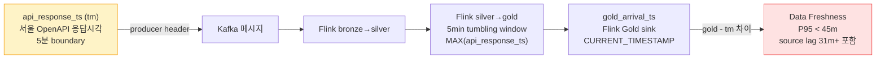
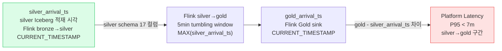
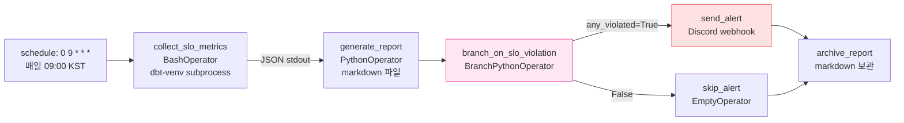

# 데이터 Lineage (Phase 1A)

> 본 문서는 Kafka 토픽 → Iceberg 테이블 매핑 + Day 10 PR α 의 두 가지 SLO 측정 경로 시각화.
> 의사결정 단일 출처 = spec §4 (데이터 소스) + spec §6-2 (SLO 정의).
> 변경 시 spec / data-flow.md 양쪽을 함께 갱신.

## 1. 토픽 → 테이블 매핑

| Kafka topic | Bronze | Silver | Gold mart |
|---|---|---|---|
| `seoul.hotspot.congestion.v1` | `bronze.hotspot_raw` | `silver.hotspot_congestion` | `gold.fact_hotspot_congestion_5min` (PyFlink streaming) / `fact_hotspot_congestion_hourly` (dbt) / `chill_open_now` (dbt) |
| `seoul.transit.subway.v1` | `bronze.subway_raw` | (P1A 는 Bronze 까지) | (P2) |
| `place.master.cdc.v1` | (Bronze 생략, Silver 직행) | `silver.dim_place` | `gold.dim_place` (Day 9 Spark MERGE INTO 멱등성) |
| 정적 1회 적재 (공공 인허가) | `bronze.places_static` (parquet) | (생략) | `chill_open_now` 의 join 대상 |
| `user.events.v1` (P1B Day 11 예정) | (P1B) | (P1B) | `fact_user_event` (P1B) |

## 2. 두 가지 SLO 측정 경로 (spec §6-2)

### 2.1. (α) Data Freshness SLO — 사용자 관점 데이터 나이

서울 OpenAPI 의 `tm` 응답값이 호출 시각보다 31분+ 옛날 (Day 10 PR α 실측). source 측 시각 자체의 일관 lag — 우리 통제 불가능. **45분 임계값** 은 source lag (31m) + Flink 5min tumbling + 우리 처리 lag 의 합 기준.

### 2.2. (β) Platform Latency SLO — 우리 통제 구간

**Path B 결정 (Day 10 PR α 작업 도중 발견)** — silver Iceberg catalog 에 `kafka_ts` 컬럼 미존재 → silver_arrival_ts 활용. bronze→silver 의 lag (Kafka broker → silver 적재) 는 본 SLO 에 미포함 한계. Phase 1B/2 의 silver schema 정정 (`kafka_ts` ADD COLUMN + bronze_to_silver.py SELECT 정정) 시점에 full coverage 로 확장 가능.

## 3. Gold 의 SLO 측정 컬럼 (`gold.fact_hotspot_congestion_5min`)

| 컬럼 | 의미 | 측정 사용 |
|---|---|---|
| `last_api_response_ts` | MAX(api_response_ts) over 5min tumbling window | Data Freshness 의 source 시각 |
| `last_silver_arrival_ts` | MAX(silver_arrival_ts) over 5min tumbling window — Day 10 PR α 추가 | Platform Latency 의 source 시각 |
| `gold_arrival_ts` | Flink Gold sink 의 CURRENT_TIMESTAMP | 두 SLO 의 공통 target 시각 |

## 4. SLO 일일 리포트 — `slo_daily_report` DAG (Day 10 PR α)

**XCom 흐름**:

- `collect_slo_metrics` push = `{data_freshness: {p50, p95, p99, count, slo_violated, threshold_seconds}, platform_latency: {...}, any_violated: bool}`
- `generate_report` pull → markdown 리포트 파일 생성
- `branch_on_slo_violation` pull → `any_violated` 검사 → `"send_alert"` / `"skip_alert"` 반환
- `send_alert` pull → Discord webhook payload 안 두 가지 SLO 메트릭 + 위반 SLO 명시 (`build_slo_alert_message` pure 함수)

**Option B 패턴 (Day 9 PR γ SoT reuse)**: `collect_slo_metrics` 는 BashOperator + dbt-venv subprocess. Airflow base image 에 duckdb / pyiceberg 미설치 회피.

## 5. 변경 이력

| 일자 | 내용 |
|---|---|
| 2026-05-14 | 최초 작성 (Day 10 PR β). Day 10 PR α 의 두 가지 SLO 분리 + silver_arrival_ts (Path B) + `slo_daily_report` DAG 반영. |
