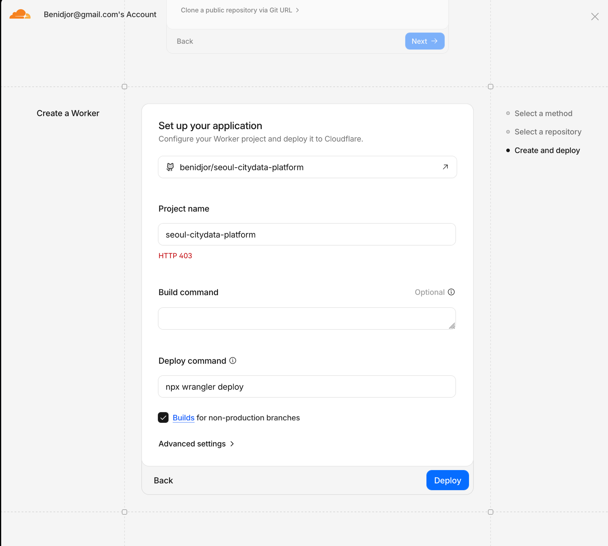
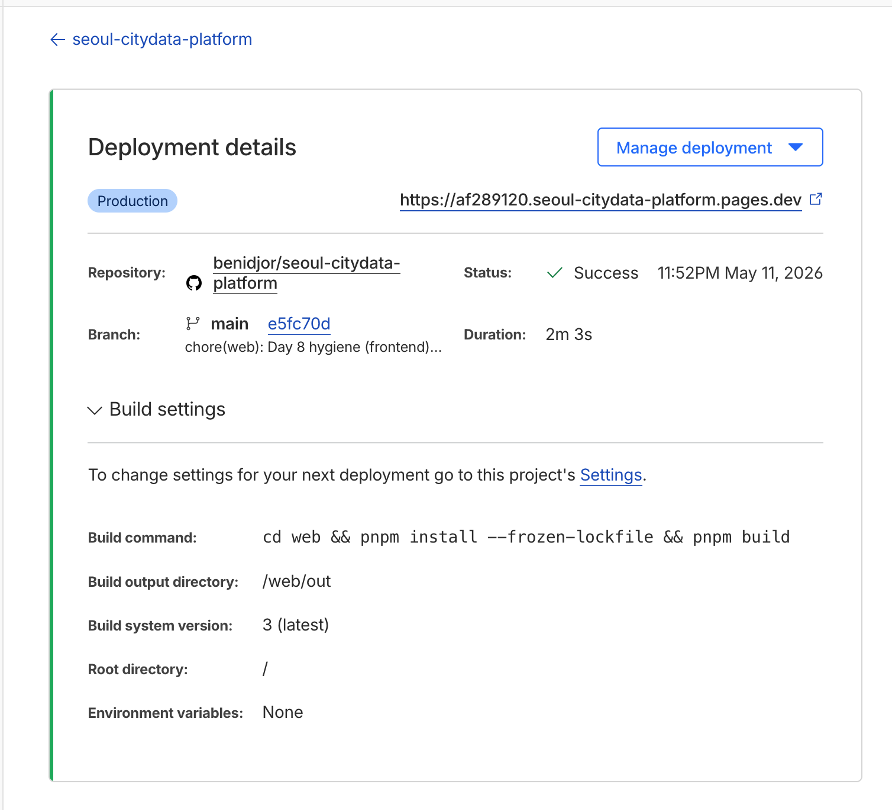
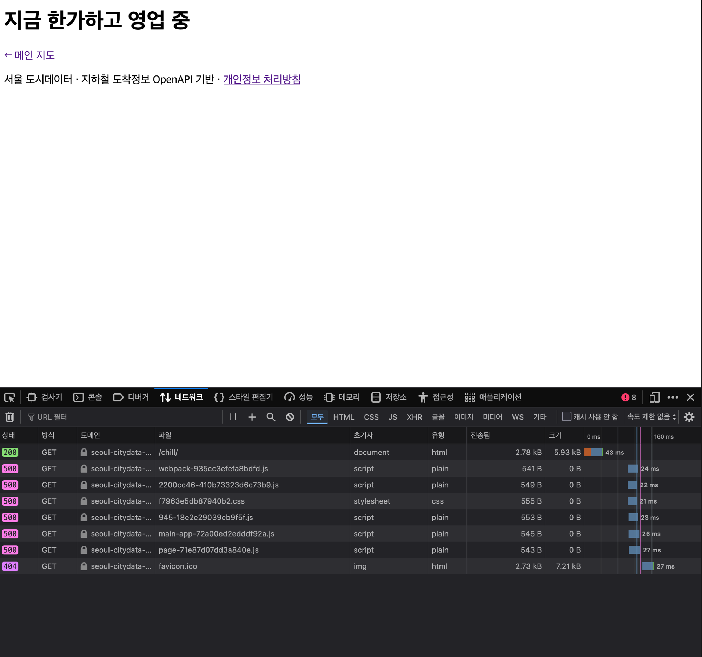
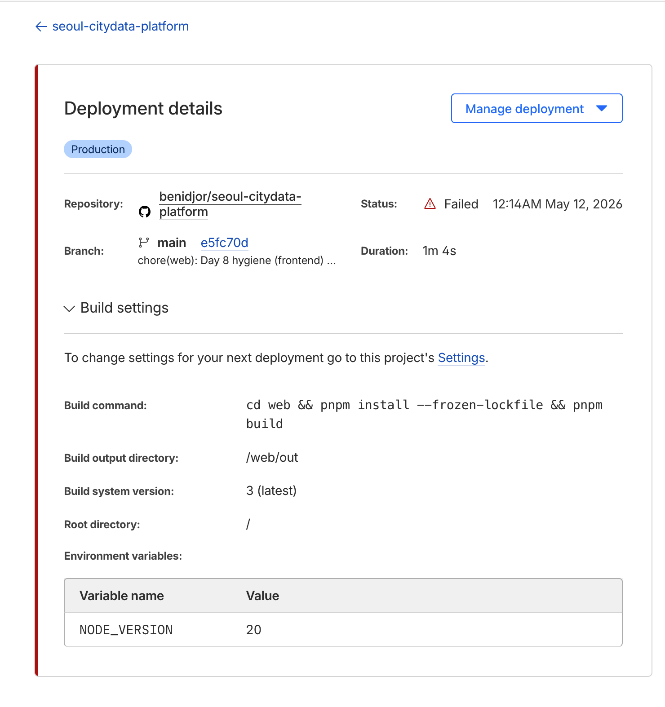
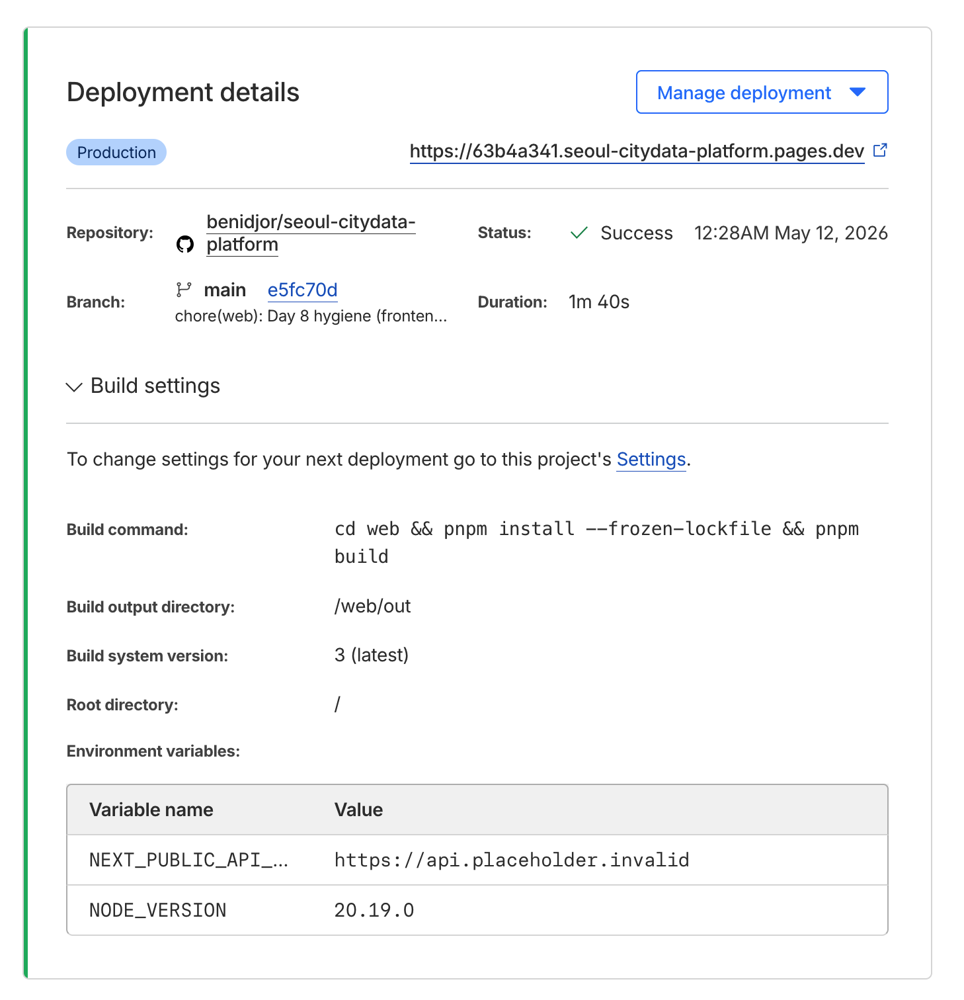
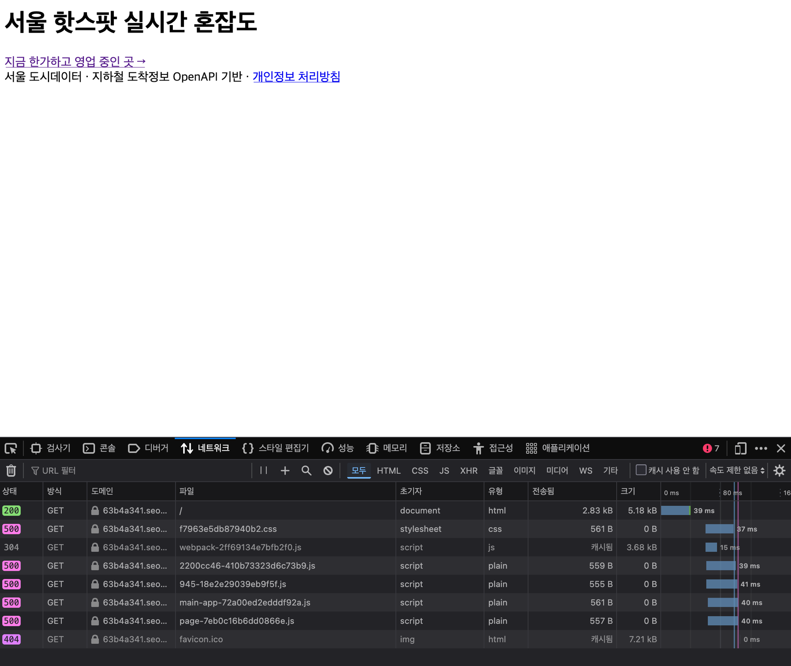
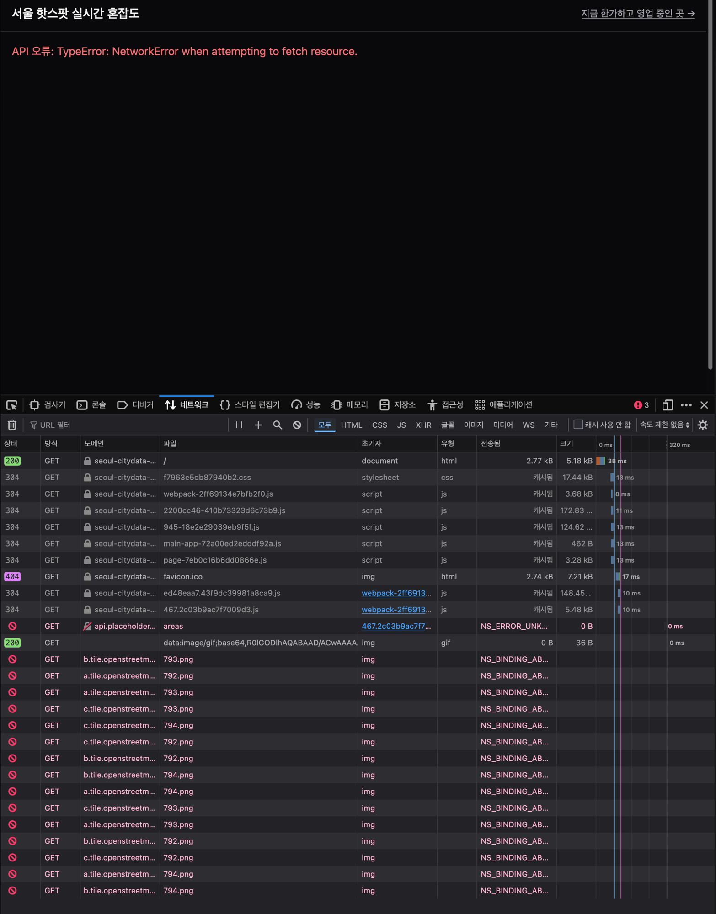
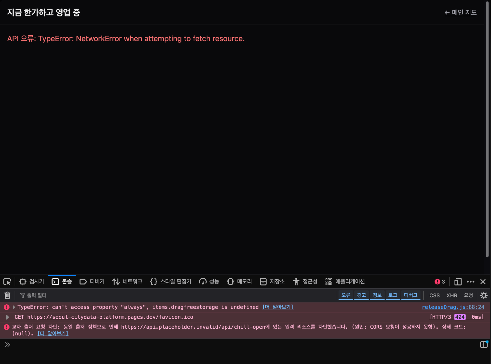
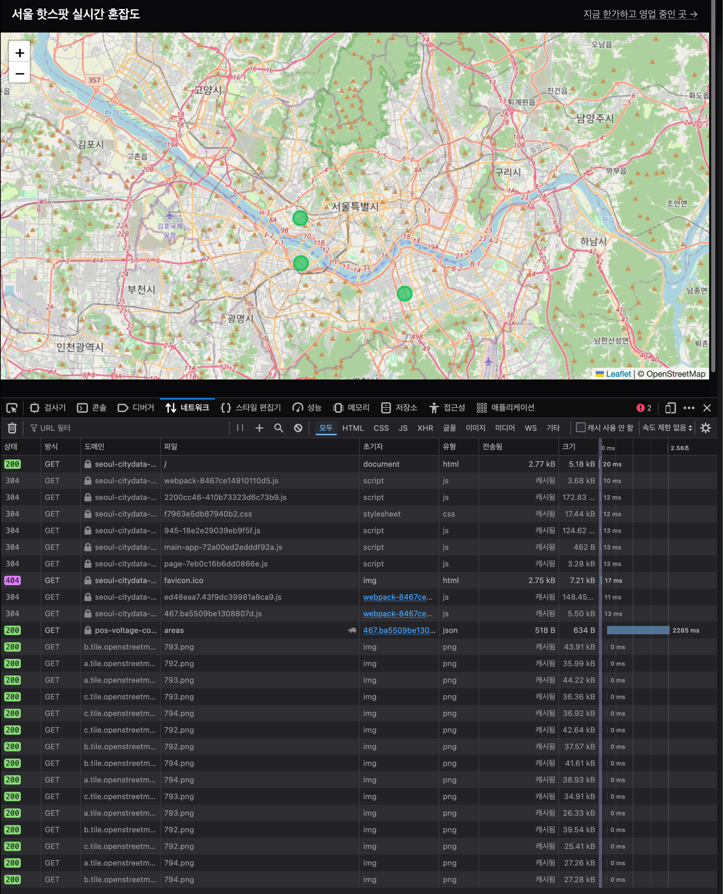
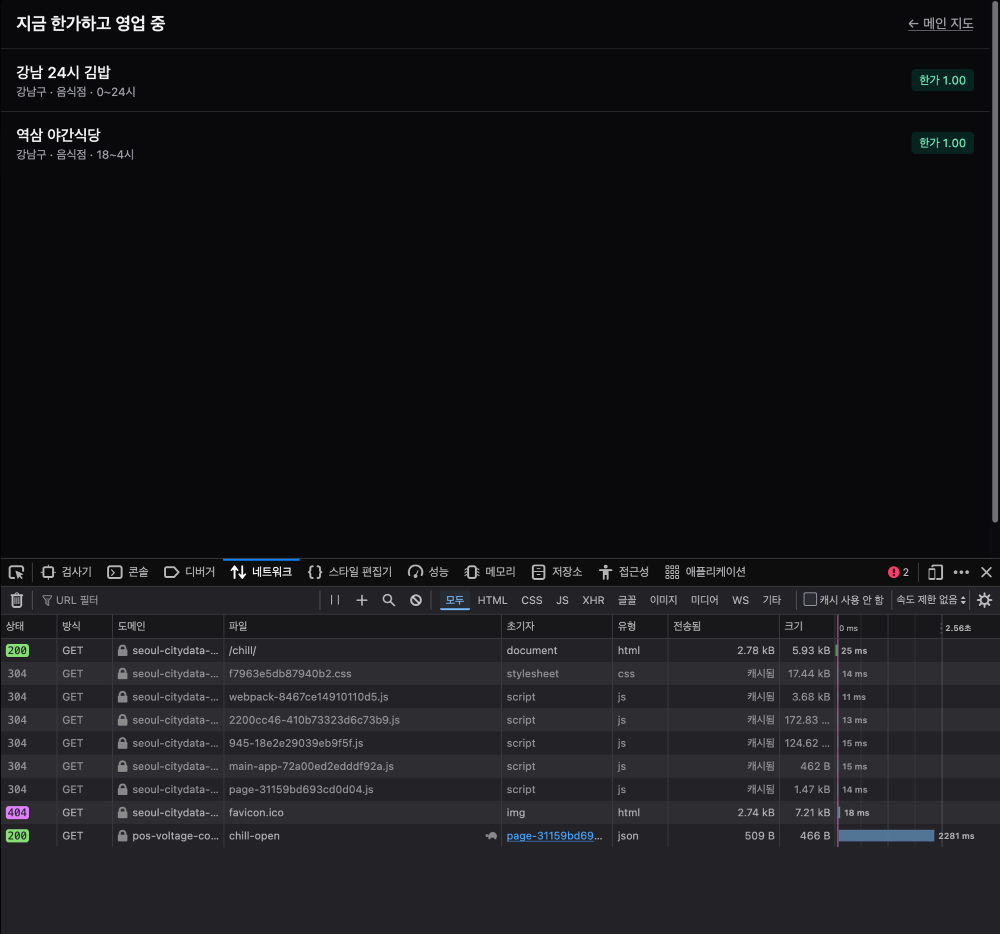

# Day 8 운영 후속 — Cloudflare Pages 실 배포 + 임시 Tunnel 영역 (PR γ-2)

> 작성: 2026-05-12 01:00 KST
> 영역: Day 8 PR α (#45) + hotfix (#46) + PR β (#47) + hygiene (#48, #49) 모두 머지 후, Cloudflare Pages 실 배포 + Cloudflare Tunnel 영역의 사용자 수동 영역 (Day 7 PR γ §10-5 SoT). 본 archive 는 Cloudflare 영역의 troubleshooting 자산 명문화.
> 관련 PR: 본 PR γ
> 직전 archive: [`2026-05-12-day-8-archive.md`](2026-05-12-day-8-archive.md) (Day 8 코드 영역 학습)
> 사용자 수동 영역 SoT: Day 7 PR γ archive [`2026-05-11-day-7-nextjs-cloudflare-deploy.md`](2026-05-11-day-7-nextjs-cloudflare-deploy.md) §10-5

## 0. 진입 흐름 요약

Day 8 코드 영역 종료 (PR #45~49 머지) 후 Cloudflare Pages 실 배포 진입. Day 7 PR β 시점에는 docs / config 영역만 정착, 실 배포 명령 (`wrangler pages deploy`) 은 사용자 수동 영역으로 분리됐던 항목. 본 시점에 사용자가 Cloudflare 계정 가입 + 실 배포 진행.

진행 단계 (chronological, troubleshooting 학습 포함):

| 단계 | 산출 | 시점 |
|---|---|---|
| 0 | Cloudflare 가입 + GitHub repo OAuth | 23:30~ |
| A | "Create a Worker" 흐름 진입 → HTTP 403 차단 | 23:35~ |
| B | "Pages" 흐름 정공 진입 + 첫 빌드 (502 transient) | 23:55~ |
| C | 첫 deploy "Success" 보고 vs 실 URL 500 발견 | 00:05~ |
| D | git 빈 commit retry (1차) → chunk hash dedup 발견 | 00:10~ |
| E | NODE_VERSION=20 등록 + retry → asdf preset fail | 00:14~ |
| F | NODE_VERSION=20.19.0 정정 + retry → 일부 chunk 만 fresh | 00:18~ |
| G | NEXT_PUBLIC_API_BASE 환경변수 추가 → vendor chunk 여전히 500 | 00:28~ |
| H | Pages project 재생성 (nuclear option) → 31 file fresh upload | 00:35~ |
| I | 임시 Cloudflare Tunnel 가동 + 환경변수 갱신 + 실 작동 검증 | 00:55~ |

## 1. Issue 1 — Workers vs Pages 진입 정공 영역

### 증상

Cloudflare 가입 후 첫 진입 시 사용자가 "Create a Worker" 흐름 선택. GitHub repo (`benidjor/seoul-citydata-platform`) 연결 + project name (`seoul-citydata-platform`) 입력 + Deploy command (`npx wrangler deploy`) 영역에서 **HTTP 403** 차단.



### 진단

Cloudflare 의 두 product 영역:

| 영역 | Workers | Pages |
|---|---|---|
| **용도** | 동적 JS edge runtime (serverless function, API) | 정적 site 호스팅 (HTML/JS/CSS) |
| **Phase 1A 적용 영역** | (Phase 1B 의 Edge API `user.events.v1`) | **frontend `web/out/` 정적 산출** ← 본 영역 |
| **deploy 명령** | `npx wrangler deploy` (wrangler.toml 의존) | `wrangler pages deploy <dir>` 또는 GitHub 자동 연동 |

본 repo 에는 `wrangler.toml` 부재 (Phase 1B 진입 전 영역, CLAUDE.md §3 SoT) → Workers 흐름의 `npx wrangler deploy` 가 config 못 찾음 → 403 차단 추정.

### 해결

Workers 흐름 빠져나가서 **Pages 흐름 진입**:

```
Workers & Pages → "Pages" 탭 → Create application → Connect to Git
→ 같은 GitHub repo (OAuth 권한 자동 재사용)
```

Pages 흐름은 `wrangler.toml` 의존 X → 정상 진입.

### 학습 — Cloudflare 의 두 product 영역 구분 의무

Cloudflare 의 최근 UI 변경 — Workers 와 Pages 가 통합된 흐름 (Workers & Pages) 으로 변경되면서 처음 "Create" 진입 시 default 가 Worker 영역. 정적 site 영역은 Pages 명시 의무. 사용자 첫 진입 시 흔한 trap.

## 2. Issue 2 — 첫 빌드 502 Bad Gateway → chunk corrupt 영구화

### 증상

Pages 흐름 정공 진입 후 첫 빌드 명령:

```
Build command: cd web && pnpm install --frozen-lockfile && pnpm build
Build output directory: /web/out
Root directory: /
```

빌드 자체는 성공 — `✓ Compiled successfully` + 4 Route Static prerender. 다만 deploy 단계 로그:

```
23:52:42  Error: Failed to upload files. Please try again.
          POST /pages/assets/upload -> 502 Bad Gateway
23:52:42  ✨ Success! Uploaded 31 files (55.11 sec)
23:52:43  ✨ Upload complete!
23:52:45  Success: Assets published!
23:52:47  Success: Your site was deployed!
```

502 transient 발생 + retry 영역에서 결과적으로 "Success" 보고. 그러나 실 URL (`seoul-citydata-platform.pages.dev`) 접근 시 **500 Internal Server Error**.



페이지 자체는 텍스트만 보이고 Leaflet 지도 / 리스트 영역 비어있음:


### 진단 (네트워크 탭으로 정공 진단)

브라우저 개발자도구 → 네트워크 탭:



| 파일 | Status | 의미 |
|---|---|---|
| `/chill/` (HTML) | **200** | HTML 정상 로드 |
| `webpack-*.js` | **500** | JS chunk 누락 |
| `2200cc46-*.js` | **500** | shared chunk 누락 |
| `f7963e5db87940b2.css` | **500** | Tailwind CSS 누락 |
| `945-*.js` | **500** | vendor chunk 누락 |
| `main-app-*.js` | **500** | Next app shell 누락 |
| `page-*.js` | **500** | page chunk 누락 |

→ **HTML 만 정상, 모든 JS/CSS chunk 500** = React 가 클라이언트에서 실행조차 안 됨. SSR prerender 된 텍스트만 보임.

### root cause — 502 transient 영향으로 chunk 일부 corrupt upload

wrangler 가 deploy step 의 31 file upload 중 502 받음 → retry → 결과적으로 "Success" 보고했지만 실제로는 일부 chunk file 이 **corrupt 영역으로 upload**. Cloudflare Pages CDN 에서는 missing 영역 또는 0 byte file → 500 반환.

### 학습 — "빌드 성공" ≠ "산출 정상"

빌드 status ✓ 는 git 연동 + 빌드 명령 + wrangler 호출 완료 영역. 실 파일 무결성 영역은 별개. 본 502 transient 같은 인프라 영역 이슈는 wrangler 의 retry 영역이 cover 못 함.

**진단 의무** — 빌드 success 후 다음 영역 cross-check:
1. **빌드 로그의 `Uploaded X files (Y already uploaded)` 영역** — 이 값이 정공 fresh upload 영역 검증의 SoT
2. **실 URL 접근 + 네트워크 탭의 chunk status** — HTML 200 + chunk 500 = upload corrupt 신호
3. **브라우저 콘솔의 `<script> 로드에 실패` 영역** — chunk 500 의 client side 영향

## 3. Issue 3 — chunk hash dedup cache 의 함정 (재시도 무효)

### 증상

Issue 2 발견 후 첫 fix 시도 — **git 빈 commit + push** 으로 새 deploy trigger:

```bash
git commit --allow-empty -m "trigger pages rebuild"
git push origin main
```

2차 빌드 + deploy 진행 → status Success → 그러나 **chunk 영역 여전히 500**. 같은 corrupt chunk 영역 그대로 노출.

### 진단

2차 빌드 로그의 핵심 line:

```
✨ Success! Uploaded 8 files (23 already uploaded) (1.99 sec)
```

**31 file 중 23 file 이 `already uploaded`** = Cloudflare Pages 가 chunk file hash 기준 dedup → 이전 deploy 의 corrupt 영역 cache hit → 같은 corrupt chunk 그대로 노출.

### root cause — Next.js 의 deterministic build + Cloudflare 의 hash dedup

Next.js 14 의 content-based chunk hash 영역 — **코드 변경 0 = 같은 hash = 같은 file name**. git 빈 commit 은 코드 변경 X → chunk hash 영역 동일 → Cloudflare 가 "이미 같은 hash 의 file 있음, skip" 영역 처리.

따라서:
- 1차 deploy 의 502 corrupt chunk → cache 영역에 보존
- 2차 / 3차 deploy 의 dedup → cache 영역의 corrupt 재사용
- **빈 commit 으로는 영원히 fix 안 됨**

### 학습 — Cloudflare Pages file dedup cache 영역의 함정

본 영역의 trap 인지가 정공:
- "Retry deployment" 또는 "git 빈 commit" 으로는 **content 변경 없는 chunk 영역 fix 불가**
- chunk hash 영역 강제 변경 의무 — 코드 변경 또는 buildId 영역 변경 또는 cache 자체 reset

## 4. Issue 4 — asdf 의 NODE_VERSION patch 영역 resolve

### 증상

Issue 3 fix 시도로 **NODE_VERSION=20 환경변수 등록** + Retry deployment. 빌드 자체 fail:

```
00:14:16  Executing user command: cd web && pnpm install --frozen-lockfile && pnpm build
00:14:16  No preset version installed for command pnpm
00:14:16  Please install a version by running one of the following:
00:14:16  asdf install nodejs 20.20.0
00:14:16  or add one of the following versions in your config file at /opt/buildhome/.tool-versions
00:14:16  nodejs 14.21.3
00:14:16  nodejs 16.20.2
00:14:16  nodejs 18.17.1
00:14:16  nodejs 20.19.0
00:14:16  nodejs 22.16.0
00:14:16  Failed: Error while executing user command. Exited with error code: 126
```



### 진단

Cloudflare Pages build environment 의 **asdf version manager** 영역:
- `NODE_VERSION=20` 입력 → asdf 가 `20.20.0` (latest 20.x) 으로 자동 resolve
- 본 환경의 preset = `20.19.0` 만 install 됨, `20.20.0` 부재
- 결과 = `pnpm` not found (Node 자체 install 안 됨) → exit code 126

### 해결

NODE_VERSION 값을 정확한 patch 버전으로 명시:

| 변수 | 이전 | 신규 |
|---|---|---|
| `NODE_VERSION` | `20` | **`20.19.0`** |

본 환경 지원 inventory:
- 14.21.3 (구 LTS, EOL)
- 16.20.2 (구 LTS, EOL)
- 18.17.1 (구 LTS)
- **20.19.0** (현재 LTS, next 14 권장) ← 본 영역
- 22.16.0 (latest LTS)

### 학습 — Cloud build environment 의 default version manager 영역

Cloudflare Pages / Netlify / Vercel 같은 cloud build 영역의 default behavior:
- **default Node version** = 보통 LTS 의 어떤 버전 (cloud 마다 다름). 본 Cloudflare = 18.x default
- **major.minor 영역만 입력 시 latest patch resolve 영역**: asdf 의 동작 — 1차 시도에서 `20` → `20.20.0` 으로 resolve. 본 환경 preset 영역에 없으면 fail
- **권고** = 정확한 `<major>.<minor>.<patch>` 명시 (예: `20.19.0`). cloud 영역의 preset 변경에 영향받지 않음

Day 7 PR γ `2026-05-11-day-7-nextjs-cloudflare-deploy.md` §1 의 "pnpm 11 의 ignored build script 정책 변경" 과 같은 패턴 — **cloud / package manager 의 default 영역 변경이 plan 본문 가정 영역과 충돌**.

## 5. Issue 5 — NEXT_PUBLIC_API_BASE build-time inline + 부분 fresh upload

### 증상

Issue 4 fix (NODE_VERSION=20.19.0) 후 빌드 성공. 그러나 chunk 영역 여전히 500. 3차 fix 시도 — **NEXT_PUBLIC_API_BASE=`https://api.placeholder.invalid` 환경변수 추가** + Retry deployment.



빌드 로그:

```
00:28:32  ✨ Success! Uploaded 11 files (20 already uploaded) (1.13 sec)
```

11 file fresh upload — 이전 8 file 보다 증가 ✓. 일부 chunk hash 영역 변경 효과 확인.

### 그러나 vendor chunk 여전히 500

네트워크 탭:



| chunk | 상태 |
|---|---|
| `webpack-2ff69134e7bfb2f0.js` | **304** (new hash, fresh upload ✓) |
| `page-a52091c3677822a7.js` | **304** (new hash, fresh upload ✓) |
| `2200cc46-*.js` (vendor) | **500** (same hash, dedup corrupt) |
| `945-*.js` (vendor) | **500** (same hash, dedup corrupt) |
| `main-app-*.js` | **500** (same hash, dedup corrupt) |
| `f7963e5db87940b2.css` | **500** (same hash, dedup corrupt) |

→ NEXT_PUBLIC_API_BASE 가 inline 된 chunk 만 hash 변경, **vendor / main-app / CSS chunk 는 같은 hash → 영원히 cache hit corrupt**.

### 진단 — Next.js 의 chunk 영역 종류

Next.js 14 의 빌드 chunk 영역 분류:

| chunk 영역 | hash 변경 trigger |
|---|---|
| **webpack runtime** | next.config 영역 변경 또는 buildId 변경 |
| **vendor (node_modules)** | 의존성 추가/제거/버전 변경 |
| **main-app** | `app/layout.tsx` 등 app shell 영역 변경 |
| **page chunk** | 해당 page tsx 영역 변경 |
| **CSS** | Tailwind output 영역 (style 사용 변경) |

→ 환경변수 inline 영역 (webpack runtime + 일부 page) 만 변경 영향. vendor 영역은 의존성 변경 없으면 영원히 같은 hash.

### 결론 — chunk hash 부분 변경으로는 영원히 fix 불가

Cloudflare Pages 의 dedup 영역이 hash 기준이라 vendor chunk 같이 변경 없는 영역은 영원히 cache hit. 다음 옵션 의무:

1. **Pages project 재생성** (cache 영역 완전 reset) ← 본 archive 의 정공
2. **wrangler API 로 deployment file purge** (가능 영역 검토)
3. **vendor 의존성 강제 변경** (over-engineering)
4. **`generateBuildId` 명시 + 모든 chunk 영역 영향** (Next 14 의 buildId 는 chunk hash 직접 영향 X)

## 6. Issue 6 — Pages project 재생성 (nuclear option) 정공

### 진행

기존 Pages project 의 cache 영역이 영원히 corrupt vendor chunk 보존 → 유일한 해결 = **project 자체 재생성**:

```
Settings → 스크롤 끝까지 → Permanently delete this Pages project → Delete
```

새 project 생성 + 같은 GitHub repo 연결 + 같은 build configuration + 환경변수 (NODE_VERSION=20.19.0 + NEXT_PUBLIC_API_BASE=placeholder) 일괄 등록.

### 결과

새 project 의 첫 빌드 로그:

```
00:39:41  ✨ Success! Uploaded 31 files (2.07 sec)
```

**31 file 모두 fresh upload, 0 already uploaded** ✓ — 새 project 의 cache 영역은 비어있으므로 모든 chunk fresh upload.



브라우저 검증 — 모든 chunk 정상 로드 + React mount + API fetch 시도. API placeholder 의 DNS 실패는 의도된 동작:



"교차 출처 요청 차단: 동일 출처 정책으로 인해 https://api.placeholder.invalid/api/chill-open 에 있는 원격 리소스를 차단했습니다" = **chunk 정상 로드 + React 마운트 + fetch 시도 모두 정공**. API tunnel 부재만 fail.

### 학습 — Pages project 재생성의 nuclear option 인지 의무

본 영역은 다음 영역에서 의무:
- **502 transient 같은 인프라 이슈 영향으로 chunk corrupt 가 hash 영역에 보존된 경우**
- chunk hash 부분 변경 영역의 fix 시도 후에도 잔존 chunk corrupt 영역
- wrangler / 대시보드의 cache purge 영역이 부재한 경우

**대안 영역 inventory** (본 archive 영역에서 시도 안 함, 추후 검토):
- `wrangler pages deployment delete <id>` — 개별 deployment 삭제
- `wrangler pages deployment list` + 모든 deployment 삭제 후 fresh push
- Cloudflare 대시보드의 cache invalidation 영역 (Settings → Build cache)

## 7. Issue 7 — 임시 Cloudflare Tunnel 가동 + 실 작동 검증

### 진행

Pages project 재생성 정공 + frontend 정적 노출 영역 정공 → 다음 영역 = **API tunnel** (Day 7 PR γ §10-5 의 사용자 수동 영역).

도메인 영역 결정 — 사용자 도메인 부재 → 4 옵션 검토:

| 옵션 | hostname | 비용 | 영구성 |
|---|---|---|---|
| 임시 tunnel | `*.trycloudflare.com` | $0 | ❌ |
| DuckDNS + Tunnel | `*.duckdns.org` | $0 | ✅ |
| 저비용 도메인 | `*.dev` 등 | $10/년 | ✅ |
| Workers 영역 | `*.workers.dev` | $0 | ✅ (Phase 1B) |

본 시점 = Phase 1A 데모 영역 → **임시 tunnel 선택** (가장 빠른 setup, Phase 1B / 2 영역에서 영구 영역 검토 분리).

### cloudflared 가동

```bash
brew install cloudflared
nohup cloudflared tunnel --url http://localhost:8000 > /tmp/cloudflared.log 2>&1 & disown
```

발급 hostname: **`https://pos-voltage-completing-compaq.trycloudflare.com`**

tunnel connection 등록 — 인천 영역 (ICN05), 빠른 latency.

### 환경변수 갱신 + Retry deployment

Cloudflare Pages 대시보드 → Settings → Variables and Secrets → `NEXT_PUBLIC_API_BASE` Edit:

| 변수 | 이전 | 신규 |
|---|---|---|
| `NEXT_PUBLIC_API_BASE` | `https://api.placeholder.invalid` | `https://pos-voltage-completing-compaq.trycloudflare.com` |

Deployments → Retry deployment → 빌드 + deploy 완료 후 브라우저 강력 새로고침.

### 결과 — 완전 정상 작동



- **Leaflet OpenStreetMap 지도** + 녹색 마커 3개 (강남/마포/영등포 한가 자치구) 정상 표시
- `pos-voltage-co.../areas` API 응답 200 (2285ms latency, tunnel 경유 정상)



- **가게 리스트 2건**: 강남 24시 김밥 (강남구 · 음식점 · 0~24시 · 한가 1.00) + 역삼 야간식당 (강남구 · 음식점 · 18~4시 · 한가 1.00)
- `pos-voltage-co.../chill-open` API 응답 200 (2281ms latency)

### Day 8 plan line 2037 종료 게이트 평가

| 영역 | 상태 |
|---|---|
| `/chill/` 에서 한가/영업중 리스트 ≥1 | ✅ 2건 |
| chill_open_now mart 빌드 성공 | ✅ PR #45 dbt run 4 PASS |
| **Plus** — Cloudflare 실 배포 + Tunnel 실 작동 | ✅ Phase 1A 데모 영역 완전 정공 |

## 8. 운영 영역 인지 의무

임시 tunnel 영역의 영구 작동 위해 다음 4 process alive 유지 의무:

| 자원 | PID | 만료 / 재가동 영역 |
|---|---|---|
| **uvicorn** (`/api/chill-open` source) | 54013 | 사용자 macOS 재부팅 / kill 까지 영구 |
| **streaming 4 process** (b2s / s2g / 2 producer) | 32605 / 32606 / 48441 / 48459 | hotfix #46 의 long-running mode default, SIGTERM 까지 영구 |
| **cloudflared tunnel** (임시) | (background) | cloudflared 자체 crash / 사용자 macOS 재부팅 시 종료 → **재가동 시 새 hostname 발급 의무** |
| **caffeinate** (sleep 방지) | 48702 | 25h timer, 만료 2026-05-12 20:49 → 만료 후 재가동 의무 |

### 임시 tunnel 의 운영 제약

- **macOS sleep 영역** — caffeinate 가 cover. 만료 시 sleep 진입 → cloudflared / uvicorn 도 sleep
- **cloudflared 재가동 시 새 hostname** — 매 재가동 시 `*.trycloudflare.com` 새 URL → Cloudflare Pages 환경변수 + Retry deployment 의무 (자동화 불가)
- **사용자 인터넷 영역 의존** — 사용자 macOS 의 인터넷 연결 영역이 API 노출 영역. WiFi disconnect / ISP 영역 issue 시 API 접근 불가
- **uptime 보장 없음** — Cloudflare 의 `trycloudflare.com` 영역 = production 용 아님 (cloudflared 로그 line 1 의 명시)

### Phase 1B / 2 영역의 영구 영역 진행 권고

본 임시 tunnel 영역의 제약 = Phase 1A 데모 한정 영역 (포트폴리오 스크린샷 / 시연 영상 영역 cover). 본격 외부 공개 영역 진입 시 다음 영역 의무:

1. **DuckDNS 또는 저비용 도메인 ($10/년)** 영역 — 영구 hostname
2. **정식 named tunnel** (`cloudflared tunnel create` + `cloudflared tunnel route dns`) — 영구 영역 + DNS 매핑
3. **launchd 의 자동 가동 영역** — 사용자 macOS 재부팅 시 cloudflared 자동 재가동
4. **모니터링 영역** — Tunnel 영역 health check + 알림 (Phase 2 영역)

## 9. 학습 패턴 5종

### 9-1. Cloudflare 의 Workers ≠ Pages 영역 구분 의무

본 archive Issue 1 SoT — 정적 site = Pages, 동적 edge function = Workers. 첫 진입 시 default 가 Workers 영역이라 사용자 혼란 가능. 명확한 product 영역 인지가 trap 회피 정공.

### 9-2. 빌드 success ≠ 실 산출 정상

Issue 2 SoT — wrangler 의 retry 영역이 인프라 transient 영역 (502) 의 corrupt 영향 cover 못 함. 실 산출 검증 영역 SoT:

1. 빌드 로그의 `Uploaded X files (Y already uploaded)` 영역
2. 실 URL 접근 + 네트워크 탭의 chunk status
3. 브라우저 콘솔의 `<script> 로드에 실패` 영역

### 9-3. Cloudflare Pages file dedup cache 영역의 영구 영향

Issue 3 SoT — chunk hash 영역의 cache hit 이 502 transient corrupt 영역을 영구 보존. 빈 commit / Retry deployment / 부분 hash 변경 등으로는 fix 불가. **Pages project 재생성** 영역이 nuclear option 정공.

대안 영역 (추후 검토):
- `wrangler pages deployment delete <id>` 로 개별 deployment 영역 cache 영역 reset
- 대시보드의 cache invalidation 영역 (Settings 영역 검색 필요)

### 9-4. asdf / 패키지 매니저 의 default version resolve 함정

Issue 4 SoT — cloud build environment 의 `NODE_VERSION=20` 같은 major/minor 입력 영역의 자동 patch resolve 영역이 본 환경의 preset 영역과 불일치 가능. 정확한 `<major>.<minor>.<patch>` 명시 영역이 안전.

본 영역은 Day 7 PR γ archive §1 의 "pnpm 11 의 ignored build script 정책 변경" 과 같은 fingerprint — **cloud / package manager 의 default 영역 변경이 plan 본문 가정 영역과 충돌**.

### 9-5. NEXT_PUBLIC_API_BASE build-time inline 영역의 chunk hash 영향 분리

Issue 5 SoT — Next.js 14 의 chunk 영역 종류 (webpack runtime / vendor / main-app / page / CSS) 별로 hash 영역 영향 trigger 영역 다름. NEXT_PUBLIC_API_BASE 같은 build-time inline 영역 변경 시:

- ✅ inline 영역 chunk (webpack + 일부 page) → hash 변경
- ❌ vendor / main-app / CSS chunk → 변경 없음, hash 동일

따라서 cache dedup 영역 우회 위해서는 영향 영역 분리 인지 + 모든 chunk 영역 영향 의무. nuclear option (project 재생성) 영역 정공.

본 영역은 Day 7 PR γ §4 의 "NEXT_PUBLIC_API_BASE build-time inline 위험" SoT 의 확장형 — 그 시점에는 fallback `localhost:8000` 의 prod chunk inline 위험 영역 명문화, 본 시점에는 chunk hash 영역 영향 분리 영역 추가 학습.

## 10. 관련 문서

- 본 archive 의 직전 영역: [`2026-05-12-day-8-archive.md`](2026-05-12-day-8-archive.md) (Day 8 코드 영역 학습)
- Day 7 PR β archive (Cloudflare 자동화 영역 docs 정착 시점): [`2026-05-11-day-7-nextjs-cloudflare-deploy.md`](2026-05-11-day-7-nextjs-cloudflare-deploy.md)
  - §4 — NEXT_PUBLIC_API_BASE build-time inline 위험 SoT
  - §10-5 — 자동화 영역 vs 사용자 수동 영역 분리
- Day 7 PR δ archive (운영 후속 패턴 SoT): [`2026-05-11-day-7-streaming-smoke-timeout-restart.md`](2026-05-11-day-7-streaming-smoke-timeout-restart.md)
- Day 7 deploy 가이드: [`../../runbook/day7_deploy.md`](../../runbook/day7_deploy.md)
- Day 7 Cloudflare 설정 가이드: [`../../../infra/cloudflare/README.md`](../../../infra/cloudflare/README.md)
- 관련 PR: #41 (Day 7 PR α — Next.js 골격) / #42 (Day 7 PR β — Leaflet 메인 지도 + Cloudflare 자동화 docs) / #47 (Day 8 PR β — /chill 페이지)
- 메모리: `phase-1a-progress`, `execution-policy`, `korean-conventions`

## 11. 스크린샷 목록 (timeline 순서)

| # | 파일 | 시점 |
|---|---|---|
| 01 | `screenshots/01-workers-403.png` | Workers 흐름의 HTTP 403 |
| 02 | `screenshots/02-pages-settings.png` | Pages Settings 영역 진입 |
| 03 | `screenshots/03-first-deploy-details.png` | 1차 deployment details (NODE_VERSION 없음, env vars None) |
| 04 | `screenshots/04-empty-main-chunk-500.png` | 메인 페이지 chunk 500 으로 텍스트만 |
| 05 | `screenshots/05-network-chunk-500.png` | 네트워크 탭 chunk 500 |
| 06 | `screenshots/06-asdf-node-version-fail.png` | NODE_VERSION=20 asdf fail |
| 07 | `screenshots/07-placeholder-env-deploy.png` | NEXT_PUBLIC_API_BASE 추가 deployment |
| 08 | `screenshots/08-vendor-chunk-still-500.png` | vendor chunk 여전히 500 |
| 09 | `screenshots/09-pages-recreated-deploy.png` | Pages project 재생성 후 deploy 정상 |
| 10 | `screenshots/10-api-placeholder-fail.png` | API placeholder DNS 실패 (의도된 fetch fail) |
| 11 | `screenshots/11-final-main-map.png` | 최종 메인 지도 + 마커 3개 정상 |
| 12 | `screenshots/12-final-chill-page.png` | 최종 chill 페이지 + 가게 리스트 2건 정상 |
