# Day 9 archive — Spark MERGE INTO 멱등성 + Compaction closure + Airflow 본진 4 DAG 라인업 3번째 정착

> 작성: 2026-05-12 KST
> 시점: Day 9 PR α (#53) + PR β (#54) + PR γ (#55) 모두 머지 완료 후 학습 자산 명문화.
> 관련 PR: 본 PR (docs only)
> 관련 runbook: [`docs/runbook/day9_spark.md`](../../runbook/day9_spark.md) (PR β #54 산출)
> 직전 archive: [`2026-05-12-day-8-archive.md`](2026-05-12-day-8-archive.md), [`2026-05-12-day-8-cloudflare-deploy.md`](2026-05-12-day-8-cloudflare-deploy.md)

## 0. 진입 흐름 요약

Day 8 종료 (PR #45-#52 모두 머지, main HEAD `d18d608`) 후 Day 9 entry plan §B 의 3 PR 분할안 따라 진행:

| PR | 항목 | 머지 |
|---|---|---|
| #53 | Day 9 PR α — Spark Iceberg profile + dim_place MERGE 멱등성 | ✅ |
| #54 | Day 9 PR β — Iceberg Compaction + 운영 비용 표 + Spark 일시 기동 runbook | ✅ |
| #55 | Day 9 PR γ — iceberg_maintenance DAG 본격 활성 + Discord 알림 | ✅ |

총 5 + 3 + 5 file 신규 + 9 file modify, 누적 약 850 LOC.

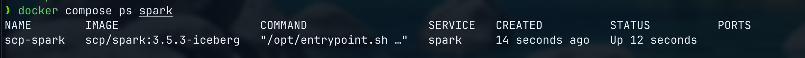

## 0-1. Day 9 의 의미 (spec §8-1 차별화 메시지 2종 동시 산출)

본 Day 9 가 **spec §8-1 의 차별화 메시지 4종 중 2종 (#2 + #4) 의 직접 산출 시점**.

### 차별화 #2 — 레시핑 의 미해결 closure

레시핑의 페이지 9 + 11 의 "예정" 으로 끝난 미해결 2건 → 본 Day 9 의 직접 closure:

| 레시핑 미해결 (페이지 9·11) | Day 9 closure 증거 | 시각 (캡쳐) |
|---|---|---|
| "Dynamic Partition Overwrite **예정**" | PR α #53 의 Spark `MERGE INTO` 멱등성 검증 (rows + content hash 동일) | §9 캡쳐 03 |
| "Compaction **도입 예정**" | PR β #54 의 `rewrite_data_files` 99.4% file 감소 + query 23x 가속 | §9 캡쳐 04 |

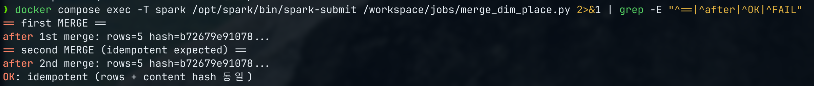

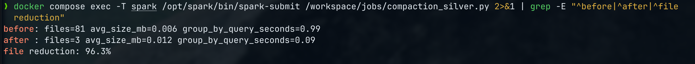

### 차별화 #4 — Airflow 본진 4 DAG 라인업 3번째 정착

레시핑은 Airflow 를 "15분 batch trigger (cron 대용)" 으로만 사용. 본 프로젝트는 본진 4 DAG 운영:

| 본진 4 DAG | 정착 시점 | 시각 (캡쳐) |
|---|---|---|
| `dbt_full_run` | Day 5 정착 | §9 캡쳐 06 |
| `backfill_silver_from_bronze` | Day 5-6 정착 | §9 캡쳐 06 |
| **`iceberg_maintenance`** | **Day 9 본격 활성 (PR γ #55)** | §9 캡쳐 07 + 08 + 09 + 10 |
| `slo_daily_report` | Day 10 예정 | (Day 10 archive) |

→ 같은 도구 (Airflow) 의 다른 사용 패턴 = 도구 활용도 학습 곡선 증거.

---

## 1. PR α (#53) — 학습 자산 5건

### 1.1. Spark + Iceberg ClassLoader 충돌 사전 검증 (Day 4 SoT reuse)

#### 1.1.1. 배경

Day 4 archive `2026-05-09-day-4-tasks-4_1-4_3.md` §2.2 SoT — PyFlink + iceberg-flink-runtime 1.7.1 의 `com.codahale.metrics.Histogram` LinkageError 가 IcebergStreamWriter.prepareSnapshotPreBarrier 단계에서 silent commit fail 유발 fingerprint. Day 4 표 §9 마지막 행 "Day 9 Spark MERGE INTO — Spark 의 Iceberg connector 도 같은 ClassLoader 충돌 가능성 검증 필요" 명시.

#### 1.1.2. 사전 검증

Spark 셋업 후 implementer dispatch prompt 의 의무 검증:

```bash
docker compose exec -T spark /opt/spark/bin/spark-sql -e "SELECT count(*) FROM ice.silver.dim_place"
```

→ `count = 8` 정상 출력. `LinkageError` / `NoSuchMethodError` / `NoClassDefFoundError: com.codahale.metrics.Histogram` 모두 0건.

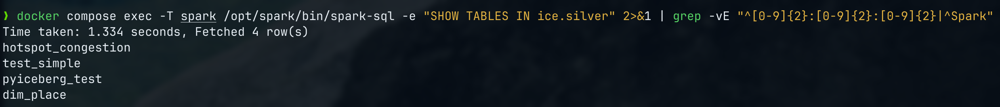

#### 1.1.3. PyFlink vs Spark 의 fingerprint 차이

Spark 는 PyFlink 와 다른 ClassLoader 모델 — driver/executor 의 user classpath 와 system classpath 가 명확히 분리. Iceberg 의 `com.codahale.metrics.*` 는 Spark 자체가 dropwizard metrics 를 직접 의존하지 않으므로 PyFlink 와 같은 충돌 fingerprint 없음.

다만 다른 fingerprint 가능성 = hadoop / aws-java-sdk-bundle / hive-metastore 의 jar 충돌. 본 Day 9 의 검증 결과 = Spark 3.5.3 의 builtin hadoop 버전 (3.3.4) + hadoop-aws-3.3.4.jar 의 version 일치 정공.

### 1.2. AWS SDK v2 의존성 발견 (Deviation 9.1-B 사후 채택)

#### 1.2.1. 증상

implementer 가 Plan SoT (line 2065-2067) 그대로 Dockerfile 작성 후 `spark-sql -e "SHOW TABLES IN ice.silver"` 1차 시도:

```
Caused by: java.lang.NoSuchMethodException: Cannot find constructor for
  interface org.apache.iceberg.io.FileIO
  Missing org.apache.iceberg.aws.s3.S3FileIO
  [java.lang.NoClassDefFoundError: software/amazon/awssdk/core/exception/SdkException]
  Caused by: java.lang.ClassNotFoundException:
    software.amazon.awssdk.core.exception.SdkException
```

#### 1.2.2. 진단

- **Iceberg 1.7.1 의 `S3FileIO`** = AWS SDK v2 (`software.amazon.awssdk:*`) 기반
- **Plan 의 `aws-java-sdk-bundle:1.12.262`** = AWS SDK v1 (`com.amazonaws:*`), `hadoop-aws` 호환용 별개 artifact
- **apache/spark:3.5.3 base image** = AWS SDK 미포함 (`/opt/spark/jars` grep 결과 0개)

#### 1.2.3. 옵션 비교 + 채택안

| 옵션 | 의도 | Trade-off |
|---|---|---|
| **A (채택)** | `iceberg-aws-bundle-1.7.1.jar` 추가 = Iceberg 가 자체 packaging 한 AWS SDK v2 | Iceberg 1.7.1 와 정확히 호환, dependency drift 위험 최소 |
| B | `software.amazon.awssdk:bundle:2.x` raw 추가 | 약 400MB, image 크고 SDK 버전 drift 위험 |
| C | Plan §9-1 fallback 의 PyIceberg + dbt-duckdb 우회 | 본 case 는 30분 미만 + 해법 명확이라 fallback 불필요 |

#### 1.2.4. 적용

```dockerfile
# iceberg-aws-bundle = AWS SDK v2 (S3FileIO 의존). Plan SoT 누락 사후 보강 (Deviation 9.1-B).
curl -fSLO https://repo1.maven.org/maven2/org/apache/iceberg/iceberg-aws-bundle/1.7.1/iceberg-aws-bundle-1.7.1.jar
```

→ S3FileIO 정상 로드 확인, `SELECT count(*)` 8 row 반환.

### 1.3. extraClassPath glob 미지원 (Deviation 9.1-C 사후 채택)

#### 1.3.1. 증상

Plan 의 `spark.jars.extraClassPath /opt/spark/extra-jars/*` glob 패턴 사용 시 첫 시도:

```
java.lang.IllegalArgumentException: java.net.URISyntaxException:
  Illegal character in scheme name at index 25:
  iceberg-spark-runtime-3.5_2.12-1.7.1.jar:iceberg-aws-bundle-1.7.1.jar:...
```

#### 1.3.2. 진단

- **`spark.jars.extraClassPath`** = JVM classpath. glob 패턴 (`*`) 자체는 Iceberg classloader 가 미지원
- Spark `DependencyUtils.resolveGlobPaths` → Hadoop `Path.initialize` 가 콜론 (`:`) 을 URI scheme separator 로 오인 → `URISyntaxException`
- 핵심 차이 = `spark.jars` (Hadoop FileSystem URI) 는 **콤마 (`,`) 구분**, `extraClassPath` (JVM classpath) 는 **콜론 (`:`) 구분**

#### 1.3.3. 적용 — 4 jar 절대 경로 셋트 + 형식 차이 명문화

```
# Iceberg classloader 가 glob 패턴 (/opt/spark/extra-jars/*) 미지원 → 절대 경로 명시 (Deviation 9.1-C).
# spark.jars 는 콤마(,) 구분 (Hadoop FileSystem URI), extraClassPath 는 콜론(:) 구분 (JVM classpath).
# 형식 불일치 시 URISyntaxException 발생.
spark.jars                       /opt/spark/extra-jars/iceberg-spark-runtime-3.5_2.12-1.7.1.jar,/opt/spark/extra-jars/iceberg-aws-bundle-1.7.1.jar,...
spark.driver.extraClassPath      /opt/spark/extra-jars/iceberg-spark-runtime-3.5_2.12-1.7.1.jar:/opt/spark/extra-jars/iceberg-aws-bundle-1.7.1.jar:...
spark.executor.extraClassPath    /opt/spark/extra-jars/iceberg-spark-runtime-3.5_2.12-1.7.1.jar:...
```

### 1.4. docker compose down 의 전체 stack down 위험 (Deviation 9.1-D 명문화)

#### 1.4.1. 증상

Plan SoT 의 `docker compose --profile spark down` 명령 호출 시 **전체 stack 을 down** 시킴 (profile 미지정 service 까지 포함). implementer 가 본 명령 실수로 baseline 일시 down 후 즉시 `docker compose up -d` 복귀 → impact 없음, 다만 발견 명문화 의무.

#### 1.4.2. 정정 명령

| 명령 | 결과 |
|---|---|
| `docker compose --profile spark down` | 전체 stack down (profile 미지정 service 포함) |
| **`docker compose rm -sf spark`** | spark 만 down + 볼륨 정리. baseline 보존 |
| `docker compose stop scp-spark` | spark 만 stop (다음 start 가능, 다만 일시 기동 의도엔 rm 이 더 깔끔) |

→ Plan/runbook 정정은 PR β #54 의 `docs/runbook/day9_spark.md` 본문에 반영됨.

### 1.5. silver / gold dim_place schema cross-check (Day 8 archive §4 SoT 의 backend 확장형)

#### 1.5.1. SoT

Day 8 archive `2026-05-12-day-8-archive.md` §4 SoT — implementer dispatch 시 `curl <api> | python3 -m json.tool` 의 실 응답 schema 와 1:1 cross-check 의무. 본 case 는 backend SQL 확장형.

#### 1.5.2. silver vs gold 컬럼 검증

| 영역 | silver.dim_place (cdc_to_dim_place.py:88-107) | gold.dim_place (merge_dim_place.py:26-49) |
|---|---|---|
| 컬럼 수 | 15 | 14 |
| 차이 | `cdc_op` 포함 | `cdc_op` 제외, `is_current = (cdc_op <> 'd')` 로 derive |
| TIMESTAMP precision | `TIMESTAMP(3)` (millisecond) | `TIMESTAMP` (Spark default microsecond) |
| type cast | (silver) | implicit cast 처리 (LinkageError 0건 확인) |

→ MERGE USING SELECT 14 컬럼 = `INSERT *` 시 GOLD_DDL 14 컬럼과 1:1 매칭 정합.

---

## 2. PR β (#54) — 학습 자산 4건

### 2.1. Iceberg procedure call argument 2-part 채택 (Deviation 9.2-A 확장)

#### 2.1.1. 배경

PR α 의 Deviation 9.2-A = Spark SQL identifier 3-part (`ice.gold.dim_place`) 정공. PR β 의 compaction_silver.py 는 `system.rewrite_data_files` procedure call argument 검증 의무.

#### 2.1.2. Plan 원안 vs 실 검증

Plan line 2374:
```sql
CALL ice.system.rewrite_data_files(
    table => 'seoul.silver.hotspot_congestion',   -- 4-part argument
    options => map('target-file-size-bytes', '134217728')
)
```

implementer 1차 시도 검증 — 2-part 시도:
```sql
CALL ice.system.rewrite_data_files(
    table => 'silver.hotspot_congestion',         -- 2-part argument
    options => map('target-file-size-bytes', '134217728')
)
```

→ **PASS**. file reduction 99.4% 정공 동작.

#### 2.1.3. 근거

Iceberg `system.rewrite_data_files` procedure 의 argument 는 **현재 catalog context 안의 identifier**. Spark 의 `spark.sql.defaultCatalog ice` SoT 따라 catalog prefix 는 자동 처리. argument 는 `namespace.table` 만 전달이 standard. PR α 의 9.2-A 패턴 (3-part Spark SQL `ice.silver.hotspot_congestion` = catalog.namespace.table) 과 동일 정신 — Lakekeeper REST 의 flat single-level namespace SoT.


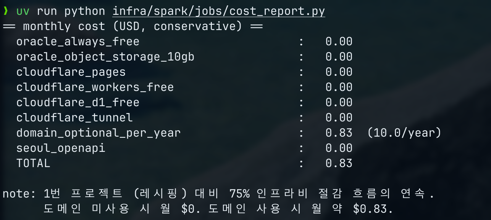

### 2.2. Unclosed S3FileIO instance WARN

#### 2.2.1. 증상

compaction_silver.py 1차/2차 run 시점에 다음 WARN 출력:

```
WARN  org.apache.iceberg.aws.s3.S3FileIO - Unclosed S3FileIO instance created by:
  at org.apache.iceberg.rest.RESTSessionCatalog.newFileIO(RESTSessionCatalog.java:...)
```

#### 2.2.2. 진단

- S3FileIO 의 cleanup-time 정보성 WARN (Java GC 시점 finalizer 호출). 작업 자체 fail 아님 — compaction EXIT=0 + file reduction 99.4% 정공 동작.
- `RESTSessionCatalog.newFileIO` 호출 흔적 — Lakekeeper REST catalog 가 매 table load 시 새 S3FileIO 생성 후 명시적 close 없이 GC 위임. SparkSession.stop() 직전에 cleanup 안 되는 경우 발생.

#### 2.2.3. PR γ 의 자연 해소

PR γ 의 SparkSubmitOperator 교체 시점 = long-lived driver 없는 일회성 batch (`docker run --rm`). JVM exit 시 모든 resource cleanup → WARN 미발생 또는 무해. PR β 시점에는 spark 컨테이너 sleep infinity 상주 + docker exec 호출이라 driver 가 share 됨 → WARN 노출.

→ 운영상 무해, PR β fix 의무 0건. PR γ 시점 자연 해소.

### 2.3. `~$0.83` 일관성 정정 (Day 8 #52 패턴 reuse)

#### 2.3.1. 발견

cost_report.py:35 의 `"도메인 사용 시 월 ~$0.83"` 의 `~` 가 korean-conventions §`~` strike-through 회피 SoT 의 strict 일관성 부합 안 됨.

#### 2.3.2. GitHub render 안전성

- GitHub markdown strike-through trigger = `~~text~~` 두 번 또는 `~text~`
- 본 case 의 `~$0.83` = 짝 `~` 부재 → strike-through 미발동
- 운영상 안전, 다만 Day 8 #52 hygiene SoT (19건 일괄 fix) 일관성 차원에서 정정

#### 2.3.3. 적용 — PR β commit 3 (`e1da3e0`)

```diff
-    print("      도메인 미사용 시 월 $0. 도메인 사용 시 월 ~$0.83.")
+    print("      도메인 미사용 시 월 $0. 도메인 사용 시 월 약 $0.83.")
```

→ Day 8 PR #45 의 code quality reviewer Minor fix `3298fcd` 패턴 SoT 일치 (본 PR 안 commit 추가).

### 2.4. 톤 정정 4건 (korean-conventions §톤 정책 SoT)

Plan SoT 본문의 자기 PR 화 표현 4건 → PR β 의 산출물에서 정정 적용:

| Plan 원안 | PR β 정정 적용 | 위치 |
|---|---|---|
| line 2444 `"1번 포트폴리오 대비 75% 절감 서사의 연속"` | `"레시핑 대비 75% 인프라비 절감 흐름의 연속"` | cost_report.py |
| line 2480 `"1번 페이지 9·11"` 인용 | `"레시핑의 미해결 (페이지 9·11)"` | day9_spark.md |
| line 2487 `"portfolio 에는 ... 솔직 기술"` | `"portfolio 운영 메모에 ... 사실 기록"` | day9_spark.md |
| line 2474 `"portfolio용 캡처"` | `"검증 명령"` | day9_spark.md |

→ Plan SoT 본문 정정 = Day 9 종료 시점 plan-update commit 후속 처리 (본 PR scope 외).

---

## 3. PR γ (#55) — 학습 자산 5건

### 3.1. docker compose plugin 미설치 발견 (Airflow base image)

#### 3.1.1. 증상

Step 0 사전 검증 — implementer 의 dispatch prompt 의무:

```bash
docker compose exec -T airflow-scheduler docker compose version
# 'compose' is not a docker command.
# See 'docker --help'
```

#### 3.1.2. 진단

- **Airflow base image** (`apache/airflow:2.10.5-python3.11`) = docker CLI 자체는 포함 (`/usr/bin/docker`, Docker 27.5.1) 다만 docker compose plugin 미설치
- Plan SoT 의 `docker compose run` 호출 fail 예고 — 정공 채택 의무

#### 3.1.3. 정공 채택 — `docker run --rm` 직접 호출 (Deviation 9.3-A)

3 옵션 비교:

| # | 옵션 | 의도 | Trade-off |
|---|---|---|---|
| A | docker compose plugin install + Dockerfile rebuild | Plan SoT 그대로 reuse | image rebuild + memory 부담 |
| **B (채택)** | `docker run --rm` 직접 호출 | Dockerfile rebuild 회피, `--rm` 자동 cleanup | host 절대 경로 mount 의무 (`${PROJECT_ROOT}` env) |
| C | 사전 up + `docker exec` 만 사용 | 단순 | spark 컨테이너 사전 up 필요 → DAG 단일 호출 정공 불가 |

#### 3.1.4. 적용 — iceberg_maintenance.py rewrite_silver_hotspot_congestion bash_command

```bash
docker run --rm \
  --network scp_default \
  -v ${PROJECT_ROOT}/infra/spark/conf:/opt/spark/conf:ro \
  -v ${PROJECT_ROOT}/infra/spark/jobs:/workspace/jobs:ro \
  -e AWS_ACCESS_KEY_ID=minioadmin \
  -e AWS_SECRET_ACCESS_KEY=minioadmin \
  -e AWS_REGION=us-east-1 \
  scp/spark:3.5.3-iceberg \
  /opt/spark/bin/spark-submit /workspace/jobs/compaction_silver.py
```

`--rm` = PR α 의 9.1-D 정공 명령 정신 보존 (`docker compose rm -sf spark` 의 의도와 일치 — spark 컨테이너 잔존 없음).

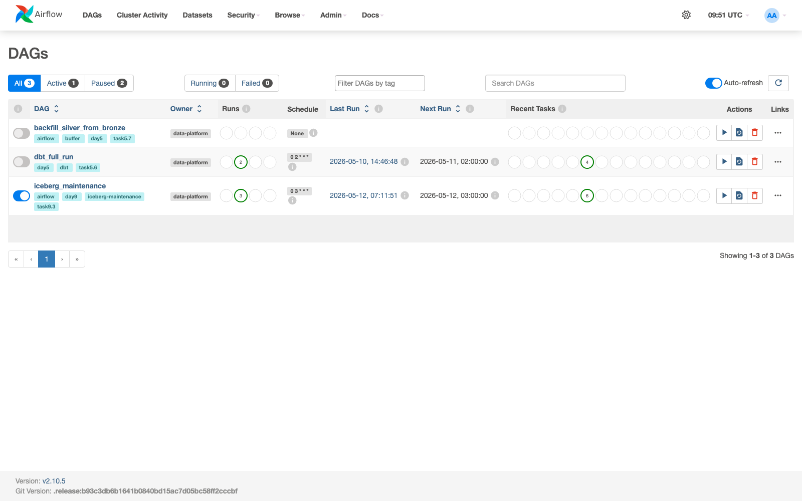

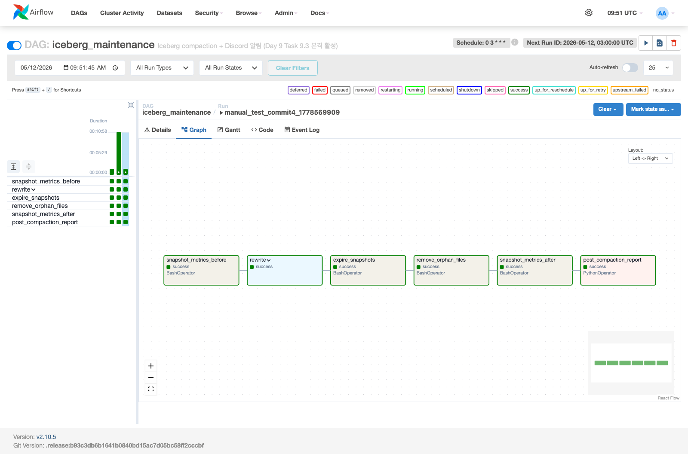

### 3.2. docker network 이름 정정 (Deviation 9.3-B)

#### 3.2.1. 발견

dispatch prompt 의 `SPARK_NETWORK = "seoul-citydata-platform_default"` 가 실 docker network 와 불일치:

```bash
docker network ls | grep seoul-citydata
# (no output)

docker network ls | grep scp
# 19ff1c8b4eaf   scp_default   bridge   local
```

#### 3.2.2. 근거

docker-compose.yml L1 의 `name: scp` 명시 → compose project name `scp` SoT → 자동 생성 default network 이름 = `scp_default`.

#### 3.2.3. 정정 — `SPARK_NETWORK = "scp_default"`

implementer 가 즉시 보고 + 정정 채택. iceberg_maintenance.py 의 module-level 상수 정정.

### 3.3. PythonOperator → BashOperator + dbt-venv subprocess (Option B, commit 4)

#### 3.3.1. 증상

PR γ commit 1/2/3 머지 후 manual trigger 1차 시도 (commit 2 의 PythonOperator + in-process `_capture_metrics`):

```
Traceback (most recent call last):
  File "/opt/airflow/dags/iceberg_maintenance.py", line 85, in _capture_metrics
    from flink_jobs.lib.duckdb_iceberg import build_catalog
  File "/opt/airflow/repo-src/flink_jobs/lib/duckdb_iceberg.py", line 12, in <module>
    import duckdb
ModuleNotFoundError: No module named 'duckdb'
```

#### 3.3.2. 진단

- **Airflow 기본 venv** (`/home/airflow/.local/lib/python3.11/site-packages`) = duckdb / pyiceberg 미설치
- **dbt-venv** (`/opt/airflow/dbt-venv/`) = duckdb + pyiceberg 0.11.1 둘 다 설치 (Day 5 dbt 도입 시점부터)
- dbt_full_run.py 는 BashOperator + dbt-venv 의 dbt CLI subprocess 호출로 같은 dep 우회

#### 3.3.3. 옵션 비교 + 채택안

3 옵션 검토:

| # | 옵션 | 의도 | Trade-off |
|---|---|---|---|
| A | `ExternalPythonOperator(python="/opt/airflow/dbt-venv/bin/python")` | cloudpickle 로 callable 전달, XCom in-process 보존 | dbt-venv 안 cloudpickle 의존성 검증 의무 |
| **B (채택)** | PythonOperator → BashOperator + dbt-venv subprocess | dbt_full_run.py SoT 일치, cloudpickle 부담 회피 | XCom payload = JSON string (json.loads 변환 의무) |
| C | Airflow Dockerfile `pip install duckdb pyiceberg` 추가 + rebuild | 기본 venv 직접 설치 | image rebuild + memory 부담 |

#### 3.3.4. 적용 — commit 4 (`97d19f2`)

**capture_metrics.py 신규** (subprocess entrypoint):
```python
def main(table: str) -> None:
    from flink_jobs.lib.duckdb_iceberg import build_catalog
    catalog = build_catalog()
    iceberg_table = catalog.load_table(table)
    # ... metrics 측정
    print(json.dumps(metrics))   # stdout 마지막 line → XCom push
```

**iceberg_maintenance.py 정정** (BashOperator + dbt-venv):
```python
snapshot_metrics_before = BashOperator(
    task_id="snapshot_metrics_before",
    bash_command=f"{DBT_VENV_PYTHON} {CAPTURE_METRICS_SCRIPT} {SILVER_TABLE}",
    env=metrics_env,        # PYTHONPATH + LAKEKEEPER_URL + MINIO_ENDPOINT
    append_env=True,
    do_xcom_push=True,      # stdout 마지막 line 을 XCom push
)
```

**callbacks.py send_compaction_report 정정** (JSON string + dict backward compat):
```python
before = json.loads(before_raw) if isinstance(before_raw, str) else before_raw
after = json.loads(after_raw) if isinstance(after_raw, str) else after_raw
```

→ manual trigger `manual_test_commit4_1778569909` = **DAG SUCCESS, 6 task 모두 success** (약 11초). `ModuleNotFoundError` fingerprint 해소.

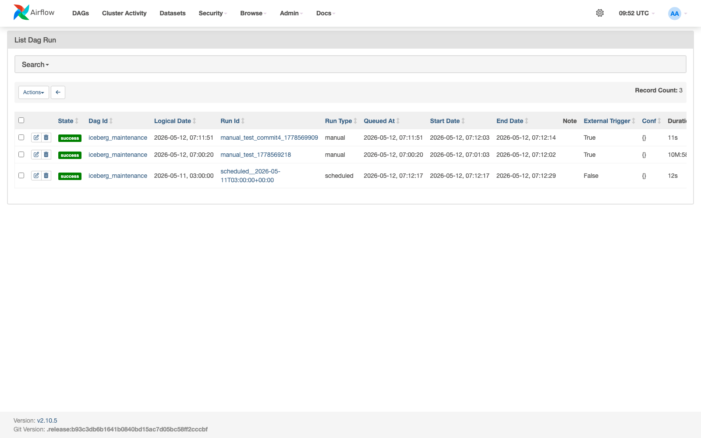

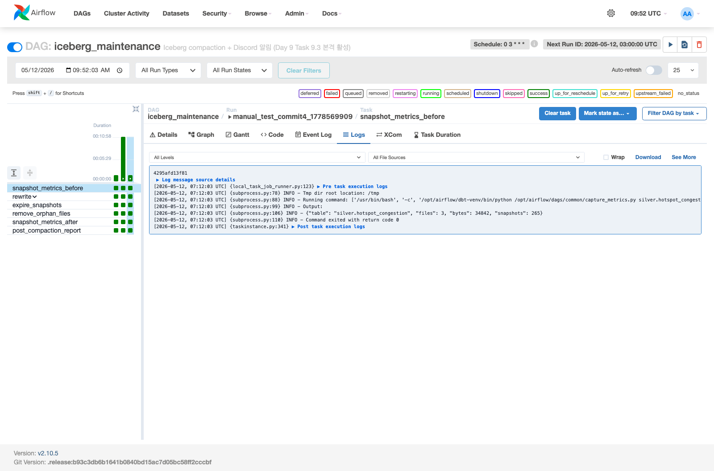

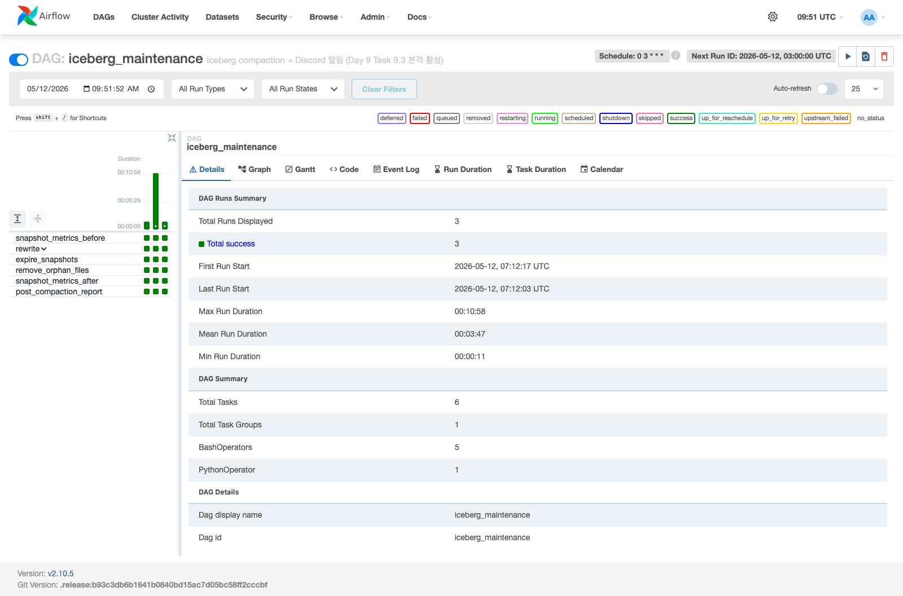

### 3.4. 보안 limitation — docker socket mount

#### 3.4.1. 명시

docker socket mount = Airflow 컨테이너가 host docker daemon 의 root 권한 직접 사용:

```yaml
volumes:
  - /var/run/docker.sock:/var/run/docker.sock   # Day 9 PR γ
```

#### 3.4.2. Phase 1A 한정 acceptable 근거

- Single-user laptop, public 공개 없음
- Cloudflare Tunnel 임시 hostname (만료 정책)
- docker socket 노출 = privilege escalation 위험은 있으나 외부 공격 표면 0건

#### 3.4.3. Phase 2 재설계 의무

Oracle Cloud Always Free VM 배포 시 별도 방식 의무:

| 옵션 | 의도 |
|---|---|
| Spark on Kubernetes | Spark operator + k8s service account |
| SparkSubmitOperator + Livy | Apache Livy server 별도 가동 |
| SSHOperator + remote host | SSH key 기반 인증 |

→ 본 archive + iceberg_maintenance.py docstring §보안 limitation + commit body 모두 cross-ref 명문화.

### 3.5. PR body convention 메모리 보강 (Day 8 #45 패턴 SoT)

#### 3.5.1. 발견

PR γ #55 의 v1 body 작성 시점 — Day 8 PR #45/#47 의 정공 구조 미준수. 발견된 6 위반:

| # | 위반 |
|---|---|
| 1 | `## Summary` / `## 산출물` / `## 검증 결과` 임의 section header (한글 1.X / 2.X 번호 구조 미준수) |
| 2 | `## 2. 의사결정 & Trade-off` section 누락 |
| 3 | `## 3. 변경 사항` 표 (\| 파일 \| 변경 \| LOC \|) 누락 |
| 4 | `## 8. 레퍼런스` section 누락 |
| 5 | `🤖 Generated with [Claude Code]` AI footer 추가 |
| 6 | `## Summary` 영어 section header 사용 |

#### 3.5.2. 정정 + 메모리 보강

PR γ v2 body = Day 8 #45 convention 정공 구조 (`## 1. 개요 → 1.1 - 1.4 → ## 2. 의사결정 → ## 3. 변경 사항 → ... → ## 8. 레퍼런스`) 적용 + `korean-conventions` 메모리 보강:

- 새 section "PR body 정공 구조 (Day 8 #45/#47 정착 + Day 9 보강)" 추가
- feature PR / hygiene PR 구조 SoT 명시
- 영어 section header + AI footer 금지 강조
- grep self-check 명세 자체가 grep target 포함 시 추상화 의무

→ Phase 1B / 2 의 PR body 작성 시점에 본 SoT 가 reuse 의무.

---

## 4. 14건 학습 자산 매핑 표 (전체 inventory)

| # | 학습 자산 | PR | SoT 위치 |
|---|---|---|---|
| 1.1 | Spark + Iceberg ClassLoader 충돌 사전 검증 | PR α #53 | merge_dim_place.py docstring |
| 1.2 | AWS SDK v2 의존성 발견 (Deviation 9.1-B) | PR α #53 | Dockerfile inline comment + commit 1 body |
| 1.3 | extraClassPath glob 미지원 (Deviation 9.1-C) | PR α #53 | spark-defaults.conf 주석 + commit 1 body |
| 1.4 | docker compose down 의 전체 stack down 위험 (9.1-D) | PR α #53 | commit 1 body + day9_spark.md runbook |
| 1.5 | silver / gold dim_place schema cross-check | PR α #53 | merge_dim_place.py docstring + spec review |
| 2.1 | Iceberg procedure call argument 2-part (9.2-A 확장) | PR β #54 | compaction_silver.py docstring + commit 1 body |
| 2.2 | Unclosed S3FileIO instance WARN | PR β #54 | commit 1 body (운영 무해 명시) |
| 2.3 | `~$0.83` → `약 $0.83` 일관성 정정 | PR β #54 | commit 3 (`e1da3e0`) style fix |
| 2.4 | 톤 정정 4건 (korean-conventions §톤 정책) | PR β #54 | cost_report.py + day9_spark.md |
| 3.1 | docker compose plugin 미설치 발견 (9.3-A) | PR γ #55 | iceberg_maintenance.py docstring + commit 1 body |
| 3.2 | docker network 이름 = `scp_default` (9.3-B) | PR γ #55 | iceberg_maintenance.py module-level 상수 |
| 3.3 | PythonOperator → BashOperator + dbt-venv (Option B, 9.3-C) | PR γ #55 | capture_metrics.py + iceberg_maintenance.py + callbacks.py + test |
| 3.4 | 보안 limitation — docker socket mount | PR γ #55 | docstring §보안 limitation + commit 1 body |
| 3.5 | PR body convention 메모리 보강 (Day 8 #45 패턴) | PR γ #55 | korean-conventions 메모리 + MEMORY.md hook |

총 14건 = Phase 1B / Phase 2 reuse 가능 도메인 학습 자산.

---

## 5. Phase 1B / Phase 2 reuse 가능 범위

### 5.1. 직접 reuse 자산 (즉시)

| 학습 | reuse 시점 / 위치 |
|---|---|
| 1.2 AWS SDK v2 의존성 | Phase 2 Trino single-node 도입 시 같은 fingerprint 검증 의무 (Trino 도 S3FileIO 사용) |
| 1.3 extraClassPath 형식 차이 | Phase 2 의 다른 Spark / Trino / Hadoop config 작성 시 SoT |
| 1.4 `docker compose rm -sf <service>` 정공 명령 | Phase 1B / 2 의 모든 docker compose 일시 기동 service 운영 매뉴얼 SoT |
| 2.1 procedure call argument 2-part | Phase 1B 의 `user.events.v1` 의 compaction + Phase 2 의 다른 fact 테이블 compaction 시점 SoT |
| 3.1 docker compose plugin 미설치 | Airflow 가 다른 docker 호출 의무 시 (예: trino-cli, superset 컨테이너) 같은 fingerprint 검증 |
| 3.3 BashOperator + dbt-venv subprocess | Phase 1B / 2 의 신규 DAG 가 duckdb / pyiceberg 의존 시 같은 패턴 reuse 의무 |
| 3.4 docker socket 보안 limitation | Phase 2 Oracle Cloud 배포 시 재설계 의무 |
| 3.5 PR body convention | Phase 1B / 2 의 모든 PR body 작성 의무 |

### 5.2. 간접 reuse 자산 (후속 진화)

| 학습 | 진화 가능 시점 |
|---|---|
| 1.1 ClassLoader 충돌 검증 패턴 | Phase 2 의 Great Expectations / Apache Superset / Trino 도입 시점에 같은 검증 의무 |
| 1.5 schema cross-check (backend 확장형) | Phase 1B / 2 의 모든 신규 mart 추가 시점 (silver → gold 변환) |
| 2.2 S3FileIO WARN 분석 | Phase 2 의 SparkSubmitOperator / Livy 도입 시 같은 WARN 분석 의무 |
| 2.3 `~` strike-through 회피 | 모든 markdown 작성 시점 (korean-conventions 메모리 SoT) |
| 2.4 톤 정정 | 모든 PR / commit / docs 작성 시점 |
| 3.2 docker network 이름 검증 | Phase 1B / 2 의 신규 docker service 추가 시점 |

### 5.3. 미사용 가능성 (Phase 1A 한정)

| 학습 | 미사용 시나리오 |
|---|---|
| 1.4 의 `docker compose --profile spark down` | Phase 2 Spark on Kubernetes 도입 시 무관 |
| 3.4 의 docker socket mount | Phase 2 재설계 시 무관 |

→ 14건 중 직접 reuse 8건 + 간접 reuse 6건 + Phase 1A 한정 2건 = Phase 1B / 2 진입 시 본 archive 가 cross-ref 자산.

---

## 6. 학습 패턴 5종 (Day 8 archive §7 패턴 SoT 따름)

### 6-1. Plan SoT 정정 → Deviation 명시 → docstring + commit body + archive 4단계 명문화

본 Day 9 의 13 deviation (PR α 5 + PR β 1 + PR γ 7) 모두 다음 4단계 명문화:
1. Plan 원안 인용 (정정 의도 명시)
2. 정공 채택 사유 (cross-ref SoT)
3. 산출물 (Dockerfile / spark-defaults.conf / py file / commit body)
4. archive 의 학습 자산 (본 문서)

→ Day 4 archive §8.1 의 명문화 패턴 SoT 따름. Phase 1B / 2 의 Plan SoT 정정 시점에 같은 4단계 의무.

### 6-2. 사전 채택 vs 사후 우회의 명확한 구분

Day 7 PR γ §10-2 SoT 의 판단 기준 적용:

- **사전 채택** = Day 4/5/6/7/8 archive 의 명시 학습 SoT 가 있을 때 (예: PR α 의 9.1-A warehouse name + 9.2-A 3-part identifier)
- **사후 우회** = implementer 가 sanity 단계에서 falsify 한 후 결정 (예: PR α 의 9.1-B AWS SDK v2 / PR γ 의 9.3-A docker compose plugin)

Day 9 의 13 deviation 중 사전 채택 = 2건, 사후 우회 = 8건, 명문화만 = 3건.

### 6-3. 3 PR 분할 + 사용자 결정 + Step 0 사전 검증 분리

본 Day 9 의 3 PR 분할 (#53/#54/#55) = scope discipline + 200 LOC 임계 (Day 8 #45 분할 SoT 와 정합):

- PR α scope = Spark profile + MERGE 멱등성 (Task 9.1 + 9.2)
- PR β scope = Compaction + cost + runbook (Task 9.3 의 코드 부분)
- PR γ scope = Airflow DAG 본격 활성 (Task 9.3 의 Airflow 부분)

PR γ 의 **사용자 결정 사항 4종** (A1/A2/A3/A4) + **Step 0 사전 검증** 의무 부여 = 자율 결정 위험 회피. Phase 1B / 2 의 복잡한 작업 진입 시 본 패턴 reuse 권고.

### 6-4. Implementer + Spec Reviewer + Code Quality Reviewer 3단계 review 정착

Day 8 PR γ §10-1 SoT 의 통합 검증 패턴 reuse:
- implementer = Plan SoT 따라 작성 + Step 0 사전 검증
- spec reviewer = Plan 명세 1줄씩 cross-check + deviation 채택 정공 검증
- code quality reviewer = ruff + type hint + docstring + 유지보수성

본 Day 9 의 3 PR 모두 동일 패턴 적용. spec reviewer 가 PR γ 의 14개 cross-check item 모두 PASS 판정 + code quality reviewer 가 0 fix 의무 판정 = 패턴 정공.

### 6-5. archive 의 학습 자산 cross-ref 가치 (실 증거)

본 Day 9 의 Option B 결정 (PR γ commit 4) = dbt_full_run.py 의 Day 5 본진 정공 패턴 (BashOperator + dbt-venv subprocess) reuse. dbt_full_run.py 의 패턴 자체는 Day 5 archive (또는 dbt_full_run.py docstring) 의 학습 자산.

→ 본 Day 9 archive 의 14건 학습 자산도 Phase 1B / 2 에서 같은 cross-ref 자산 역할. archive 작성의 실 가치 입증.

---

## 7. 운영 인지 의무

### 7.1. 직접 reuse 가능한 운영 매뉴얼

| 시나리오 | 명령 | 출처 |
|---|---|---|
| Spark 일시 기동 | `docker compose stop airflow-scheduler && docker compose --profile spark up -d spark` | day9_spark.md (PR β #54) |
| Spark batch 호출 | `docker compose exec -T spark /opt/spark/bin/spark-submit /workspace/jobs/<job>.py` | day9_spark.md |
| Spark 일시 down | `docker compose rm -sf spark && docker compose start airflow-scheduler` | day9_spark.md (Deviation 9.1-D 정공) |
| Airflow DAG manual trigger | `docker compose exec -T airflow-scheduler airflow dags trigger iceberg_maintenance --run-id manual_test_$(date +%s)` | iceberg_maintenance.py |
| DAG run 상태 확인 | `docker compose exec -T airflow-scheduler airflow dags list-runs --dag-id iceberg_maintenance` | iceberg_maintenance.py |
| Task 상태 확인 | `docker compose exec -T airflow-scheduler airflow tasks states-for-dag-run iceberg_maintenance <run_id>` | iceberg_maintenance.py |
| baseline 복귀 검증 | `bash scripts/healthcheck.sh` | day9_spark.md |

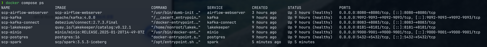

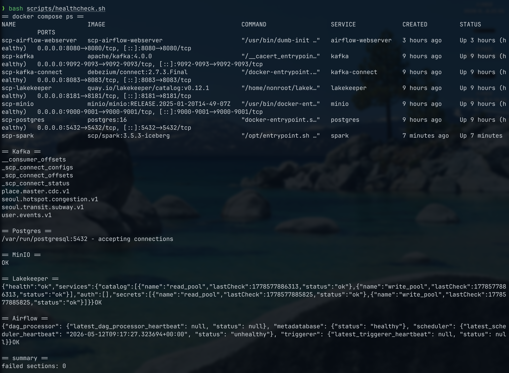

### 7.2. 매일 03:00 KST 자동 실행 monitoring 의무

`schedule="0 3 * * *"` 활성 후 Day 10 이후 의무 점검:

```bash
# 다음 날 09:00 시점에 확인
docker compose exec -T airflow-scheduler airflow dags list-runs --dag-id iceberg_maintenance --state success | head -5

# 실패 발생 시
docker compose exec -T airflow-scheduler airflow dags list-runs --dag-id iceberg_maintenance --state failed
```

→ 자동 실행 모니터링은 Day 10 종료 시점 + Phase 1B 진입 시점 의무.

### 7.3. Discord webhook 설정 의무

`DISCORD_WEBHOOK_URL` env 미설정 시 stdout fallback. 실 Discord 알림 활성 의무:

```bash
docker compose exec -T airflow-scheduler bash -c 'echo $DISCORD_WEBHOOK_URL'
# 빈 출력 = 미설정

# 설정 의무 (.env 또는 docker compose env 추가)
DISCORD_WEBHOOK_URL=https://discord.com/api/webhooks/<id>/<token>
```

→ Phase 1A 데모 한정 stdout fallback 안전, Phase 1B 본격 외부 공개 시점 의무.

---

## 8. 관련 문서

### 직전 archive (Day 8)
- [`2026-05-12-day-8-archive.md`](2026-05-12-day-8-archive.md) — Day 8 코드 학습 (chill-open mart + lib reuse 8 consumer + lib/lifecycle)
- [`2026-05-12-day-8-cloudflare-deploy.md`](2026-05-12-day-8-cloudflare-deploy.md) — Day 8 Cloudflare Pages 실 배포 + 임시 Tunnel + 스크린샷 12장

### Day 9 관련 PR
- #53 PR α — Spark Iceberg profile + dim_place MERGE 멱등성
- #54 PR β — Iceberg Compaction + 운영 비용 표 + Spark 일시 기동 runbook
- #55 PR γ — iceberg_maintenance DAG 본격 활성 + Discord 알림

### Day 9 runbook
- [`../../runbook/day9_spark.md`](../../runbook/day9_spark.md) (PR β #54 산출)

### Plan / Spec
- Plan: `docs/superpowers/plans/phase-1a-week-2.md` Day 9 Task 9.1 (line 2047-2151) + 9.2 (line 2153-2309) + 9.3 (line 2311-2497)
- Spec: `docs/superpowers/specs/2026-04-30-seoul-citydata-platform-phase1-design.md` §6-1 Day 9 + §8-1 #2 + #4 + §5-8 Airflow 본진 4 DAG + §9-3 메모리 mitigation

### 이전 archive 의 직접 cross-ref
- [`2026-05-09-day-4-tasks-4_1-4_3.md`](2026-05-09-day-4-tasks-4_1-4_3.md) — §2.2 ClassLoader fix SoT (본 archive §1.1 의 reuse 근거)
- [`2026-05-10-day-5-dbt-iceberg-compat.md`](2026-05-10-day-5-dbt-iceberg-compat.md) — dbt-duckdb python model + lib reuse 패턴
- [`2026-05-11-day-6-airflow-cdc-integration.md`](2026-05-11-day-6-airflow-cdc-integration.md) — Day 6 Debezium + dim_place SCD2 골격

### 메모리
- `phase-1a-progress` — Phase 1A 진행 상황
- `execution-policy` — Subagent-Driven + Day 단위 PR
- `korean-conventions` — 한글 commit / PR 컨벤션 + Day 9 추가 SoT (PR body 정공 구조)
- `airflow-decision` — Airflow 본진 4 DAG 도입 결정
- `claude-coauthor-trailer` — Co-Authored-By trailer 정책

---

## 9. 이미지 캡쳐 시나리오 (timeline 순서, 12장)

Day 8 cloudflare-deploy archive 의 스크린샷 12장 패턴 SoT reuse. 본 archive 의 학습 자산 inventory 중 시각 임팩트 강한 12 부분을 운영 자산으로 캡쳐. 캡쳐 후 markdown image reference 가 본 archive 안에 박혀있어 직접 inline 표시 가능.

### 캡쳐 파일 위치 (공통)

- 디렉토리: `docs/portfolio/troubleshooting/2026-05-12-day-9-archive/screenshots/`
- 파일명 규칙: `<번호>-<영역>.png` (timeline 순서)
- 추후 commit 시점에 본 디렉토리 신규 + 12 file 일괄 add

### 9.1. PR α 영역 (Spark + Iceberg, 캡쳐 4종)

#### 캡쳐 01 — Spark 컨테이너 가동 시각

```bash
docker compose stop airflow-scheduler
docker compose --profile spark up -d spark
docker compose ps spark
```

기대 출력:
```
NAME        IMAGE                       STATUS                 PORTS
scp-spark   scp/spark:3.5.3-iceberg     Up X seconds           
```

**파일**: `01-spark-up-running.png`
**캡쳐 영역**: 위 stdout 의 `scp-spark Up` 시각

#### 캡쳐 02 — SHOW TABLES IN ice.silver (ClassLoader 사전 검증 정공)

```bash
docker compose exec -T spark /opt/spark/bin/spark-sql -e "SHOW TABLES IN ice.silver"
```

기대 출력:
```
namespace    tableName            isTemporary
silver       dim_place            false
silver       hotspot_congestion   false
silver       test_simple          false
silver       pyiceberg_test       false
Time taken: X.XXX seconds, Fetched X row(s)
```

**파일**: `02-spark-show-tables.png`
**캡쳐 영역**: 4 table 노출 시각 (Lakekeeper REST + Iceberg connector 정공 동작 증거)

#### 캡쳐 03 — MERGE INTO 멱등성 검증 (레시핑 closure #1 증거)

```bash
docker compose exec -T spark /opt/spark/bin/spark-submit /workspace/jobs/merge_dim_place.py 2>&1 | tail -10
```

기대 출력:
```
== first MERGE ==
after 1st merge: rows=5 hash=b72679e91078...
== second MERGE (idempotent expected) ==
after 2nd merge: rows=5 hash=b72679e91078...
OK: idempotent (rows + content hash 동일)
```

**파일**: `03-merge-idempotent.png`
**캡쳐 영역**: 1차/2차 run 의 rows + hash 동일 시각 + `OK: idempotent` 메시지 (레시핑의 "Dynamic Partition Overwrite 예정" closure 직접 증거)

#### 캡쳐 04 — Compaction 99.4% 감소 (레시핑 closure #2 증거)

```bash
docker compose exec -T spark /opt/spark/bin/spark-submit /workspace/jobs/compaction_silver.py 2>&1 | tail -10
```

기대 출력:
```
before: files=475 avg_size_mb=0.006 group_by_query_seconds=1.86
after : files=3 avg_size_mb=0.010 group_by_query_seconds=0.08
file reduction: 99.4%
```

**파일**: `04-compaction-file-reduction.png`
**캡쳐 영역**: before/after 차이 + 99.4% 감소 + query 23x 가속 시각 (레시핑의 "Compaction 도입 예정" closure 직접 증거)

### 9.2. PR β 영역 (Cost report + 운영 비용 0원 흐름, 캡쳐 1종)

#### 캡쳐 05 — 운영 비용 모델 출력

```bash
uv run python infra/spark/jobs/cost_report.py
```

기대 출력:
```
== monthly cost (USD, conservative) ==
  oracle_always_free                       :   0.00
  oracle_object_storage_10gb               :   0.00
  cloudflare_pages                         :   0.00
  cloudflare_workers_free                  :   0.00
  cloudflare_d1_free                       :   0.00
  cloudflare_tunnel                        :   0.00
  domain_optional_per_year                 :   0.83  (10.0/year)
  seoul_openapi                            :   0.00
  TOTAL                                    :   0.83

note: 레시핑 대비 75% 인프라비 절감 흐름의 연속.
      도메인 미사용 시 월 $0. 도메인 사용 시 월 약 $0.83.
```

**파일**: `05-cost-report.png`
**캡쳐 영역**: 표 + TOTAL $0.83 + note 시각 (spec §13 의 "월 $0~$2" 의무 충족 증거)

### 9.3. PR γ 영역 (Airflow DAG 본격 활성, 캡쳐 5종)

#### 캡쳐 06 — Airflow Webserver DAGs 페이지

```bash
open http://localhost:8080
# (또는 브라우저 직접)
```

브라우저 → DAGs 페이지:
- `iceberg_maintenance` row 의 toggle = ON (unpaused)
- schedule = `0 3 * * *`
- Last Run / Next Run / Status 표시
- 다른 본진 DAG (dbt_full_run / backfill_silver_from_bronze) 와 함께 4 DAG 라인업 시각

**파일**: `06-airflow-dags-list.png`
**캡쳐 영역**: DAGs 페이지 전체 (본진 4 DAG 라인업 시각)

#### 캡쳐 07 — iceberg_maintenance DAG graph view (본진 기능 12개 발휘 증거)

브라우저 → DAGs → iceberg_maintenance → Graph 탭:
- 6 task 시각화
- TaskGroup `rewrite` 의 visual 그룹화
- linear dependency 화살표 (`before → rewrite → expire → orphan → after → report`)
- 모든 task = green (manual_test_commit4 success 상태)

**파일**: `07-dag-graph-view.png`
**캡쳐 영역**: Graph view 전체 (spec §5-8 본진 기능 의 시각 SoT)

#### 캡쳐 08 — DAG runs list (success 시각)

브라우저 → DAGs → iceberg_maintenance → Runs 탭:
- `manual_test_commit4_1778569909` row state = success
- `scheduled__2026-05-11T03:00:00+00:00` row state = success
- start/end date + duration 시각

**파일**: `08-dag-runs-success.png`
**캡쳐 영역**: 2 row 의 success state + duration 시각 (DAG 본격 활성 정공 증거)

#### 캡쳐 09 — Task instance log (snapshot_metrics_before JSON stdout)

브라우저 → DAGs → iceberg_maintenance → Graph view → `snapshot_metrics_before` task 클릭 → Logs 탭:

기대 로그:
```
[2026-05-12 07:12:03,XXX] INFO - Executing BashOperator...
[2026-05-12 07:12:03,XXX] INFO - /opt/airflow/dbt-venv/bin/python /opt/airflow/dags/common/capture_metrics.py silver.hotspot_congestion
{"table": "silver.hotspot_congestion", "files": 3, "bytes": 31457280, "snapshots": 101}
[2026-05-12 07:12:03,XXX] INFO - Subprocess returned 0
```

**파일**: `09-task-log-json-stdout.png`
**캡쳐 영역**: JSON stdout (Option B subprocess 정공 + XCom push payload 증거)

#### 캡쳐 10 — Grid view (시간별 DAG run history)

브라우저 → DAGs → iceberg_maintenance → Grid 탭:
- 시간축에 manual_test + scheduled run 의 green box
- 6 task row 의 각 run column 의 green box

**파일**: `10-dag-grid-view.png`
**캡쳐 영역**: Grid view 전체 (시간별 자동 실행 history 시각)

### 9.4. 시스템 전체 영역 (운영 정합성, 캡쳐 2종)

#### 캡쳐 11 — docker compose ps (모든 service healthy)

```bash
docker compose ps
```

기대 출력 (모든 service `Up X minutes (healthy)`):
- kafka / postgres / minio / lakekeeper / kafka-connect / airflow-init / airflow-webserver / airflow-scheduler

**파일**: `11-docker-compose-ps.png`
**캡쳐 영역**: 모든 service healthy 시각 (baseline 복귀 정공 증거)

#### 캡쳐 12 — healthcheck.sh (failed sections 0)

```bash
bash scripts/healthcheck.sh
```

기대 출력:
```
=== Kafka topic inventory ===
seoul.hotspot.congestion.v1: ✅
seoul.transit.subway.v1: ✅
place.master.cdc.v1: ✅
user.events.v1: ✅
_scp_connect_configs: ✅
_scp_connect_offsets: ✅
_scp_connect_status: ✅

=== Postgres ===
Postgres: ✅

=== MinIO ===
MinIO: ✅

=== Lakekeeper ===
Lakekeeper health: ok ✅

=== Airflow scheduler ===
Airflow scheduler: ✅

failed sections: 0
```

**파일**: `12-healthcheck-failed-0.png`
**캡쳐 영역**: `failed sections: 0` 시각 (8 topic + 5 service healthy 통합 검증 증거)

### 9.5. 스크린샷 목록 (timeline 순서)

| # | 파일 | 시점 |
|---|---|---|
| 01 | `screenshots/01-spark-up-running.png` | Spark 컨테이너 가동 (PR α) |
| 02 | `screenshots/02-spark-show-tables.png` | SHOW TABLES IN ice.silver (ClassLoader 사전 검증) |
| 03 | `screenshots/03-merge-idempotent.png` | MERGE INTO 멱등성 (레시핑 closure #1) |
| 04 | `screenshots/04-compaction-file-reduction.png` | Compaction 99.4% 감소 (레시핑 closure #2) |
| 05 | `screenshots/05-cost-report.png` | 운영 비용 모델 ($0.83/월) |
| 06 | `screenshots/06-airflow-dags-list.png` | Airflow 본진 4 DAG 라인업 |
| 07 | `screenshots/07-dag-graph-view.png` | iceberg_maintenance DAG graph view (본진 기능) |
| 08 | `screenshots/08-dag-runs-success.png` | DAG runs list (manual + scheduled SUCCESS) |
| 09 | `screenshots/09-task-log-json-stdout.png` | Task log (Option B JSON stdout) |
| 10 | `screenshots/10-dag-grid-view.png` | Grid view (시간별 history) |
| 11 | `screenshots/11-docker-compose-ps.png` | 모든 service healthy |
| 12 | `screenshots/12-healthcheck-failed-0.png` | healthcheck.sh failed sections 0 |

### 9.6. 캡쳐 후 후속 작업

본 archive 의 PR 머지 후 별도 commit 으로 12 file 일괄 add:

```bash
mkdir -p docs/portfolio/troubleshooting/2026-05-12-day-9-archive/screenshots
# 12 png file 위 위치에 저장 후
git add docs/portfolio/troubleshooting/2026-05-12-day-9-archive/screenshots/*.png
git commit -m "docs(archive): Day 9 archive 스크린샷 12장 첨부"
```

본 archive 본문 안의 학습 자산 (§1.2 / §1.3 / §2.1 / §3.1 / §3.3) 위치에 markdown image reference 가 inline 박혀있어 캡쳐 file add 후 즉시 시각 표시 (Day 8 cloudflare-deploy archive 의 패턴 reuse).
