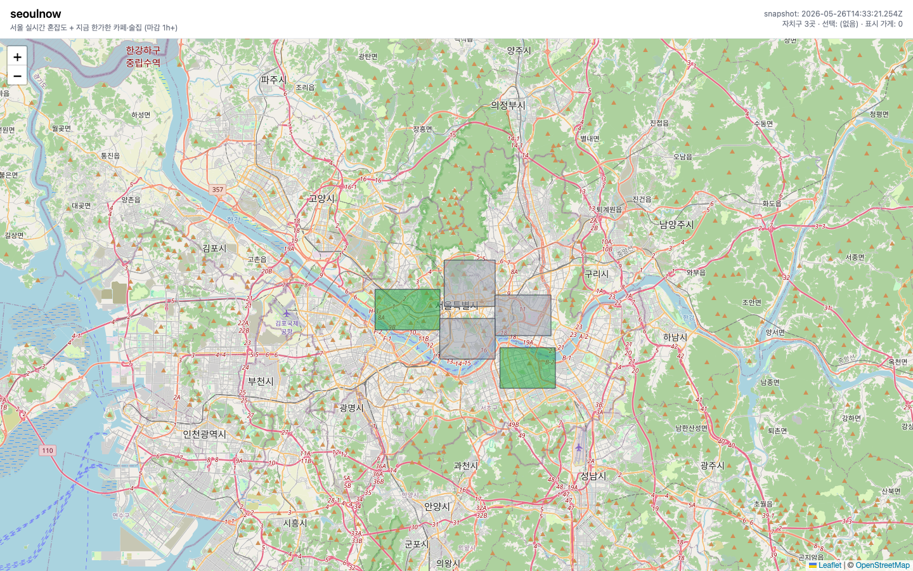

# VM 마이그레이션 bring-up — 부트스트랩 실측 갭 11 이슈

**발생일**: 2026-05-26 (Phase 1B Day 11, VM 마이그레이션 MVP bring-up)
**관련 runbook**: [`vm-migration-mvp.md`](../../runbook/vm-migration-mvp.md)
**관련 spec**: `docs/superpowers/specs/2026-05-25-vm-migration-design.md`
**관련 plan**: `docs/superpowers/plans/2026-05-26-vm-migration-mvp.md`
**관련 commits**: PR #80 (VM MVP 자동화 골격) / PR #81 (JAVA_HOME + 부트스트랩 의존성 3건) / 본 PR (runbook 보정 + 본 문서)

## 요약

Oracle ARM VM(155.248.164.17, Ubuntu 24.04)에서 prod 파이프라인을 처음 bring-up 하며 runbook 골격(PR #80)에 없던 부트스트랩 의존성 11건이 드러남. 모두 "git clone + `docker compose up` 만으로 재현" 가정의 빈틈 — gitignored 빌드 산출물(JAR / dbt_packages / profiles) + 호스트 프로세스 환경(JAVA_HOME / /etc/hosts) + 일회성 등록(Lakekeeper warehouse)이 누락 클래스. 본 bring-up 으로 11건을 실측해 runbook 에 영속화.

| # | 이슈 | 클래스 | 해결 |
|---|---|---|---|
| 1 | Python 3.12 distutils 제거로 pemja 빌드 실패 | 툴체인 | `.python-version` 3.11 고정 + `uv python install 3.11` |
| 2 | flink systemd 유닛에서 `JAVA_HOME` 미설정 | 호스트 env | 유닛 2개에 `Environment=JAVA_HOME=...` 박음 (PR #81) |
| 3 | pemja C 확장 컴파일 시 `cc` 부재 | 툴체인 | `apt install build-essential` |
| 4 | 호스트 프로세스가 `minio` / `lakekeeper` 해석 실패 | 호스트 env | `/etc/hosts` 에 `127.0.0.1 lakekeeper minio` |
| 5 | Lakekeeper warehouse 'seoul' 미등록 | 일회성 등록 | `MINIO_ENDPOINT=http://minio:9000 ... bootstrap.py` |
| 6 | flink job `MalformedURLException: no protocol` | gitignored 산출물 | `bash infra/flink/download_jars.sh` (JAR 5개) |
| 7 | dbt `profiles.yml` 부재 | gitignored 산출물 | `cp profiles.yml.example profiles.yml` |
| 8 | dbt `dbt_utils` 패키지 부재 | gitignored 산출물 | `uv run dbt deps` |
| 9 | cloudflared `config.yml` indent 로 `sed` 매칭 실패 | 편집 멱등성 | grouped-echo(`tee` heredoc)로 전체 재작성 |
| 10 | dbt build 가 MVP serving 에 불필요(발견) | 경로 가정 정정 | serving 이 raw gold + static 직접 read → step 제거 |
| 11 | producer 가 3 핫스팟만 발행 | 범위 정정 | MVP 스코프로 인지, 120 확장은 후속 |

## bring-up 결과 — 실데이터 지도

11건 해결 후 prod 파이프라인이 실데이터를 서빙하는 최종 상태.



- Cloudflare Pages 배포(`*.seoulnow.pages.dev`)가 VM serving(`api.seoulnow.live`)을 통해 실데이터 표시 → Mac 무관 prod 독립.
- 자치구 3곳(강남 / 영등포 / 마포) 혼잡도 색상 = Issue 11 의 producer 3 핫스팟 스코프와 정합.
- degraded 배너 소멸 + 헤더 "자치구 3곳" = Issue 4·5·6(`/etc/hosts` / warehouse 등록 / flink JAR) 해결로 gold 적재가 serving 까지 도달했다는 증거.

---

## Issue 1 — Python 3.12 distutils 제거로 pemja 빌드 실패

### 증상

`uv sync --extra flink` 가 의존성 `pemja`(PyFlink C 확장) 빌드 단계에서 실패:

```
ModuleNotFoundError: No module named 'distutils'
```

### 원인

Ubuntu 24.04 의 system Python 은 3.12. PEP 632 로 `distutils` 가 3.12 표준 라이브러리에서 제거됨. `pemja` 의 setup 스크립트가 `distutils` 를 import 해 C 확장을 빌드하므로 3.12 에서 실패. Mac dev 환경은 3.11 이라 재현되지 않던 VM 전용 편차.

### 해결

프로젝트 로컬에서 Python 3.11 고정(Mac dev 와 일치):

```bash
echo "3.11" > .python-version
uv python install 3.11
uv sync --extra dev --extra flink
```

`.python-version` 은 `uv run`(systemd 유닛이 호출) 도 동일 인터프리터를 잡게 해 런타임 일관성까지 확보.

### 검증

```bash
uv run python --version
# → Python 3.11.x
```

`uv sync` 가 pemja 빌드까지 성공 종료.

### 회피 가능 여부

Ubuntu 24.04 기본 Python 정책이라 회피 불가. **교훈**: PyFlink/pemja 스택은 distutils 의존이 남아 있어 Python 3.11 고정이 사실상 전제. runbook §1-2 에 `.python-version` 단계 명시.

---

## Issue 2 — flink systemd 유닛에서 `JAVA_HOME` 미설정

### 증상

대화형 셸에서 `export JAVA_HOME=...` 후 수동 실행은 정상이나, systemd 유닛(`seoulnow-bronze-silver` / `seoulnow-silver-gold`)으로 기동하면 PyFlink JVM 부트스트랩이 JAVA_HOME 을 찾지 못해 실패.

### 원인

두 갈래:

- **JDK 부재** — minimal Ubuntu 는 JDK 미포함. pemja JNI 헤더(빌드 시) + PyFlink JVM 런타임 둘 다 JDK 필요.
- **systemd env 비상속** — 로그인 셸 profile 의 `export JAVA_HOME` 는 systemd 서비스 프로세스에 상속되지 않음. `/etc/environment` 도 서비스 단위 환경에는 신뢰성 있게 주입되지 않아 유닛 런타임에 JAVA_HOME 이 빈 값.

### 해결

JDK 17 설치 + 유닛에 환경변수 직접 박음:

```bash
sudo apt install -y openjdk-17-jdk
# VM(ARM) 경로 = /usr/lib/jvm/java-17-openjdk-arm64 (Mac dev = Temurin 17)
```

flink 유닛 2개에 `Environment=JAVA_HOME=/usr/lib/jvm/java-17-openjdk-arm64` 추가 (PR #81). 이로써 `uv sync`(빌드)용 `export` 와 systemd 런타임용 `Environment=` 가 분리돼 둘 다 충족.

### 검증

```bash
systemctl show seoulnow-silver-gold -p Environment   # JAVA_HOME=... 포함
systemctl is-active seoulnow-bronze-silver seoulnow-silver-gold   # active
```

### 회피 가능 여부

systemd 의 env 격리는 의도된 설계라 회피 불가. **교훈**: 호스트 프로세스를 systemd 로 올릴 땐 셸 profile 에 의존하지 말고 유닛에 `Environment=` 로 명시.

---

## Issue 3 — pemja C 확장 컴파일 시 `cc` 부재

### 증상

`uv sync --extra flink` 의 pemja 빌드가 컴파일러 부재로 실패:

```
error: command 'cc' failed: No such file or directory
```

### 원인

Oracle 의 minimal Ubuntu image 는 C 컴파일러 툴체인 미포함. pemja 는 순수 wheel 이 아닌 C 확장이라 소스 빌드 시 `cc` / 헤더 필요.

### 해결

```bash
sudo apt install -y build-essential
```

Issue 1·2 와 함께 `uv sync` 선행 조건. runbook §1-2 가 `build-essential openjdk-17-jdk` 를 한 줄로 묶음.

### 검증

`cc --version` 출력 + `uv sync --extra flink` 가 pemja 빌드 성공.

### 회피 가능 여부

minimal image 정책이라 회피 불가. **교훈**: C 확장 의존(pemja)이 있는 스택은 `build-essential` 이 부트스트랩 선행 조건.

---

## Issue 4 — 호스트 프로세스가 `minio` / `lakekeeper` 해석 실패

### 증상

호스트 프로세스(systemd 의 PyFlink job + FastAPI serving)가 Iceberg read/write 시 `minio` / `lakekeeper` hostname 을 해석하지 못해 connection 실패.

### 원인

Lakekeeper REST catalog 의 `LoadTable` 응답이 S3 endpoint 를 도커 내부 hostname `minio:9000` 으로, 자기 자신을 `lakekeeper` 로 반환(override URI). 컨테이너끼리는 docker 네트워크 DNS 로 해석되지만, **호스트에서 직접 도는 PyFlink/serving 프로세스는 docker DNS 밖**이라 `minio`/`lakekeeper` 를 모름.

### 해결

호스트 `/etc/hosts` 에 alias 추가 — docker 가 publish 한 localhost 포트로 해석:

```bash
grep -q "127.0.0.1 lakekeeper minio" /etc/hosts || \
  echo "127.0.0.1 lakekeeper minio" | sudo tee -a /etc/hosts
```

Issue 5 의 warehouse endpoint(`minio:9000`)와 정합 — 컨테이너는 docker DNS, 호스트는 /etc/hosts 로 같은 `minio:9000` 를 각자 해석.

### 검증

```bash
getent hosts minio lakekeeper   # 둘 다 127.0.0.1
```

PyFlink job 의 Iceberg sink + serving `/api/hotspots` 200.

### 회피 가능 여부

streaming 을 docker 가 아닌 호스트 프로세스로 둔 설계(MVP, spec §7)의 직접 귀결. **교훈**: catalog override URI 가 docker 내부 hostname 을 반환하면 호스트 클라이언트는 hosts alias 또는 endpoint override 필요.

---

## Issue 5 — Lakekeeper warehouse 'seoul' 미등록

### 증상

인프라 compose 가 healthy 인데 flink job 의 Iceberg sink 가 catalog 를 못 찾아 실패(warehouse 'seoul' 부재).

### 원인

신규 Lakekeeper 인스턴스는 ① 서버 일회성 bootstrap 미수행 상태(project-list 비어 있음) + ② warehouse 미등록. compose 만으로는 warehouse 가 생성되지 않음 — REST management API 호출이 별도 필요.

### 해결

`infra/lakekeeper/bootstrap.py` 로 서버 bootstrap + `seoul` warehouse 멱등 등록:

```bash
MINIO_ENDPOINT=http://minio:9000 uv run --with httpx python infra/lakekeeper/bootstrap.py
# → "server bootstrapped (or already was)" + "created warehouse 'seoul'"
```

**`MINIO_ENDPOINT=http://minio:9000`(도커 내부 hostname)가 핵심.** bootstrap.py 가 이 값을 warehouse 의 storage-profile 에 박고, 이후 **Lakekeeper 컨테이너가** 그 endpoint 로 직접 MinIO 에 접근. `localhost:9000` 으로 두면 컨테이너 자기 자신을 가리켜 MinIO 에 닿지 못함. (스크립트 default 가 `minio:9000` 이라 env 생략해도 되지만, 호스트에서 돌리는 다른 명령 습관으로 `localhost` 를 넣지 않도록 명시.)

### 검증

```bash
curl -s http://localhost:8181/management/v1/warehouse | grep seoul   # warehouse 'seoul' 존재
```

flink job 의 Iceberg write 성공 + gold row 적재.

### 회피 가능 여부

Lakekeeper 의 일회성 등록 설계라 회피 불가(멱등이므로 재실행 무해). **교훈**: catalog backend 는 compose healthy ≠ ready — warehouse 등록까지가 부트스트랩.

---

## Issue 6 — flink job `MalformedURLException: no protocol`

### 증상

flink job 기동 시 connector/catalog 클래스 로드 실패:

```
java.net.MalformedURLException: no protocol
```

### 원인

PyFlink driver JVM classpath 에 connector JAR 5종(flink-sql-connector-kafka / iceberg-flink-runtime / iceberg-aws-bundle / hadoop-client-api / hadoop-client-runtime)이 없음. `infra/flink/jars/` 는 `.gitignore` 차단(~138MB)이라 clone 에 포함되지 않음. JAR 부재 시 Iceberg `FlinkCatalogFactory` 가 driver 단계에서 hadoop/aws 클래스를 못 찾아 위 예외.

### 해결

```bash
bash infra/flink/download_jars.sh
```

Maven 에서 5 JAR 를 받아 `infra/flink/jars/` + PyFlink lib 경로(스크립트가 `uv run python -c 'import pyflink'` 로 자동 탐지)에 복사. `uv sync --extra flink` 이후 실행해야 PyFlink lib 경로 탐지 성공.

### 검증

```bash
ls infra/flink/jars/*.jar | wc -l   # 5
```

flink job systemd 유닛 active + gold 적재 전진.

### 회피 가능 여부

대용량 바이너리를 repo 에 커밋하지 않는 정책의 의도된 결과. **교훈**: gitignored 빌드 산출물(JAR)은 부트스트랩 명시 step 으로 분리 — clone+compose 가정에서 가장 빠지기 쉬운 누락.

---

## Issue 7 — dbt `profiles.yml` 부재

### 증상

dbt 명령 실행 시 profile 미발견:

```
Could not find profile named 'seoul_duckdb'
```

### 원인

`dbt/seoul/profiles.yml` 은 MinIO credentials 를 담아 `.gitignore` 차단. repo 에는 `profiles.yml.example`(docker-compose 기본값 minioadmin placeholder)만 커밋됨.

### 해결

```bash
cp dbt/seoul/profiles.yml.example dbt/seoul/profiles.yml
```

example 의 minioadmin 기본값이 compose 기본 credentials 와 일치해 추가 편집 불필요.

### 검증

`uv run dbt parse` 가 profile 로드 성공.

### 회피 가능 여부

credentials 비커밋 정책의 결과라 회피 불가. **교훈**: gitignored 설정은 `.example` 복사 step 을 부트스트랩에 명시. 단 Issue 10 으로 MVP serving 엔 dbt 자체가 불필요 — 본 step 은 후속 레이어링용.

---

## Issue 8 — dbt `dbt_utils` 패키지 부재

### 증상

dbt parse/build 가 `dbt_utils` 매크로 미해결로 실패.

### 원인

`dbt/seoul/dbt_packages/` 가 `.gitignore` 차단. `packages.yml` 만 커밋돼 패키지 설치는 별도 명령 필요.

### 해결

```bash
cd ~/seoulnow/dbt/seoul && uv run dbt deps
```

### 검증

`dbt_packages/dbt_utils/` 생성 + `dbt build` 진행.

### 회피 가능 여부

dbt 표준 워크플로우(`dbt deps`)라 회피 불가. **교훈**: Issue 7 과 한 쌍 — profiles cp + dbt deps 가 dbt 실행 전제. 단 MVP serving 에는 불필요(Issue 10).

> 부가 — flink ⊥ dbt 의존성 충돌(`tool.uv.conflicts`, protobuf). dbt 를 호스트에서 돌릴 땐 `flink stop → uv sync --extra dbt → dbt → uv sync --extra dev --extra flink → flink start` 순서. MVP 는 dbt 불필요라 flink-set 그대로 유지하는 것이 가장 단순.

---

## Issue 9 — cloudflared `config.yml` indent 로 `sed` 매칭 실패

### 증상

prep 단계에서 만든 `/etc/cloudflared/config.yml`(receiver ingress 만 있음)에 `api.seoulnow.live` ingress 를 추가하려 `sed '/^ingress:/...'` 했으나 아무 변화 없음(매칭 0).

### 원인

기존 파일 전체가 2칸 indent 라 `ingress:` 가 컬럼 0 이 아님. `^ingress:` 앵커가 매칭 실패. YAML 구조 편집을 행 기반 `sed` 로 부분 패치하는 접근 자체가 깨지기 쉬움.

### 해결

부분 편집 대신 grouped-echo(`tee` heredoc)로 전체 재작성 — UUID/credentials 는 기존 파일에서 추출:

```bash
TUN_UUID=$(awk '/tunnel:/ {print $2; exit}' /etc/cloudflared/config.yml)
TUN_CRED=$(awk '/credentials-file:/ {print $2; exit}' /etc/cloudflared/config.yml)
sudo tee /etc/cloudflared/config.yml >/dev/null <<EOF
tunnel: ${TUN_UUID}
credentials-file: ${TUN_CRED}

ingress:
  - hostname: api.seoulnow.live
    service: http://localhost:8000
  - hostname: receiver.seoulnow.live
    service: http://localhost:8400
  - service: http_status:404
EOF
sudo cloudflared tunnel ingress validate
```

### 검증

```bash
sudo cloudflared tunnel ingress validate   # Validating rules... OK
cloudflared tunnel ingress rule https://api.seoulnow.live   # api ingress 매칭 확인
```

(로컬 macOS) `curl https://api.seoulnow.live/api/hotspots` → 200.

### 회피 가능 여부

YAML 을 행 단위 `sed` 로 패치한 접근의 한계 — 회피 가능. **교훈**: 작은 설정 파일은 부분 패치보다 결정적 전체 재작성(기존 값은 추출)이 멱등하고 안전. 재작성 후 `ingress validate` 로 문법 보증.

---

## Issue 10 — dbt build 가 MVP serving 에 불필요(경로 가정 정정)

### 증상(가정 오류)

초안 runbook §2 가 `dbt build`(`chill_open_now` mart + test)를 MVP 임계 경로에 둠. 그러나 serving 은 mart 없이도 실데이터를 반환.

### 진단

serving read 경로를 grep 으로 확인:

```bash
grep -rn "read_parquet\|places_static_v1\|gold_table_paths" src/api/routes/
```

- `routes/hotspots.py` → `gold_table_paths()` 로 raw gold `fact_hotspot_congestion_5min` + silver 직접 read.
- `routes/chill_open.py` → 같은 gold + `bronze/places_static_v1/data.parquet` 직접 read.

Day 11 Task 11.0 의 Option 5 pivot(기존 FastAPI live-read 직결) 결과, `chill_open_now` mart / `dim_place` / CDC 는 **후속 레이어링용**이고 MVP serving 경로엔 등장하지 않음.

### 해결

runbook §2 의 MVP 임계 경로에서 `dbt build` 제거. dbt 셋업(Issue 7·8)은 §2-1 "후속 레이어링" note 로 강등 — mart/dim_place 추가 시에만 실행.

### 검증

`dbt build` 없이 systemd 가동 후 `/api/hotspots` + `/api/chill-open` 둘 다 200(실데이터). Issue 7·8(profiles/deps)은 MVP 에선 미실행으로도 serving 정상.

### 회피 가능 여부

회피 가능 — serving read 경로를 먼저 확인했다면 불필요한 dbt 의존을 처음부터 안 넣음. **교훈**: transform 레이어 의존을 가정하기 전 실제 serving read 경로를 grep 으로 검증(아키텍처 옵션 제시 전 기존 코드 확인 원칙).

---

## Issue 11 — producer 가 3 핫스팟만 발행

### 증상

배포된 지도가 자치구 3곳(강남 / 영등포 / 마포)만 색상, 120 핫스팟 전체가 아님.

### 원인

`producers.hotspot_producer` 의 `DEFAULT_AREAS` 가 `POI001~POI003` 만 발행. 버그가 아니라 MVP 시드 스코프.

### 해결

MVP 한계로 명시 — 파이프라인 정합 검증에는 3 핫스팟으로 충분. 120 핫스팟 전체 확장은 후속 작업(메모리 `phase-1b-progress` "다음 세션" §5, 실 25-자치구 GeoJSON 교체와 함께).

### 검증

gold `fact_hotspot_congestion_5min` 에 POI001~003 3 area row + 지도 3 자치구 색상.

### 회피 가능 여부

의도된 MVP 스코프. **교훈**: bring-up 검증과 데이터 커버리지 확장을 분리 — MVP 는 경로 정합이 목표, 커버리지는 후속.

---

## 통합 lesson learned

bring-up 누락 11건은 3개 클래스로 수렴 — "git clone + compose up" 가정의 사각지대:

1. **툴체인 (Issue 1·2·3)** — minimal image 는 컴파일러·JDK 부재 + Python 3.12 distutils 제거. pemja/PyFlink 스택은 `build-essential` + `openjdk-17-jdk` + Python 3.11 고정이 부트스트랩 선행 조건.
2. **gitignored 빌드 산출물 (Issue 6·7·8)** — flink JAR(~138MB) / dbt_packages / profiles.yml 은 의도적 비커밋이라 clone 에 없음. 각각 `download_jars.sh` / `dbt deps` / `.example` 복사 명시 step 필요. 가장 빠지기 쉬운 누락 클래스.
3. **호스트 프로세스 환경 + 일회성 등록 (Issue 2·4·5)** — streaming 을 docker 가 아닌 systemd 호스트 프로세스로 둔 설계의 귀결. JAVA_HOME 은 유닛 `Environment=`, docker 내부 hostname 은 `/etc/hosts` alias, Lakekeeper warehouse 는 `bootstrap.py` 멱등 등록. **compose healthy ≠ ready** — catalog warehouse 등록까지가 부트스트랩.

추가로 **경로 가정 정정 2건** — dbt 가 MVP serving 에 불필요(Issue 10, serving 이 raw gold + static 직접 read)였고, producer 는 3 핫스팟 시드 스코프(Issue 11). 둘 다 "가정 전 실제 read 경로/스코프 확인" 으로 사전 차단 가능.

본 11건을 runbook §1-2 / §1-7 / §2 / §2-1 / §3 에 반영해 신규 VM 이 runbook 만으로 재현 가능하게 영속화.

## 관련 문서

- runbook: [`vm-migration-mvp.md`](../../runbook/vm-migration-mvp.md)
- spec: `docs/superpowers/specs/2026-05-25-vm-migration-design.md`
- plan: `docs/superpowers/plans/2026-05-26-vm-migration-mvp.md`
- 이전 troubleshooting(같은 VM, prep 단계): [`2026-05-21-day-11-prep-oracle-cloud-issues.md`](./2026-05-21-day-11-prep-oracle-cloud-issues.md), [`2026-05-21-day-11-prep-tunnel-and-shell-issues.md`](./2026-05-21-day-11-prep-tunnel-and-shell-issues.md)
- Day 11 Task 11.0 serving Option 5 pivot 근거: [`2026-05-24-day-11-task-11.0-live-data-recon.md`](./2026-05-24-day-11-task-11.0-live-data-recon.md)
