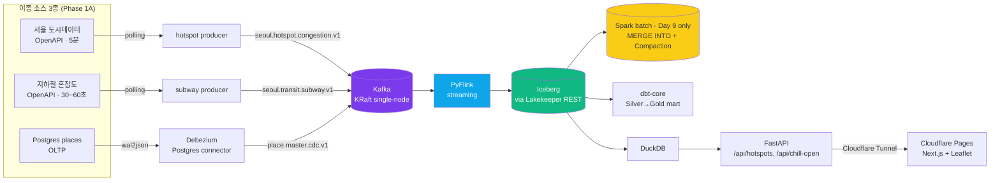
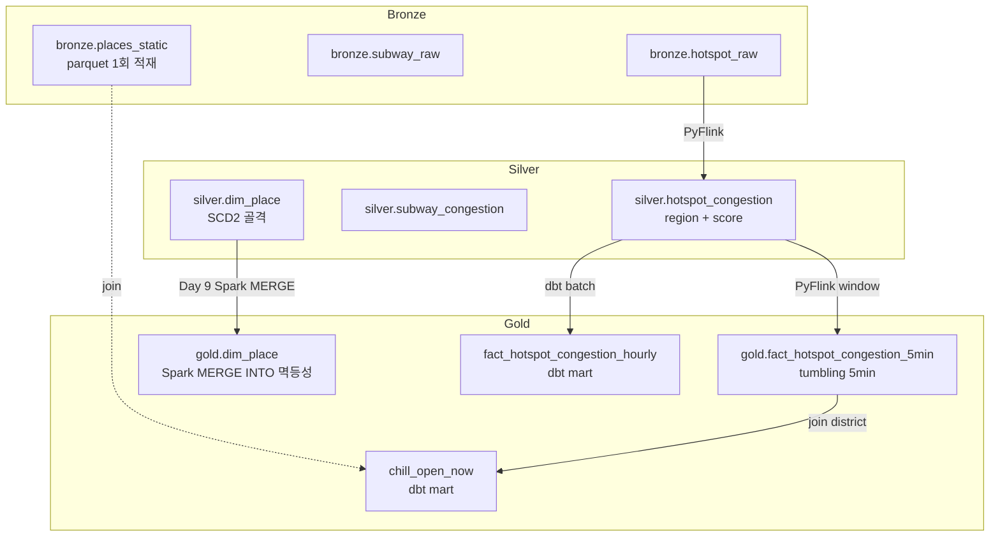
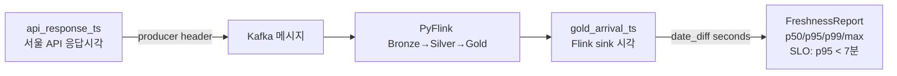

# Phase 1A Week 2 Implementation Plan (Day 6~10)

> **For agentic workers:** REQUIRED SUB-SKILL: Use superpowers:subagent-driven-development (recommended) or superpowers:executing-plans to implement this plan task-by-task. Steps use checkbox (`- [ ]`) syntax for tracking.

**Goal:** Week 1 의 Kafka → PyFlink → Iceberg(Lakekeeper) → dbt 파이프라인 위에 **CDC (Debezium → `dim_place` SCD2 골격)**, **Next.js 메인 지도 + Cloudflare Pages 공개 도메인**, **"지금 한가하고 영업 중" 데모 화면**, **Spark MERGE INTO 멱등성 + Compaction (1번 포트폴리오 미해결 이슈 closure)**, 그리고 **Phase 1A 단독 5~6페이지 포트폴리오 1차 제출본** 까지 완성한다.

**Architecture:** Week 1 docker-compose 에 `kafka-connect` + Debezium Postgres connector 를 추가하고, `places` 테이블 변경이 `place.master.cdc.v1` 토픽으로 흐른 뒤 PyFlink 가 Iceberg `silver.dim_place` 로 SCD Type 2 골격을 적재한다. Next.js (정적 export) + FastAPI (Cloudflare Tunnel 노출) 으로 메인 지도와 "한가하고 영업 중" 페이지를 띄운다. Day 9 는 Spark batch 컨테이너를 일시 기동해 Iceberg `MERGE INTO` 멱등성 + `rewrite_data_files` Compaction 을 측정해 1번 포트폴리오의 "Dynamic Partition Overwrite 예정 / Compaction 도입 예정" 두 미해결 이슈를 closure 한다. Day 10 에 모든 산출물을 5~6p 포트폴리오 1차 제출본으로 정리한다.

**Tech Stack:** Debezium 2.7 (Postgres connector), Kafka Connect, Apache Spark 3.5 + iceberg-spark-runtime 1.7, Next.js 14 (App Router, static export), Leaflet 1.9 + OpenStreetMap, FastAPI 0.115 + Uvicorn, Cloudflare Pages, Cloudflare Tunnel, mermaid (다이어그램).

**Spec:** `docs/superpowers/specs/2026-04-30-seoul-citydata-platform-phase1-design.md` 의 §6-1 Day 6~10, §6-3 포트폴리오 5~6p 구조, §8 차별화 서사, §9-1 Day 6/7/9 fallback 트리거.

**전제 (Week 1 종료 게이트 통과):**
- Week 1 plan 의 Day 5 종료 게이트 모두 충족 (`./scripts/healthcheck.sh` OK, pytest 20 PASS, Iceberg 3 layer rows > 0, SLO P95 < 7분, dbt 6 tests, GHA green)
- 토픽 4개 + warehouse `seoul` 등록 완료
- 핫스팟 producer / Bronze→Silver→Gold streaming job 이 가동 가능한 상태 (실제로 가동 중일 필요는 없음, 필요 시 재기동)
- Day 0 항목 중 **공공데이터 인허가 정보 일반음식점 CSV** 다운로드 완료 (Day 8 에서 사용)
- Cloudflare 계정 + Pages + Tunnel 활성화 (Day 7)

---

## File Structure (Week 2 추가/수정 분만 표시)

Week 1 의 구조 위에 다음을 추가:

```
seoul-citydata-platform/
├── docker-compose.yml                     (Week 1 → Week 2 modify: kafka-connect 서비스 추가)
├── infra/
│   ├── debezium/
│   │   ├── connector-places.json          (Task 6.1 신규)
│   │   └── register.sh                    (Task 6.1 신규)
│   ├── postgres/
│   │   └── seed_places.sql                (Task 6.2 신규)
│   └── spark/
│       ├── Dockerfile                     (Task 9.1 신규)
│       ├── conf/
│       │   ├── spark-defaults.conf        (Task 9.1 신규)
│       │   └── log4j2.properties          (Task 9.1 신규)
│       └── jobs/
│           ├── merge_dim_place.py         (Task 9.2 신규)
│           ├── compaction_silver.py       (Task 9.3 신규)
│           └── cost_report.py             (Task 9.3 신규)
├── src/
│   ├── flink_jobs/
│   │   ├── cdc_to_dim_place.py            (Task 6.3 신규)
│   │   └── lib/
│   │       └── scd2.py                    (Task 6.3 신규 — pure functions)
│   └── api/
│       ├── __init__.py                    (Task 7.2 신규)
│       ├── main.py                        (Task 7.2 신규 — FastAPI app)
│       ├── deps.py                        (Task 7.2 신규 — DuckDB 커넥션)
│       └── routes/
│           ├── __init__.py                (Task 7.2 신규)
│           ├── hotspots.py                (Task 7.2 신규)
│           └── chill_open.py              (Task 8.2 신규)
├── tests/
│   ├── unit/
│   │   ├── test_scd2.py                   (Task 6.3 신규)
│   │   └── test_chill_open_query.py       (Task 8.2 신규)
│   └── integration/
│       ├── __init__.py                    (Task 7.2 신규)
│       └── test_api_hotspots.py           (Task 7.2 신규)
├── web/
│   ├── package.json                       (Task 7.1 신규)
│   ├── pnpm-lock.yaml                     (자동 생성)
│   ├── next.config.mjs                    (Task 7.1 신규)
│   ├── tsconfig.json                      (Task 7.1 신규)
│   ├── postcss.config.mjs                 (Task 7.1 신규)
│   ├── tailwind.config.ts                 (Task 7.1 신규)
│   ├── app/
│   │   ├── layout.tsx                     (Task 7.1 신규)
│   │   ├── page.tsx                       (Task 7.3 신규 — 메인 지도)
│   │   ├── chill/
│   │   │   └── page.tsx                   (Task 8.3 신규 — 한가/영업중)
│   │   ├── privacy/
│   │   │   └── page.tsx                   (Task 7.1 신규 — 1줄 개인정보 처리방침)
│   │   └── globals.css                    (Task 7.1 신규)
│   ├── components/
│   │   ├── HotspotMap.tsx                 (Task 7.3 신규)
│   │   └── ChillList.tsx                  (Task 8.3 신규)
│   └── public/
│       └── favicon.svg                    (Task 7.1 신규)
├── data/
│   └── reference/
│       └── places_seed_sample.csv         (Task 8.1 신규)
├── dbt/
│   └── seoul/
│       ├── models/
│       │   ├── sources.yml                (Week 1 → Week 2 modify: dim_place + bronze.places_static)
│       │   └── marts/
│       │       ├── dim_place.sql          (Task 6.4 신규 — staging-style view)
│       │       └── chill_open_now.sql     (Task 8.2 신규 — 가장 핵심 mart)
├── infra/
│   └── cloudflare/
│       ├── tunnel-config.example.yml      (Task 7.4 신규)
│       └── README.md                      (Task 7.4 신규)
├── docs/
│   ├── runbook/
│   │   ├── day6_cdc.md                    (Task 6.4 신규)
│   │   ├── day7_deploy.md                 (Task 7.4 신규)
│   │   └── day9_spark.md                  (Task 9.3 신규)
│   ├── architecture/
│   │   ├── system_diagram.md              (Task 10.1 신규 — mermaid)
│   │   └── data_lineage.md                (Task 10.1 신규)
│   └── portfolio/
│       └── phase1a_v1.md                  (Task 10.2 신규 — 포트폴리오 5~6p)
└── README.md                              (Week 1 → Week 2 modify: 전체 사용법으로 확장)
```

---

## Conventions (Week 1 와 동일)

- **커밋 메시지**: Conventional Commits.
- **각 Task 의 마지막 Step = commit**.
- **Run 명령은 repo 루트에서 실행** (별도 명시 없는 한).
- **secrets / Cloudflare 토큰**: 절대 commit 금지. `.env` / `infra/cloudflare/credentials/*.json` 모두 `.gitignore`.
- **Iceberg 카탈로그 alias**: PyFlink/Spark 양쪽 모두 `ice` (catalog alias) + `seoul` (warehouse db namespace).
- **dim_place 테이블**: `silver.dim_place` (PyFlink 가 SCD2 골격으로 적재) + `gold.dim_place` (Day 9 Spark MERGE INTO 검증 대상).

---

## Day 6 — Postgres CDC (Debezium → `place.master.cdc.v1` → PyFlink → `silver.dim_place` SCD2 골격)

**Day 6 목표 (spec §6-1):** Postgres `places` 테이블의 INSERT/UPDATE/DELETE 가 Debezium 을 거쳐 `place.master.cdc.v1` 토픽에 흐르고, PyFlink job 이 이를 소비해 Iceberg `silver.dim_place` 에 SCD Type 2 골격으로 적재한다. **SCD2 본격 다출처 머지는 Phase 2** (spec §4-2). 여기서는 단일 출처 골격만.

### Task 6.1: Kafka Connect + Debezium Postgres connector

**Files:**
- Modify: `docker-compose.yml` (kafka-connect 서비스 추가)
- Create: `infra/debezium/connector-places.json`
- Create: `infra/debezium/register.sh`

- [ ] **Step 1: docker-compose.yml 에 kafka-connect 서비스 append**

기존 `services:` 블록 하단(volumes 직전)에 추가:

```yaml
  kafka-connect:
    image: debezium/connect:2.7
    container_name: scp-kafka-connect
    depends_on:
      kafka:
        condition: service_healthy
      postgres:
        condition: service_healthy
    ports:
      - "8083:8083"
    environment:
      BOOTSTRAP_SERVERS: kafka:9092
      GROUP_ID: scp-connect
      CONFIG_STORAGE_TOPIC: _scp_connect_configs
      OFFSET_STORAGE_TOPIC: _scp_connect_offsets
      STATUS_STORAGE_TOPIC: _scp_connect_status
      CONFIG_STORAGE_REPLICATION_FACTOR: 1
      OFFSET_STORAGE_REPLICATION_FACTOR: 1
      STATUS_STORAGE_REPLICATION_FACTOR: 1
      KEY_CONVERTER: org.apache.kafka.connect.json.JsonConverter
      VALUE_CONVERTER: org.apache.kafka.connect.json.JsonConverter
      KEY_CONVERTER_SCHEMAS_ENABLE: "false"
      VALUE_CONVERTER_SCHEMAS_ENABLE: "false"
    healthcheck:
      test: ["CMD-SHELL", "curl -sf http://localhost:8083/ || exit 1"]
      interval: 10s
      timeout: 5s
      retries: 18
```

> Kafka 컨테이너 안 hostname 은 `kafka` 가 아니라 `localhost` 광고 모드로 떠 있다 (Week 1 KAFKA_CFG_ADVERTISED_LISTENERS=PLAINTEXT://localhost:9092). connect 컨테이너는 docker network 안에서 접근하므로 advertised 가 localhost 면 연결 실패한다. **bootstrap 을 `kafka:9092` 로 바꾸기 위해 advertised listener 를 dual 로 수정한다**:

기존 Kafka 서비스의 `KAFKA_CFG_ADVERTISED_LISTENERS` 라인을 다음으로 교체:

```yaml
      KAFKA_CFG_LISTENERS: INTERNAL://:29092,EXTERNAL://:9092,CONTROLLER://:9093
      KAFKA_CFG_ADVERTISED_LISTENERS: INTERNAL://kafka:29092,EXTERNAL://localhost:9092
      KAFKA_CFG_LISTENER_SECURITY_PROTOCOL_MAP: CONTROLLER:PLAINTEXT,INTERNAL:PLAINTEXT,EXTERNAL:PLAINTEXT
      KAFKA_CFG_INTER_BROKER_LISTENER_NAME: INTERNAL
```

기존 `KAFKA_CFG_LISTENERS`, `KAFKA_CFG_LISTENER_SECURITY_PROTOCOL_MAP`, `KAFKA_CFG_INTER_BROKER_LISTENER_NAME` 라인은 위 4 줄로 대체된다. 호스트(macOS) 에서는 여전히 `localhost:9092` 로 접속 가능하고, docker network 안의 `kafka-connect` 는 `kafka:29092` 를 사용한다.

connect 서비스의 `BOOTSTRAP_SERVERS` 는 `kafka:29092` 로 수정:

```yaml
      BOOTSTRAP_SERVERS: kafka:29092
```

- [ ] **Step 2: 재기동 + healthcheck**

Run: `docker compose up -d`
Run: `./scripts/healthcheck.sh`
Expected: 모든 서비스 healthy. 추가로:

Run: `curl -sf http://localhost:8083/ | head -c 200`
Expected: `{"version":"3.7.x", ...}` 형태 JSON.

- [ ] **Step 3: 기존 producer 가 여전히 동작하는지 회귀 확인**

advertised listener 변경으로 host 측 클라이언트가 깨질 수 있음 — 회귀 검증.

Run: `./infra/kafka/create_topics.sh`
Expected: 4개 토픽 모두 `already exists, skipping`.

Run: `uv run python -c "from confluent_kafka import Producer; p = Producer({'bootstrap.servers':'localhost:9092'}); p.produce('seoul.hotspot.congestion.v1','test',b'{}'); p.flush()"`
Expected: 에러 없음.

- [ ] **Step 4: infra/debezium/connector-places.json 작성**

```json
{
  "name": "scp-pg-places",
  "config": {
    "connector.class": "io.debezium.connector.postgresql.PostgresConnector",
    "tasks.max": "1",
    "database.hostname": "postgres",
    "database.port": "5432",
    "database.user": "scp",
    "database.password": "scp_dev_password",
    "database.dbname": "scp",
    "database.server.name": "scp",
    "topic.prefix": "scp",
    "plugin.name": "pgoutput",
    "publication.autocreate.mode": "filtered",
    "slot.name": "scp_places_slot",
    "schema.include.list": "public",
    "table.include.list": "public.places",
    "snapshot.mode": "initial",
    "tombstones.on.delete": "false",
    "transforms": "rename",
    "transforms.rename.type": "org.apache.kafka.connect.transforms.RegexRouter",
    "transforms.rename.regex": "scp\\.public\\.places",
    "transforms.rename.replacement": "place.master.cdc.v1",
    "key.converter.schemas.enable": "false",
    "value.converter.schemas.enable": "false"
  }
}
```

> RegexRouter 로 기본 토픽명 `scp.public.places` 를 spec §4-3 의 `place.master.cdc.v1` 로 매핑한다.

- [ ] **Step 5: infra/debezium/register.sh 작성**

```bash
#!/usr/bin/env bash
set -euo pipefail

CONNECT_URL="${CONNECT_URL:-http://localhost:8083}"
CONFIG="$(dirname "$0")/connector-places.json"

echo "== existing connectors =="
curl -sf "${CONNECT_URL}/connectors"
echo

if curl -sf "${CONNECT_URL}/connectors/scp-pg-places" >/dev/null 2>&1; then
  echo "deleting existing scp-pg-places ..."
  curl -X DELETE "${CONNECT_URL}/connectors/scp-pg-places"
  sleep 2
fi

echo "registering scp-pg-places ..."
curl -sf -X POST -H "Content-Type: application/json" \
  --data @"${CONFIG}" "${CONNECT_URL}/connectors" | head -c 500
echo

echo
echo "== status =="
sleep 3
curl -sf "${CONNECT_URL}/connectors/scp-pg-places/status"
```

Run: `chmod +x infra/debezium/register.sh`

- [ ] **Step 6: Commit (등록은 Task 6.2 에서 places 테이블 생성 후)**

```bash
git add docker-compose.yml infra/debezium/connector-places.json infra/debezium/register.sh
git commit -m "feat: kafka-connect + debezium postgres connector for places"
```

---

### Task 6.2: Postgres `places` 테이블 시드

**Files:**
- Create: `infra/postgres/seed_places.sql`

**근거:** spec §3 — Postgres `places` 마스터 + Day 6 CDC 데모. Day 8 의 "한가하고 영업 중" 화면도 places 를 참조.

- [ ] **Step 1: seed_places.sql 작성**

```sql
-- Day 6 CDC 데모용 places 마스터.
-- replica identity FULL → DELETE/UPDATE 시 이전 값까지 Debezium 으로 흐른다.

CREATE TABLE IF NOT EXISTS places (
    place_id        BIGSERIAL PRIMARY KEY,
    biz_reg_no      TEXT UNIQUE,                 -- 사업자등록번호 (정규)
    name            TEXT NOT NULL,
    category        TEXT NOT NULL,               -- '카페', '음식점', '편의점' 등
    district        TEXT NOT NULL,
    gu_code         TEXT NOT NULL,
    latitude        DOUBLE PRECISION,
    longitude       DOUBLE PRECISION,
    open_hour       INTEGER,                     -- 0~23
    close_hour      INTEGER,                     -- 0~23, close_hour < open_hour 이면 자정 넘김
    status          TEXT NOT NULL DEFAULT 'active',  -- 'active' | 'closed'
    created_at      TIMESTAMPTZ NOT NULL DEFAULT now(),
    updated_at      TIMESTAMPTZ NOT NULL DEFAULT now()
);
ALTER TABLE places REPLICA IDENTITY FULL;

CREATE OR REPLACE FUNCTION places_touch_updated_at() RETURNS TRIGGER AS $$
BEGIN
    NEW.updated_at = now();
    RETURN NEW;
END;
$$ LANGUAGE plpgsql;

DROP TRIGGER IF EXISTS trg_places_updated_at ON places;
CREATE TRIGGER trg_places_updated_at
    BEFORE UPDATE ON places
    FOR EACH ROW
    EXECUTE FUNCTION places_touch_updated_at();

-- Day 6 데모용 시드 (자치구는 Week 1 hotspot_regions.csv 와 일치)
INSERT INTO places (biz_reg_no, name, category, district, gu_code, latitude, longitude, open_hour, close_hour)
VALUES
    ('1208612345', '강남 모닝카페', '카페', '강남구', '11680', 37.4985, 127.0280, 7, 23),
    ('1208612346', '홍대 24시 분식', '음식점', '마포구', '11440', 37.5572, 126.9242, 0, 24),
    ('1208612347', '여의도 브런치', '카페', '영등포구', '11560', 37.5215, 126.9248, 9, 21),
    ('1208612348', '종로 한정식', '음식점', '종로구', '11110', 37.5703, 126.9915, 11, 22),
    ('1208612349', '성수 로스터리', '카페', '성동구', '11200', 37.5450, 127.0560, 8, 23)
ON CONFLICT (biz_reg_no) DO NOTHING;
```

- [ ] **Step 2: 적용**

Run:
```bash
docker compose exec -T postgres psql -U scp -d scp < infra/postgres/seed_places.sql
```
Expected: `CREATE TABLE`, `INSERT 0 5`. (재실행 시 `INSERT 0 0`).

검증:
Run: `docker compose exec -T postgres psql -U scp -d scp -c "SELECT count(*) FROM places;"`
Expected: `5`.

- [ ] **Step 3: Debezium connector 등록**

Run: `./infra/debezium/register.sh`
Expected: 마지막 status JSON 에 `"connector":{"state":"RUNNING"}` + `"tasks":[{...,"state":"RUNNING"}]`.

- [ ] **Step 4: 토픽 흐름 확인**

Debezium initial snapshot 이 5행 발행:
Run:
```bash
docker compose exec -T kafka /opt/bitnami/kafka/bin/kafka-console-consumer.sh \
  --bootstrap-server localhost:9092 \
  --topic place.master.cdc.v1 \
  --from-beginning --max-messages 5 --timeout-ms 10000
```
Expected: 5개 JSON 메시지. 각 메시지에 `before`, `after`, `op` (`r` = read/snapshot), `ts_ms` 등.

CDC live test:
Run: `docker compose exec -T postgres psql -U scp -d scp -c "UPDATE places SET name='강남 모닝카페 ☕' WHERE biz_reg_no='1208612345';"`
Run:
```bash
docker compose exec -T kafka /opt/bitnami/kafka/bin/kafka-console-consumer.sh \
  --bootstrap-server localhost:9092 \
  --topic place.master.cdc.v1 \
  --max-messages 1 --timeout-ms 10000
```
Expected: 1개 메시지. `op:"u"`, `before.name:"강남 모닝카페"`, `after.name:"강남 모닝카페 ☕"`.

- [ ] **Step 5: Commit**

```bash
git add infra/postgres/seed_places.sql
git commit -m "feat: postgres places seed + cdc smoke verified"
```

---

### Task 6.3: PyFlink CDC 컨슈머 + SCD Type 2 골격 (TDD pure functions)

**Files:**
- Create: `src/flink_jobs/lib/scd2.py`
- Create: `tests/unit/test_scd2.py`
- Create: `src/flink_jobs/cdc_to_dim_place.py`

**근거:** spec §4-2 — `dim_place` SCD Type 2 골격. spec §6-1 Day 6 — PyFlink → `dim_place`.

**디자인:** `cdc_to_dim_place.py` 는 Debezium envelope (`op`, `before`, `after`, `ts_ms`) 를 풀어 SCD2 row 로 변환한다. SCD2 본격 머지(Type 2 closure) 는 Day 9 Spark MERGE INTO 에서 다루고, 본 task 의 PyFlink 는 **변경 이벤트를 그대로 append-only 로 적재** (각 변경마다 `valid_from`, `valid_to=NULL`, `is_current` 플래그). Day 9 Spark batch 가 같은 `place_id` 의 직전 행 `valid_to` 를 닫고 `is_current=false` 로 갱신한다 (= 1번 미해결 closure 의 일환).

- [ ] **Step 1: 실패 테스트 작성**

`tests/unit/test_scd2.py`:

```python
from datetime import datetime, timezone

import pytest

from flink_jobs.lib.scd2 import (
    Scd2Row,
    parse_debezium_envelope,
    to_scd2_row,
)


def _envelope(op: str, after: dict | None, before: dict | None = None, ts_ms: int = 1714490000000):
    return {"op": op, "before": before, "after": after, "ts_ms": ts_ms}


def test_parse_debezium_envelope_create():
    after = {"place_id": 1, "biz_reg_no": "BR1", "name": "A", "category": "카페",
             "district": "강남구", "gu_code": "11680",
             "latitude": 37.5, "longitude": 127.0,
             "open_hour": 9, "close_hour": 22, "status": "active",
             "created_at": "2026-04-30T00:00:00Z", "updated_at": "2026-04-30T00:00:00Z"}
    rec = parse_debezium_envelope(_envelope("c", after))
    assert rec is not None
    assert rec.op == "c"
    assert rec.payload["place_id"] == 1


def test_parse_debezium_envelope_delete_uses_before():
    before = {"place_id": 2, "name": "X", "biz_reg_no": "BR2",
              "category": "음식점", "district": "마포구", "gu_code": "11440",
              "latitude": 37.5, "longitude": 126.9,
              "open_hour": 0, "close_hour": 24, "status": "active",
              "created_at": "2026-04-30T00:00:00Z", "updated_at": "2026-04-30T00:00:00Z"}
    rec = parse_debezium_envelope(_envelope("d", after=None, before=before))
    assert rec is not None
    assert rec.op == "d"
    assert rec.payload["place_id"] == 2


def test_parse_debezium_envelope_returns_none_when_no_payload():
    assert parse_debezium_envelope(_envelope("u", after=None, before=None)) is None


def test_to_scd2_row_create_marks_current():
    after = {"place_id": 1, "biz_reg_no": "BR1", "name": "A", "category": "카페",
             "district": "강남구", "gu_code": "11680",
             "latitude": 37.5, "longitude": 127.0,
             "open_hour": 9, "close_hour": 22, "status": "active",
             "created_at": "2026-04-30T00:00:00Z", "updated_at": "2026-04-30T00:00:00Z"}
    rec = parse_debezium_envelope(_envelope("c", after, ts_ms=1714490000000))
    row = to_scd2_row(rec)
    assert isinstance(row, Scd2Row)
    assert row.place_id == 1
    assert row.is_current is True
    assert row.valid_from == datetime(2024, 4, 30, 12, 33, 20, tzinfo=timezone.utc).replace(tzinfo=None)
    assert row.valid_to is None
    assert row.cdc_op == "c"


def test_to_scd2_row_delete_marks_not_current():
    before = {"place_id": 2, "biz_reg_no": "BR2", "name": "X", "category": "음식점",
              "district": "마포구", "gu_code": "11440",
              "latitude": 37.5, "longitude": 126.9,
              "open_hour": 0, "close_hour": 24, "status": "active",
              "created_at": "2026-04-30T00:00:00Z", "updated_at": "2026-04-30T00:00:00Z"}
    rec = parse_debezium_envelope(_envelope("d", after=None, before=before, ts_ms=1714490000000))
    row = to_scd2_row(rec)
    assert row.is_current is False
    assert row.cdc_op == "d"
```

- [ ] **Step 2: 실패 확인**

Run: `uv run pytest tests/unit/test_scd2.py -v`
Expected: ImportError.

- [ ] **Step 3: src/flink_jobs/lib/scd2.py 작성**

```python
"""SCD Type 2 골격 변환 (Debezium envelope → SCD2 row)."""
from __future__ import annotations

from dataclasses import dataclass
from datetime import datetime, timezone
from typing import Any


@dataclass(frozen=True)
class CdcRecord:
    op: str   # "c" | "u" | "d" | "r" (snapshot read)
    payload: dict[str, Any]
    ts_ms: int


@dataclass(frozen=True)
class Scd2Row:
    place_id: int
    biz_reg_no: str
    name: str
    category: str
    district: str
    gu_code: str
    latitude: float | None
    longitude: float | None
    open_hour: int | None
    close_hour: int | None
    status: str
    cdc_op: str
    valid_from: datetime
    valid_to: datetime | None
    is_current: bool


def parse_debezium_envelope(env: dict[str, Any]) -> CdcRecord | None:
    op = env.get("op")
    if op not in ("c", "u", "d", "r"):
        return None
    payload = env.get("after") if op != "d" else env.get("before")
    if not payload:
        return None
    return CdcRecord(op=op, payload=payload, ts_ms=int(env.get("ts_ms", 0)))


def to_scd2_row(rec: CdcRecord) -> Scd2Row:
    p = rec.payload
    valid_from = datetime.fromtimestamp(rec.ts_ms / 1000, tz=timezone.utc).replace(tzinfo=None)
    return Scd2Row(
        place_id=int(p["place_id"]),
        biz_reg_no=str(p.get("biz_reg_no") or ""),
        name=str(p.get("name") or ""),
        category=str(p.get("category") or ""),
        district=str(p.get("district") or ""),
        gu_code=str(p.get("gu_code") or ""),
        latitude=p.get("latitude"),
        longitude=p.get("longitude"),
        open_hour=p.get("open_hour"),
        close_hour=p.get("close_hour"),
        status=str(p.get("status") or "active"),
        cdc_op=rec.op,
        valid_from=valid_from,
        valid_to=None,                         # Day 9 Spark MERGE 에서 닫음
        is_current=(rec.op != "d"),            # delete 면 false, 그 외 true
    )
```

- [ ] **Step 4: 단위 테스트 통과**

Run: `uv run pytest tests/unit/test_scd2.py -v`
Expected: 5개 PASS.

- [ ] **Step 5: src/flink_jobs/cdc_to_dim_place.py 작성**

```python
"""Debezium `place.master.cdc.v1` → Iceberg silver.dim_place (append SCD2 골격).

valid_to 닫기는 Day 9 Spark MERGE 가 담당. 본 job 은 streaming append-only.

Run:
  uv run --extra flink python -m flink_jobs.cdc_to_dim_place
"""
from __future__ import annotations

import logging
import os

from pyflink.table import EnvironmentSettings, TableEnvironment

from flink_jobs.bronze_to_silver import _classpath
from flink_jobs.lib.iceberg_sink import register_iceberg_catalog, warehouse_namespace

logging.basicConfig(level=logging.INFO)


def build_env() -> TableEnvironment:
    settings = EnvironmentSettings.in_streaming_mode()
    t_env = TableEnvironment.create(settings)
    t_env.get_config().set("pipeline.jars", _classpath())
    t_env.get_config().set("parallelism.default", "1")
    t_env.get_config().set("execution.checkpointing.interval", "60 s")
    return t_env


def register_cdc_source(t_env: TableEnvironment) -> None:
    bootstrap = os.environ.get("KAFKA_BOOTSTRAP_SERVERS", "localhost:9092")
    # Debezium envelope (schemas disabled): {op, before, after, ts_ms, source}
    ddl = f"""
    CREATE TEMPORARY TABLE place_cdc_src (
      op STRING,
      ts_ms BIGINT,
      `before` ROW<
        place_id BIGINT, biz_reg_no STRING, name STRING, category STRING,
        district STRING, gu_code STRING,
        latitude DOUBLE, longitude DOUBLE,
        open_hour INT, close_hour INT, status STRING
      >,
      `after` ROW<
        place_id BIGINT, biz_reg_no STRING, name STRING, category STRING,
        district STRING, gu_code STRING,
        latitude DOUBLE, longitude DOUBLE,
        open_hour INT, close_hour INT, status STRING
      >
    ) WITH (
      'connector' = 'kafka',
      'topic' = 'place.master.cdc.v1',
      'properties.bootstrap.servers' = '{bootstrap}',
      'properties.group.id' = 'flink-cdc-dim-place',
      'scan.startup.mode' = 'earliest-offset',
      'format' = 'json',
      'json.ignore-parse-errors' = 'true'
    )
    """
    t_env.execute_sql(ddl)


def create_dim_place_table(t_env: TableEnvironment) -> None:
    cat = warehouse_namespace()
    t_env.execute_sql(
        f"""
        CREATE TABLE IF NOT EXISTS ice.{cat}.silver.dim_place (
          place_id BIGINT,
          biz_reg_no STRING,
          name STRING,
          category STRING,
          district STRING,
          gu_code STRING,
          latitude DOUBLE,
          longitude DOUBLE,
          open_hour INT,
          close_hour INT,
          status STRING,
          cdc_op STRING,
          valid_from TIMESTAMP(3),
          valid_to TIMESTAMP(3),
          is_current BOOLEAN
        ) PARTITIONED BY (district)
        WITH ('format-version' = '2')
        """
    )


def run() -> None:
    t_env = build_env()
    register_iceberg_catalog(t_env, catalog_alias="ice")
    cat = warehouse_namespace()

    register_cdc_source(t_env)
    create_dim_place_table(t_env)

    t_env.execute_sql(
        f"""
        INSERT INTO ice.{cat}.silver.dim_place
        SELECT
          COALESCE(`after`.place_id, `before`.place_id)        AS place_id,
          COALESCE(`after`.biz_reg_no, `before`.biz_reg_no)    AS biz_reg_no,
          COALESCE(`after`.name, `before`.name)                AS name,
          COALESCE(`after`.category, `before`.category)        AS category,
          COALESCE(`after`.district, `before`.district)        AS district,
          COALESCE(`after`.gu_code, `before`.gu_code)          AS gu_code,
          COALESCE(`after`.latitude, `before`.latitude)        AS latitude,
          COALESCE(`after`.longitude, `before`.longitude)      AS longitude,
          COALESCE(`after`.open_hour, `before`.open_hour)      AS open_hour,
          COALESCE(`after`.close_hour, `before`.close_hour)    AS close_hour,
          COALESCE(`after`.status, `before`.status)            AS status,
          op                                                    AS cdc_op,
          TO_TIMESTAMP_LTZ(ts_ms, 3)                            AS valid_from,
          CAST(NULL AS TIMESTAMP(3))                            AS valid_to,
          (op <> 'd')                                           AS is_current
        FROM place_cdc_src
        WHERE op IN ('c','u','d','r')
        """
    )


if __name__ == "__main__":
    run()
```

- [ ] **Step 6: smoke run + 검증**

Run:
```bash
uv run --extra flink python -m flink_jobs.cdc_to_dim_place &
FPID=$!
sleep 60
# CDC 이벤트 1개 트리거
docker compose exec -T postgres psql -U scp -d scp -c "UPDATE places SET name='홍대 24시 분식 v2' WHERE biz_reg_no='1208612346';"
sleep 30
kill $FPID 2>/dev/null || true
```

DuckDB 검증:
Run:
```bash
uv run python -c "
import duckdb
con = duckdb.connect()
con.execute(\"INSTALL iceberg; LOAD iceberg; INSTALL httpfs; LOAD httpfs;\")
con.execute(\"CREATE OR REPLACE SECRET (TYPE S3, KEY_ID 'minioadmin', SECRET 'minioadmin', ENDPOINT 'localhost:9000', URL_STYLE 'path', USE_SSL false, REGION 'us-east-1')\")
print(con.execute(\"SELECT place_id, name, cdc_op, valid_from FROM iceberg_scan('s3://seoul-warehouse/warehouse/silver/dim_place') ORDER BY valid_from DESC LIMIT 10\").fetchall())
"
```
Expected: 6행 이상 (initial snapshot 5 + update 1). update 행은 `cdc_op='u'`, `name='홍대 24시 분식 v2'`.

- [ ] **Step 7: Commit**

```bash
git add src/flink_jobs/lib/scd2.py tests/unit/test_scd2.py src/flink_jobs/cdc_to_dim_place.py
git commit -m "feat: pyflink cdc consumer for silver.dim_place scd2 skeleton"
```

---

### Task 6.4: dbt source 갱신 + Day 6 runbook + fallback 가드

**Files:**
- Modify: `dbt/seoul/models/sources.yml` (silver.dim_place 추가)
- Create: `dbt/seoul/models/marts/dim_place.sql`
- Create: `docs/runbook/day6_cdc.md`

**근거:** spec §6-1 Day 6 산출물 = "CDC 동작 데모". spec §9-1 Day 6 fallback = Postgres outbox + 폴링 producer.

- [ ] **Step 1: dbt sources.yml 갱신**

`dbt/seoul/models/sources.yml` 의 `tables:` 리스트에 추가:

```yaml
      - name: dim_place
        description: SCD2 골격 — 각 CDC 변경마다 append. valid_to 닫기는 Day 9 Spark.
        meta:
          external_location: "s3://seoul-warehouse/warehouse/silver/dim_place"
        columns:
          - name: place_id
          - name: cdc_op
          - name: valid_from
          - name: valid_to
          - name: is_current
```

- [ ] **Step 2: dbt mart `dim_place.sql` (current snapshot view)**

```sql
{{ config(materialized='view', schema='gold') }}

-- "현재 활성" 가게만 추출. SCD2 폐쇄 전이라도 latest 1행으로 좁힌다.
with ranked as (
    select
        *,
        row_number() over (partition by place_id order by valid_from desc) as rn
    from {{ source('silver', 'dim_place') }}
)
select
    place_id, biz_reg_no, name, category, district, gu_code,
    latitude, longitude, open_hour, close_hour, status,
    valid_from
from ranked
where rn = 1
  and cdc_op <> 'd'
  and status = 'active'
```

- [ ] **Step 3: dbt run + test**

Run:
```bash
cd dbt/seoul
DBT_PROFILES_DIR=$(pwd) uv run --project ../.. dbt run
DBT_PROFILES_DIR=$(pwd) uv run --project ../.. dbt test
cd ../..
```
Expected: 3 models (stg + hourly + dim_place) + 6 tests PASS.

- [ ] **Step 4: docs/runbook/day6_cdc.md 작성**

```markdown
# Day 6 CDC Runbook

## 정상 경로
1. `docker compose up -d` → kafka-connect healthy 대기
2. `docker compose exec -T postgres psql -U scp -d scp < infra/postgres/seed_places.sql` (재실행 가능)
3. `./infra/debezium/register.sh` → `RUNNING` 확인
4. `uv run --extra flink python -m flink_jobs.cdc_to_dim_place` 백그라운드 가동

## CDC 검증 한 줄
```bash
docker compose exec -T postgres psql -U scp -d scp \
  -c "UPDATE places SET name = name || ' *' WHERE biz_reg_no='1208612345';"
```
이후 30~60초 안에 `silver.dim_place` 에 `cdc_op='u'` 한 행 추가.

## fallback 트리거 (spec §9-1 Day 6)

Debezium 셋업 4시간 초과 시 우회:
1. `places` 테이블 옆에 `places_outbox(place_id, op, payload_json, created_at)` 생성
2. application trigger 가 INSERT/UPDATE/DELETE 마다 outbox 에 한 행 append
3. 폴링 producer 가 `created_at > last_seen` 만 읽어 `place.master.cdc.v1` 으로 발행
4. 이 경우 SCD2 골격은 그대로 유지, "Debezium 도입 시도 + 트레이드오프" 를 portfolio 에 솔직히 기술

## 자주 발생하는 문제

| 증상 | 조치 |
|---|---|
| connector status `FAILED` + `replication slot already exists` | `docker compose exec postgres psql -U scp -d scp -c "SELECT pg_drop_replication_slot('scp_places_slot');"` 후 재등록 |
| Flink job 이 Debezium 메시지를 `op IS NULL` 로 인식 | connect 워커의 `VALUE_CONVERTER_SCHEMAS_ENABLE=false` 확인. envelope 이 schema 래핑 없는 plain JSON 이어야 함. |
| 토픽이 `scp.public.places` 로 만들어짐 | RegexRouter 설정이 안 먹은 것. `connector-places.json` 의 `transforms.rename.*` 재확인 후 connector 삭제+재등록. |
```

- [ ] **Step 5: Commit**

```bash
git add dbt/seoul/models/sources.yml dbt/seoul/models/marts/dim_place.sql docs/runbook/day6_cdc.md
git commit -m "feat: dim_place dbt mart + day6 cdc runbook"
```

**Day 6 종료 게이트:** `silver.dim_place` rows ≥ 6 (snapshot 5 + 변경 1) + `cdc_op` 다양성 (`r` 또는 `c`, `u`) 확인 + dbt mart `dim_place` 빌드 성공. 미달 시 Day 7 진입 금지.

---

## Day 7 — Next.js 메인 지도 + Cloudflare Pages 배포

**Day 7 목표 (spec §6-1):** 핫스팟 120개(샘플 10개) 의 latest `congest_level_score` 를 자치구 색상으로 보여주는 Next.js 단일 페이지를 띄우고, **공개 도메인** 으로 노출한다. 데이터 흐름은 브라우저 → Cloudflare Pages (정적) → fetch → Cloudflare Tunnel → FastAPI → DuckDB → Iceberg.

### Task 7.1: Next.js 14 + Tailwind + Leaflet 골격

**Files:**
- Create: `web/package.json`
- Create: `web/next.config.mjs`
- Create: `web/tsconfig.json`
- Create: `web/postcss.config.mjs`
- Create: `web/tailwind.config.ts`
- Create: `web/app/layout.tsx`
- Create: `web/app/globals.css`
- Create: `web/app/privacy/page.tsx`
- Create: `web/public/favicon.svg`

- [ ] **Step 1: web/package.json**

```json
{
  "name": "seoul-citydata-web",
  "version": "0.1.0",
  "private": true,
  "scripts": {
    "dev": "next dev -p 3000",
    "build": "next build",
    "lint": "next lint",
    "typecheck": "tsc --noEmit"
  },
  "dependencies": {
    "leaflet": "1.9.4",
    "next": "14.2.15",
    "react": "18.3.1",
    "react-dom": "18.3.1",
    "react-leaflet": "4.2.1"
  },
  "devDependencies": {
    "@types/leaflet": "1.9.12",
    "@types/node": "20.16.0",
    "@types/react": "18.3.3",
    "@types/react-dom": "18.3.0",
    "autoprefixer": "10.4.20",
    "eslint": "8.57.0",
    "eslint-config-next": "14.2.15",
    "postcss": "8.4.41",
    "tailwindcss": "3.4.10",
    "typescript": "5.5.4"
  }
}
```

- [ ] **Step 2: web/next.config.mjs (정적 export)**

```javascript
/** @type {import('next').NextConfig} */
const nextConfig = {
  output: 'export',
  images: { unoptimized: true },
  trailingSlash: true,
  env: {
    NEXT_PUBLIC_API_BASE: process.env.NEXT_PUBLIC_API_BASE || 'http://localhost:8000',
  },
};

export default nextConfig;
```

- [ ] **Step 3: web/tsconfig.json**

```json
{
  "compilerOptions": {
    "target": "ES2022",
    "lib": ["dom", "dom.iterable", "esnext"],
    "allowJs": false,
    "skipLibCheck": true,
    "strict": true,
    "noEmit": true,
    "esModuleInterop": true,
    "module": "esnext",
    "moduleResolution": "bundler",
    "resolveJsonModule": true,
    "isolatedModules": true,
    "jsx": "preserve",
    "incremental": true,
    "plugins": [{ "name": "next" }],
    "baseUrl": ".",
    "paths": { "@/*": ["./*"] }
  },
  "include": ["next-env.d.ts", "**/*.ts", "**/*.tsx"],
  "exclude": ["node_modules"]
}
```

- [ ] **Step 4: tailwind / postcss / globals**

`web/tailwind.config.ts`:

```typescript
import type { Config } from 'tailwindcss';

const config: Config = {
  content: ['./app/**/*.{ts,tsx}', './components/**/*.{ts,tsx}'],
  theme: { extend: {} },
  plugins: [],
};
export default config;
```

`web/postcss.config.mjs`:

```javascript
export default { plugins: { tailwindcss: {}, autoprefixer: {} } };
```

`web/app/globals.css`:

```css
@import "tailwindcss/utilities";
@import "tailwindcss/components";
@import "tailwindcss/base";
@import 'leaflet/dist/leaflet.css';

html, body { height: 100%; }
body { @apply bg-zinc-950 text-zinc-100; font-family: ui-sans-serif, system-ui, sans-serif; }
.leaflet-container { background: #0a0a0a; }
```

- [ ] **Step 5: web/app/layout.tsx**

```tsx
import './globals.css';

export const metadata = {
  title: '서울 실시간 혼잡도',
  description: '서울 핫스팟 120곳의 실시간 혼잡도 — Phase 1A 데모',
};

export default function RootLayout({ children }: { children: React.ReactNode }) {
  return (
    <html lang="ko">
      <body>
        <div className="min-h-full">{children}</div>
        <footer className="px-4 py-2 text-xs text-zinc-500 border-t border-zinc-800">
          서울 도시데이터 · 지하철 혼잡도 OpenAPI 기반 ·{' '}
          <a className="underline" href="/privacy">개인정보 처리방침</a>
        </footer>
      </body>
    </html>
  );
}
```

- [ ] **Step 6: web/app/privacy/page.tsx**

```tsx
export default function Privacy() {
  return (
    <main className="px-4 py-8 max-w-2xl mx-auto">
      <h1 className="text-2xl mb-4">개인정보 처리방침</h1>
      <p className="text-sm leading-relaxed">
        본 사이트는 익명 쿠키만 사용하며, 로그인·이메일·IP 등 개인정보를 영구 저장하지 않습니다.
        익명 쿠키는 서비스 개선 목적에만 사용되며 1년 후 자동 만료됩니다.
      </p>
    </main>
  );
}
```

- [ ] **Step 7: web/public/favicon.svg**

```svg
<svg xmlns="http://www.w3.org/2000/svg" viewBox="0 0 32 32"><rect width="32" height="32" rx="6" fill="#7c3aed"/><text x="16" y="22" font-size="18" text-anchor="middle" fill="#fff" font-family="ui-sans-serif">서</text></svg>
```

- [ ] **Step 8: 의존성 설치 + dev 서버 smoke**

Run: `corepack enable pnpm`
Run: `cd web && pnpm install && cd ..`
Run: `cd web && pnpm typecheck && cd ..`
Expected: type errors 0.

Run: `cd web && pnpm dev &`
잠깐 후 브라우저 (또는 curl) 로 `http://localhost:3000/privacy` 접속 → 페이지 렌더 확인. 종료: `pkill -f "next dev"`.

- [ ] **Step 9: Commit**

```bash
git add web/package.json web/pnpm-lock.yaml web/next.config.mjs web/tsconfig.json \
        web/postcss.config.mjs web/tailwind.config.ts \
        web/app/layout.tsx web/app/globals.css web/app/privacy/page.tsx \
        web/public/favicon.svg
git commit -m "feat: nextjs 14 scaffold (static export, leaflet, tailwind)"
```

---

### Task 7.2: FastAPI backend `/api/hotspots` (DuckDB → Iceberg)

**Files:**
- Create: `src/api/__init__.py`
- Create: `src/api/main.py`
- Create: `src/api/deps.py`
- Create: `src/api/routes/__init__.py`
- Create: `src/api/routes/hotspots.py`
- Create: `tests/integration/__init__.py`
- Create: `tests/integration/test_api_hotspots.py`
- Modify: `pyproject.toml` (fastapi, uvicorn 추가)

- [ ] **Step 1: pyproject.toml 의 `dependencies` 에 FastAPI/Uvicorn 추가**

```toml
    "fastapi>=0.115",
    "uvicorn[standard]>=0.30",
```

Run: `uv sync --extra dev`

- [ ] **Step 2: src/api/deps.py — DuckDB 커넥션 (request 마다 새로 만들지 말고 process-singleton)**

```python
"""DuckDB 커넥션 (process-wide, lazy)."""
from __future__ import annotations

from functools import lru_cache

import duckdb

from platform_common import get_settings


@lru_cache
def duck_connection() -> duckdb.DuckDBPyConnection:
    s = get_settings()
    con = duckdb.connect()
    con.execute("INSTALL iceberg; LOAD iceberg; INSTALL httpfs; LOAD httpfs;")
    endpoint_no_proto = s.minio_endpoint.replace("http://", "").replace("https://", "")
    con.execute(
        f"""CREATE OR REPLACE SECRET (
            TYPE S3,
            KEY_ID '{s.minio_user}',
            SECRET '{s.minio_password}',
            ENDPOINT '{endpoint_no_proto}',
            URL_STYLE 'path',
            USE_SSL false,
            REGION '{s.minio_region}'
        )"""
    )
    return con


def warehouse_base() -> str:
    s = get_settings()
    return f"s3://{s.iceberg_warehouse_bucket}/warehouse"
```

- [ ] **Step 3: src/api/routes/hotspots.py**

```python
"""GET /api/hotspots → district 별 latest avg_congest_score."""
from __future__ import annotations

from fastapi import APIRouter

from src.api.deps import duck_connection, warehouse_base

router = APIRouter(prefix="/api", tags=["hotspots"])


@router.get("/hotspots")
def list_hotspots() -> dict:
    con = duck_connection()
    base = warehouse_base()
    rows = con.execute(
        f"""
        WITH latest AS (
            SELECT *, row_number() OVER (
                PARTITION BY district ORDER BY window_start DESC
            ) AS rn
            FROM iceberg_scan('{base}/gold/fact_hotspot_congestion_5min')
        )
        SELECT
            district,
            gu_code,
            window_start,
            area_count,
            avg_congest_score,
            max_congest_score
        FROM latest
        WHERE rn = 1
        ORDER BY avg_congest_score DESC NULLS LAST
        """
    ).fetchall()
    cols = ["district", "gu_code", "window_start", "area_count",
            "avg_congest_score", "max_congest_score"]
    items = [dict(zip(cols, [c.isoformat() if hasattr(c, "isoformat") else c for c in r])) for r in rows]
    return {"items": items, "count": len(items)}


@router.get("/hotspots/areas")
def list_areas() -> dict:
    """핫스팟 위경도 + 최신 score (지도 마커용)."""
    con = duck_connection()
    base = warehouse_base()
    rows = con.execute(
        f"""
        WITH latest AS (
            SELECT *, row_number() OVER (
                PARTITION BY area_code ORDER BY silver_arrival_ts DESC
            ) AS rn
            FROM iceberg_scan('{base}/silver/hotspot_congestion')
        )
        SELECT area_code, area_name, district, latitude, longitude,
               congest_level_score, congest_level, api_response_ts
        FROM latest WHERE rn = 1
        """
    ).fetchall()
    cols = ["area_code", "area_name", "district", "latitude", "longitude",
            "congest_level_score", "congest_level", "api_response_ts"]
    items = [dict(zip(cols, [c.isoformat() if hasattr(c, "isoformat") else c for c in r])) for r in rows]
    return {"items": items, "count": len(items)}
```

- [ ] **Step 4: src/api/main.py**

```python
"""FastAPI app entry."""
from __future__ import annotations

from fastapi import FastAPI
from fastapi.middleware.cors import CORSMiddleware

from src.api.routes.hotspots import router as hotspots_router


def create_app() -> FastAPI:
    app = FastAPI(title="Seoul Citydata API", version="0.1.0")
    app.add_middleware(
        CORSMiddleware,
        allow_origins=["*"],
        allow_methods=["GET"],
        allow_headers=["*"],
    )
    app.include_router(hotspots_router)

    @app.get("/health")
    def health() -> dict:
        return {"ok": True}

    return app


app = create_app()
```

- [ ] **Step 5: src/api/__init__.py, src/api/routes/__init__.py — 빈 파일**

```python
```

- [ ] **Step 6: 통합 테스트 (DuckDB 연결 mock)**

`tests/integration/__init__.py`: 빈 파일.

`tests/integration/test_api_hotspots.py`:

```python
from fastapi.testclient import TestClient

from src.api.main import create_app


def test_health_returns_ok():
    app = create_app()
    client = TestClient(app)
    r = client.get("/health")
    assert r.status_code == 200
    assert r.json() == {"ok": True}


def test_hotspots_route_registered():
    app = create_app()
    routes = [r.path for r in app.routes]
    assert "/api/hotspots" in routes
    assert "/api/hotspots/areas" in routes
```

> 본격 통합 테스트 (실제 Iceberg 쿼리) 는 Iceberg 데이터가 있어야 하므로 CI 가 아닌 로컬 검증으로 한정. Step 8 에서 실 호출 검증.

Run: `uv run pytest tests/integration -v`
Expected: 2 PASS.

- [ ] **Step 7: 로컬 가동**

Run: `uv run uvicorn src.api.main:app --host 0.0.0.0 --port 8000 --reload &`

Run: `curl -sf http://localhost:8000/health`
Expected: `{"ok":true}`.

Run: `curl -sf http://localhost:8000/api/hotspots/areas | head -c 500`
Expected: `{"items":[{"area_code":"POI001","area_name":"강남역",...}], "count":...}`.

데이터 0건이면 Week 1 의 producer + Bronze→Silver job 을 5분 이상 다시 가동해 데이터 쌓기.

- [ ] **Step 8: Commit**

```bash
git add pyproject.toml uv.lock src/api/ tests/integration/
git commit -m "feat: fastapi /api/hotspots backed by duckdb iceberg"
```

---

### Task 7.3: 메인 지도 페이지 (Leaflet + 자치구 색상)

**Files:**
- Create: `web/components/HotspotMap.tsx`
- Create: `web/app/page.tsx`

- [ ] **Step 1: web/components/HotspotMap.tsx**

```tsx
'use client';

import { useEffect, useState } from 'react';
import { MapContainer, TileLayer, CircleMarker, Tooltip } from 'react-leaflet';

type Area = {
  area_code: string;
  area_name: string;
  district: string;
  latitude: number;
  longitude: number;
  congest_level_score: number;
  congest_level: string;
  api_response_ts: string;
};

const COLOR_BY_SCORE: Record<number, string> = {
  1: '#22c55e', // 여유
  2: '#facc15', // 보통
  3: '#fb923c', // 약간 붐빔
  4: '#ef4444', // 붐빔
};

export default function HotspotMap() {
  const [areas, setAreas] = useState<Area[]>([]);
  const [error, setError] = useState<string | null>(null);

  useEffect(() => {
    const base = process.env.NEXT_PUBLIC_API_BASE!;
    fetch(`${base}/api/hotspots/areas`)
      .then(r => r.json())
      .then(d => setAreas(d.items ?? []))
      .catch(e => setError(String(e)));
  }, []);

  if (error) return <div className="p-4 text-red-400">API 오류: {error}</div>;

  return (
    <MapContainer
      center={[37.5665, 126.978]}
      zoom={11}
      style={{ height: 'calc(100vh - 80px)', width: '100%' }}
      scrollWheelZoom
    >
      <TileLayer
        attribution='© OpenStreetMap'
        url="https://{s}.tile.openstreetmap.org/{z}/{x}/{y}.png"
      />
      {areas.map(a => (
        <CircleMarker
          key={a.area_code}
          center={[a.latitude, a.longitude]}
          radius={10}
          pathOptions={{
            color: COLOR_BY_SCORE[a.congest_level_score] ?? '#71717a',
            fillOpacity: 0.7,
          }}
        >
          <Tooltip direction="top">
            <div className="text-xs">
              <strong>{a.area_name}</strong> · {a.district}<br />
              {a.congest_level} ({a.congest_level_score})<br />
              <span className="opacity-70">{a.api_response_ts}</span>
            </div>
          </Tooltip>
        </CircleMarker>
      ))}
    </MapContainer>
  );
}
```

- [ ] **Step 2: web/app/page.tsx (지도 dynamic import — SSR 안전)**

```tsx
'use client';

import dynamic from 'next/dynamic';

const HotspotMap = dynamic(() => import('@/components/HotspotMap'), { ssr: false });

export default function Page() {
  return (
    <main>
      <header className="px-4 py-3 border-b border-zinc-800 flex items-center justify-between">
        <h1 className="text-lg font-semibold">서울 핫스팟 실시간 혼잡도</h1>
        <a href="/chill/" className="text-sm text-zinc-400 hover:text-zinc-100 underline">
          지금 한가하고 영업 중인 곳 →
        </a>
      </header>
      <HotspotMap />
    </main>
  );
}
```

- [ ] **Step 3: dev 가동 + 시각 확인**

Run: `cd web && pnpm dev &`
Run: `curl -sf http://localhost:3000/ | head -c 200`
Expected: HTML 응답에 `서울 핫스팟 실시간 혼잡도` 포함.

브라우저로 `http://localhost:3000/` 접속. FastAPI (`localhost:8000`) 가 가동 중이면 지도에 마커가 자치구 색상으로 찍혀야 함.

종료: `pkill -f "next dev"`.

- [ ] **Step 4: Static export 빌드 검증**

Run: `cd web && pnpm build && cd ..`
Expected: `web/out/` 생성. `web/out/index.html` 존재.

- [ ] **Step 5: Commit**

```bash
git add web/components/HotspotMap.tsx web/app/page.tsx
git commit -m "feat: main map page with leaflet + osm + score colors"
```

---

### Task 7.4: Cloudflare Tunnel + Pages 배포

**Files:**
- Create: `infra/cloudflare/tunnel-config.example.yml`
- Create: `infra/cloudflare/README.md`
- Create: `docs/runbook/day7_deploy.md`

**근거:** spec §3 — Cloudflare Pages + Tunnel. spec §9-1 Day 7 fallback = Streamlit + ngrok.

이 task 는 사용자 계정에 토큰이 있어야 하므로 **자동화 가능한 부분 (config 템플릿) + 수동 절차 문서** 로 분리.

- [ ] **Step 1: infra/cloudflare/tunnel-config.example.yml**

```yaml
# Cloudflare Tunnel config template.
# 복사: cp infra/cloudflare/tunnel-config.example.yml ~/.cloudflared/config.yml
# 토큰 / 도메인은 본인 계정 값으로 교체. credentials 파일은 *절대* commit 금지.

tunnel: <YOUR_TUNNEL_UUID>
credentials-file: /Users/<you>/.cloudflared/<YOUR_TUNNEL_UUID>.json

ingress:
  - hostname: api.<your-domain>.com
    service: http://localhost:8000
  - service: http_status:404
```

- [ ] **Step 2: infra/cloudflare/README.md**

```markdown
# Cloudflare 배포 가이드

## Pages (정적 사이트)

```bash
cd web
pnpm build       # web/out/ 생성

# 1회 셋업
npm i -g wrangler
wrangler login

# 배포 (project 이름은 한 번 만든 뒤 고정)
wrangler pages deploy out --project-name seoul-citydata --branch main
```

배포 환경 변수:
- `NEXT_PUBLIC_API_BASE = https://api.<your-domain>.com`

빌드는 로컬에서 수행 후 `out/` 만 업로드. `output: 'export'` 모드라 정적 파일만.

## Tunnel (FastAPI 외부 노출)

1. `brew install cloudflared`
2. `cloudflared tunnel login` → 브라우저 인증
3. `cloudflared tunnel create scp-api` → 토큰 + UUID 발급
4. `cp infra/cloudflare/tunnel-config.example.yml ~/.cloudflared/config.yml` 후 UUID/도메인 채움
5. `cloudflared tunnel route dns scp-api api.<your-domain>.com`
6. `cloudflared tunnel run scp-api` (또는 launchd / systemd 등록)

이후 브라우저 (`https://seoul-citydata.pages.dev`) 가 `https://api.<your-domain>.com/api/hotspots/areas` 를 fetch.

## fallback (spec §9-1 Day 7)

Cloudflare Pages 배포에서 4 시간 이상 막히면:
1. `pnpm build && cd out && python -m http.server 8080`
2. `ngrok http 8080` → 임시 도메인 1개. 포트폴리오에는 스크린샷 + 코드 + 동영상.
```

- [ ] **Step 3: docs/runbook/day7_deploy.md (간단 체크리스트)**

```markdown
# Day 7 Deploy Checklist

- [ ] FastAPI 가 로컬 8000 에서 healthy
- [ ] `cloudflared tunnel run scp-api` 가 떠 있고, `https://api.<your-domain>.com/health` 가 `{"ok":true}` 반환
- [ ] `web/.env.production` 또는 `wrangler pages` env 에 `NEXT_PUBLIC_API_BASE=https://api.<your-domain>.com`
- [ ] `wrangler pages deploy out --project-name seoul-citydata` 성공
- [ ] `https://seoul-citydata.pages.dev/` 접속 시 지도에 마커 출력
- [ ] `/privacy/` 페이지 접근 가능
- [ ] 모바일 뷰포트에서도 지도 zoom 가능
```

- [ ] **Step 4: 실 배포 (수동, 토큰 보유 가정)**

Run (사용자 본인 셸):
```bash
# Pages 배포
cd web && pnpm build && cd ..
wrangler pages deploy web/out --project-name seoul-citydata --branch main

# Tunnel
cloudflared tunnel run scp-api
```

Expected: 배포 URL `https://seoul-citydata.pages.dev/` 정상 렌더, 지도 마커 표시.

- [ ] **Step 5: .gitignore 갱신 (Cloudflare credentials 차단)**

`.gitignore` 끝에 추가 (이미 `*.key`, `vapid-keys.json` 은 있음):

```
# Cloudflare
.cloudflared/
infra/cloudflare/credentials/
infra/cloudflare/tunnel-config.yml
```

- [ ] **Step 6: Commit**

```bash
git add infra/cloudflare/tunnel-config.example.yml infra/cloudflare/README.md \
        docs/runbook/day7_deploy.md .gitignore
git commit -m "feat: cloudflare pages + tunnel deploy guide"
```

**Day 7 종료 게이트:** 공개 URL 접속 시 지도 + 마커 + tooltip 정상 동작. fallback 발동 시 ngrok URL + 영상으로 대체. 미달 시 Day 8 진입은 가능하나 portfolio 1차 제출 시 fallback 명시.

---

## Day 8 — "지금 한가하고 영업 중" 데모 화면

**Day 8 목표 (spec §6-1):** 공공 인허가 정적 데이터 + Gold 혼잡도를 결합해 "**자치구가 한가(score≤2)** + **현재 영업 중**" 가게를 리스트로 제공한다. spec §6 사용자 화면 #2 에 해당.

### Task 8.1: 공공 인허가 1회 적재 (정적 Bronze)

**Files:**
- Create: `data/reference/places_seed_sample.csv`
- Create: `scripts/load_static_places.py`

**근거:** spec §4 — 공공데이터 인허가 정보, "Day 6 정적 1회 적재". Day 6 의 Postgres `places` 5건과 합쳐 사용.

본 plan 은 Day 0 에서 다운받은 일반음식점 인허가 CSV 의 일부만 샘플링해 Bronze 적재. 전체 적재는 Phase 2.

- [ ] **Step 1: data/reference/places_seed_sample.csv (10행 샘플)**

```csv
biz_reg_no,name,category,district,gu_code,latitude,longitude,open_hour,close_hour,status
2208612001,강남 24시 김밥,음식점,강남구,11680,37.4979,127.0271,0,24,active
2208612002,역삼 야간식당,음식점,강남구,11680,37.5009,127.0376,18,4,active
2208612003,홍대 주말카페,카페,마포구,11440,37.5563,126.9229,10,22,active
2208612004,여의도 한낮커피,카페,영등포구,11560,37.5223,126.9239,7,18,active
2208612005,종로 어묵집,음식점,종로구,11110,37.5712,126.9890,11,21,active
2208612006,성수 베이글,카페,성동구,11200,37.5455,127.0571,8,19,active
2208612007,잠실 패스트푸드,음식점,송파구,11710,37.5161,127.0735,9,23,active
2208612008,건대 떡볶이,음식점,광진구,11215,37.5408,127.0710,11,22,active
2208612009,압구정 디저트,카페,강남구,11680,37.5278,127.0413,12,21,active
2208612010,남산타워 레스토랑,음식점,용산구,11170,37.5511,126.9882,11,21,active
```

- [ ] **Step 2: scripts/load_static_places.py — Bronze 1회 적재**

```python
"""공공 인허가 일반음식점/휴게음식점 1회 적재 → bronze.places_static (Iceberg).

Run:
    uv run python scripts/load_static_places.py [--csv path/to.csv]
"""
from __future__ import annotations

import argparse
import csv
from pathlib import Path

import duckdb

from platform_common import get_settings


DEFAULT_CSV = Path(__file__).resolve().parents[1] / "data" / "reference" / "places_seed_sample.csv"


def main() -> None:
    parser = argparse.ArgumentParser()
    parser.add_argument("--csv", default=str(DEFAULT_CSV))
    args = parser.parse_args()

    s = get_settings()
    con = duckdb.connect()
    con.execute("INSTALL iceberg; LOAD iceberg; INSTALL httpfs; LOAD httpfs;")
    endpoint = s.minio_endpoint.replace("http://", "")
    con.execute(
        f"""CREATE OR REPLACE SECRET (
            TYPE S3, KEY_ID '{s.minio_user}', SECRET '{s.minio_password}',
            ENDPOINT '{endpoint}', URL_STYLE 'path', USE_SSL false, REGION '{s.minio_region}'
        )"""
    )

    con.execute("CREATE SCHEMA IF NOT EXISTS scratch")
    con.execute(f"""
        CREATE OR REPLACE TABLE scratch.places_static AS
        SELECT * FROM read_csv_auto('{args.csv}', header=true)
    """)
    rows = con.execute("SELECT count(*) FROM scratch.places_static").fetchone()[0]
    print(f"loaded {rows} rows from {args.csv}")

    # DuckDB 0.x 의 iceberg 쓰기는 미성숙 → parquet 로 직접 적재 후 Iceberg 메타데이터는 PyFlink/Spark 가 다음 가동 시 갱신
    out = f"s3://{s.iceberg_warehouse_bucket}/warehouse/bronze/places_static_v1/data.parquet"
    con.execute(f"COPY (SELECT * FROM scratch.places_static) TO '{out}' (FORMAT PARQUET)")
    print(f"wrote parquet: {out}")
    print("note: register iceberg metadata via spark or pyflink in next session.")


if __name__ == "__main__":
    main()
```

> Iceberg 정식 등록은 PyFlink/Spark 의 `CREATE TABLE ... LIKE`/`MIGRATE` 로 가능. 본 plan 은 단순화를 위해 **Day 8 mart 를 dbt + DuckDB 가 직접 parquet 를 읽도록** 한다 (Step 3-Task 8.2 의 mart). Iceberg 정식 마이그레이션은 Day 9 Spark 일시 기동 시 묶어서 처리.

- [ ] **Step 3: 실행**

Run: `uv run python scripts/load_static_places.py`
Expected: `loaded 10 rows ...` + `wrote parquet: s3://...`. 에러 없음.

검증:
Run:
```bash
uv run python -c "
import duckdb
con = duckdb.connect()
con.execute(\"INSTALL httpfs; LOAD httpfs;\")
con.execute(\"CREATE OR REPLACE SECRET (TYPE S3, KEY_ID 'minioadmin', SECRET 'minioadmin', ENDPOINT 'localhost:9000', URL_STYLE 'path', USE_SSL false, REGION 'us-east-1')\")
print(con.execute(\"SELECT count(*) FROM read_parquet('s3://seoul-warehouse/warehouse/bronze/places_static_v1/data.parquet')\").fetchone())
"
```
Expected: `(10,)`.

- [ ] **Step 4: Commit**

```bash
git add data/reference/places_seed_sample.csv scripts/load_static_places.py
git commit -m "feat: static places one-off load (10 sample rows → bronze parquet)"
```

---

### Task 8.2: dbt mart `chill_open_now` + API 라우트 (TDD pure logic)

**Files:**
- Create: `dbt/seoul/models/marts/chill_open_now.sql`
- Modify: `dbt/seoul/models/sources.yml` (`bronze.places_static` 등록)
- Create: `src/api/routes/chill_open.py`
- Modify: `src/api/main.py` (라우터 include)
- Create: `tests/unit/test_chill_open_query.py`

**근거:** spec §6 사용자 화면 #2 — "지금 한가하고 영업 중인 카페". 영업 시간은 `open_hour`/`close_hour`, 한가 기준은 `avg_congest_score ≤ 2`.

- [ ] **Step 1: dbt sources 갱신**

`dbt/seoul/models/sources.yml` 에 `bronze` source 추가:

```yaml
  - name: bronze
    description: 정적 1회 적재 데이터 (parquet 직접 읽기).
    tables:
      - name: places_static
        description: 공공 인허가 일반음식점/휴게음식점 샘플.
        meta:
          external_location: "s3://seoul-warehouse/warehouse/bronze/places_static_v1/data.parquet"
        columns:
          - name: biz_reg_no
          - name: name
          - name: category
          - name: open_hour
          - name: close_hour
          - name: district
          - name: status
```

- [ ] **Step 2: dbt mart `chill_open_now.sql`**

```sql
{{ config(materialized='view', schema='gold') }}

-- 자치구 latest avg_congest_score
with district_score as (
    select
        district,
        avg_congest_score,
        window_start
    from (
        select *,
            row_number() over (partition by district order by window_start desc) as rn
        from iceberg_scan('s3://seoul-warehouse/warehouse/gold/fact_hotspot_congestion_5min')
    )
    where rn = 1
),
places_combined as (
    -- Postgres 시드 (CDC) + 공공 인허가 정적 — 단일 출처 골격, biz_reg_no 로 dedup
    select place_id, biz_reg_no, name, category, district, gu_code,
           latitude, longitude, open_hour, close_hour, status
    from {{ ref('dim_place') }}
    union all
    select null as place_id, biz_reg_no, name, category, district, gu_code,
           latitude, longitude, open_hour, close_hour, status
    from read_parquet('s3://seoul-warehouse/warehouse/bronze/places_static_v1/data.parquet')
),
ranked as (
    select *,
        row_number() over (partition by biz_reg_no order by place_id nulls last) as rn
    from places_combined
)
select
    p.biz_reg_no,
    p.name,
    p.category,
    p.district,
    p.latitude,
    p.longitude,
    p.open_hour,
    p.close_hour,
    d.avg_congest_score,
    -- 영업 중 판정: 자정 넘김 케이스(close_hour < open_hour) 와 일반 케이스 모두 처리
    case
        when p.close_hour > p.open_hour
            then extract(hour from now()) >= p.open_hour
              and extract(hour from now()) < p.close_hour
        when p.close_hour <= p.open_hour
            then extract(hour from now()) >= p.open_hour
              or extract(hour from now()) < p.close_hour
    end as is_open_now,
    d.avg_congest_score <= 2 as is_chill
from ranked p
join district_score d using (district)
where p.status = 'active' and p.rn = 1
order by d.avg_congest_score asc, p.name
```

- [ ] **Step 3: 실패 테스트 — 영업시간 판정 pure 함수**

`src/api/lib_chill.py` (이번 task 안에서 신규):

```python
"""is_open_now 판정 — 자정 넘김 / 24시간 / 정상 모두 처리."""
from __future__ import annotations


def is_open_now(open_hour: int, close_hour: int, current_hour: int) -> bool:
    if open_hour is None or close_hour is None:
        return False
    if close_hour == 24 and open_hour == 0:
        return True
    if close_hour > open_hour:
        return open_hour <= current_hour < close_hour
    # 자정 넘김 (예: 18→4)
    return current_hour >= open_hour or current_hour < close_hour
```

> `src/api/__init__.py` 옆에 `lib_chill.py` 배치.

`tests/unit/test_chill_open_query.py`:

```python
from src.api.lib_chill import is_open_now


def test_normal_hours_open():
    assert is_open_now(9, 22, 14) is True


def test_normal_hours_closed_before_open():
    assert is_open_now(9, 22, 7) is False


def test_normal_hours_closed_after_close():
    assert is_open_now(9, 22, 23) is False


def test_overnight_open_at_2am():
    assert is_open_now(18, 4, 2) is True


def test_overnight_closed_at_10am():
    assert is_open_now(18, 4, 10) is False


def test_24h_always_open():
    assert is_open_now(0, 24, 3) is True
    assert is_open_now(0, 24, 23) is True
```

- [ ] **Step 4: 테스트 실행**

Run: `uv run pytest tests/unit/test_chill_open_query.py -v`
Expected: 6 PASS.

- [ ] **Step 5: src/api/routes/chill_open.py — API 라우트**

```python
"""GET /api/chill-open → 한가 + 영업 중 가게 리스트."""
from __future__ import annotations

from datetime import datetime

from fastapi import APIRouter

from src.api.deps import duck_connection, warehouse_base
from src.api.lib_chill import is_open_now

router = APIRouter(prefix="/api", tags=["chill-open"])


@router.get("/chill-open")
def chill_open() -> dict:
    con = duck_connection()
    base = warehouse_base()

    rows = con.execute(
        f"""
        WITH district_score AS (
            SELECT district, avg_congest_score
            FROM (
                SELECT *, row_number() OVER (PARTITION BY district ORDER BY window_start DESC) AS rn
                FROM iceberg_scan('{base}/gold/fact_hotspot_congestion_5min')
            ) WHERE rn = 1
        ),
        places AS (
            SELECT * FROM read_parquet('{base}/bronze/places_static_v1/data.parquet')
            WHERE status = 'active'
        )
        SELECT
          p.biz_reg_no, p.name, p.category, p.district,
          p.latitude, p.longitude, p.open_hour, p.close_hour,
          d.avg_congest_score
        FROM places p
        JOIN district_score d USING (district)
        WHERE d.avg_congest_score <= 2
        ORDER BY d.avg_congest_score ASC, p.name
        """
    ).fetchall()
    cols = ["biz_reg_no", "name", "category", "district",
            "latitude", "longitude", "open_hour", "close_hour", "avg_congest_score"]

    current_hour = datetime.now().hour
    items = []
    for r in rows:
        d = dict(zip(cols, r))
        d["is_open_now"] = is_open_now(d["open_hour"], d["close_hour"], current_hour)
        if d["is_open_now"]:
            items.append(d)
    return {"items": items, "count": len(items), "current_hour": current_hour}
```

- [ ] **Step 6: src/api/main.py 에 라우터 포함**

`src/api/main.py` 의 `from src.api.routes.hotspots import router as hotspots_router` 아래에 추가:

```python
from src.api.routes.chill_open import router as chill_open_router
```

`app.include_router(hotspots_router)` 아래에 추가:

```python
    app.include_router(chill_open_router)
```

- [ ] **Step 7: 통합 smoke**

Run: `uv run uvicorn src.api.main:app --port 8000 &`
Run: `curl -sf http://localhost:8000/api/chill-open | head -c 500`
Expected: `{"items":[...], "count":N, "current_hour":H}`. count 는 시각 따라 0~10.

- [ ] **Step 8: dbt run + test**

Run:
```bash
cd dbt/seoul
DBT_PROFILES_DIR=$(pwd) uv run --project ../.. dbt run
DBT_PROFILES_DIR=$(pwd) uv run --project ../.. dbt test
cd ../..
```
Expected: 4 models + 6 tests PASS.

- [ ] **Step 9: Commit**

```bash
git add dbt/seoul/models/sources.yml dbt/seoul/models/marts/chill_open_now.sql \
        src/api/lib_chill.py src/api/routes/chill_open.py src/api/main.py \
        tests/unit/test_chill_open_query.py
git commit -m "feat: chill-open mart + api with overnight hours support"
```

---

### Task 8.3: Next.js `/chill` 페이지

**Files:**
- Create: `web/components/ChillList.tsx`
- Create: `web/app/chill/page.tsx`

- [ ] **Step 1: web/components/ChillList.tsx**

```tsx
'use client';

import { useEffect, useState } from 'react';

type Item = {
  biz_reg_no: string;
  name: string;
  category: string;
  district: string;
  open_hour: number;
  close_hour: number;
  avg_congest_score: number;
  is_open_now: boolean;
};

export default function ChillList() {
  const [items, setItems] = useState<Item[]>([]);
  const [error, setError] = useState<string | null>(null);

  useEffect(() => {
    const base = process.env.NEXT_PUBLIC_API_BASE!;
    fetch(`${base}/api/chill-open`)
      .then(r => r.json())
      .then(d => setItems(d.items ?? []))
      .catch(e => setError(String(e)));
  }, []);

  if (error) return <div className="p-4 text-red-400">API 오류: {error}</div>;
  if (items.length === 0) return <div className="p-4 text-zinc-400">조건 충족 가게 없음.</div>;

  return (
    <ul className="divide-y divide-zinc-800">
      {items.map(i => (
        <li key={i.biz_reg_no} className="px-4 py-3 flex items-center justify-between">
          <div>
            <div className="text-base font-medium">{i.name}</div>
            <div className="text-xs text-zinc-400">
              {i.district} · {i.category} · {i.open_hour}~{i.close_hour}시
            </div>
          </div>
          <div className="text-xs">
            <span className="px-2 py-1 rounded bg-emerald-900/40 text-emerald-300">
              한가 {i.avg_congest_score?.toFixed(2)}
            </span>
          </div>
        </li>
      ))}
    </ul>
  );
}
```

- [ ] **Step 2: web/app/chill/page.tsx**

```tsx
import ChillList from '@/components/ChillList';

export const metadata = { title: '한가하고 영업 중 — 서울' };

export default function ChillPage() {
  return (
    <main>
      <header className="px-4 py-3 border-b border-zinc-800 flex items-center justify-between">
        <h1 className="text-lg font-semibold">지금 한가하고 영업 중</h1>
        <a href="/" className="text-sm text-zinc-400 hover:text-zinc-100 underline">
          ← 메인 지도
        </a>
      </header>
      <ChillList />
    </main>
  );
}
```

- [ ] **Step 3: dev 검증**

Run: `cd web && pnpm dev &`
Run: `curl -sf http://localhost:3000/chill/ | head -c 200`
Expected: HTML 응답에 `한가하고 영업 중` 포함.

브라우저에서 `http://localhost:3000/chill/` 확인 → 가게 리스트 표시 (시각이 영업시간 안이고 자치구가 한가하면).

- [ ] **Step 4: Static export 재빌드 + 배포**

Run: `cd web && pnpm build && cd ..`
Run (사용자): `wrangler pages deploy web/out --project-name seoul-citydata --branch main`

`https://seoul-citydata.pages.dev/chill/` 접속 가능 확인.

- [ ] **Step 5: Commit**

```bash
git add web/components/ChillList.tsx web/app/chill/page.tsx
git commit -m "feat: /chill page listing chill + open-now places"
```

**Day 8 종료 게이트:** `https://seoul-citydata.pages.dev/chill/` (또는 fallback URL) 에서 한가/영업중 리스트가 적어도 1개 이상 보임. dbt 의 `chill_open_now` mart 빌드 성공.

---

## Day 9 — Spark MERGE INTO 멱등성 + Compaction + Airflow `iceberg_maintenance` 본격 운영 (1번 미해결 closure)

**Day 9 목표 (spec §6-1, §5-8):** **Spark batch** 컨테이너를 일시 기동하고, Iceberg `silver.dim_place` 의 SCD2 골격을 `gold.dim_place` 로 **MERGE INTO** 해 멱등성 검증, `silver.hotspot_congestion` 에 `rewrite_data_files` 로 Compaction 적용. **Day 5 buffer 에 골격만 박아둔 `iceberg_maintenance` DAG 의 본문을 채워 본격 운영** — Spark MERGE INTO + Compaction job 을 Airflow DAG 의 SparkSubmitOperator 로 호출, before/after 메트릭을 XCom 으로 전달, on_success_callback 으로 Discord 보고. spec §8-1 의 차별화 메시지 #2 ("미해결 closure") + #4 ("Airflow 본진 사용") 의 동시 산출물.

**메모리 운영 원칙 (spec §9-3):** Day 9 Spark 기동 직전 `docker compose stop airflow-scheduler` 로 700MB 회수 (Spark job 완료 후 재기동). Spark 동시 submit 은 `max_active_tis_per_dag=3` 로 제한.

### Task 9.1: Spark profile 추가 (docker-compose --profile spark)

**Files:**
- Create: `infra/spark/Dockerfile`
- Create: `infra/spark/conf/spark-defaults.conf`
- Create: `infra/spark/conf/log4j2.properties`
- Modify: `docker-compose.yml` (spark 서비스 + profile)

**근거:** spec §13 — "Kafka + Flink 상시 가동 + Spark는 Day 9 일시 기동 원칙 (24GB 한계)". profile 분리로 평소엔 안 뜸.

- [ ] **Step 1: infra/spark/Dockerfile**

```dockerfile
FROM apache/spark:3.5.3-python3

USER root
RUN mkdir -p /opt/spark/extra-jars && \
    cd /opt/spark/extra-jars && \
    curl -fSLO https://repo1.maven.org/maven2/org/apache/iceberg/iceberg-spark-runtime-3.5_2.12/1.7.1/iceberg-spark-runtime-3.5_2.12-1.7.1.jar && \
    curl -fSLO https://repo1.maven.org/maven2/org/apache/hadoop/hadoop-aws/3.3.4/hadoop-aws-3.3.4.jar && \
    curl -fSLO https://repo1.maven.org/maven2/com/amazonaws/aws-java-sdk-bundle/1.12.262/aws-java-sdk-bundle-1.12.262.jar

USER spark
WORKDIR /workspace
```

- [ ] **Step 2: infra/spark/conf/spark-defaults.conf**

```
spark.jars.extraClassPath /opt/spark/extra-jars/*

spark.sql.extensions org.apache.iceberg.spark.extensions.IcebergSparkSessionExtensions
spark.sql.catalog.ice org.apache.iceberg.spark.SparkCatalog
spark.sql.catalog.ice.type rest
spark.sql.catalog.ice.uri http://lakekeeper:8181/catalog
spark.sql.catalog.ice.warehouse s3://seoul-warehouse/warehouse
spark.sql.catalog.ice.io-impl org.apache.iceberg.aws.s3.S3FileIO
spark.sql.catalog.ice.s3.endpoint http://minio:9000
spark.sql.catalog.ice.s3.access-key-id minioadmin
spark.sql.catalog.ice.s3.secret-access-key minioadmin
spark.sql.catalog.ice.s3.path-style-access true

spark.sql.defaultCatalog ice
spark.driver.memory 1g
spark.executor.memory 1g
```

- [ ] **Step 3: infra/spark/conf/log4j2.properties (간결한 로그)**

```
rootLogger.level = WARN
rootLogger.appenderRef.stdout.ref = STDOUT

appender.stdout.type = Console
appender.stdout.name = STDOUT
appender.stdout.layout.type = PatternLayout
appender.stdout.layout.pattern = %d{HH:mm:ss} %-5p %c{1} - %m%n

logger.spark.name = org.apache.spark
logger.spark.level = WARN
logger.iceberg.name = org.apache.iceberg
logger.iceberg.level = INFO
```

- [ ] **Step 4: docker-compose.yml 에 spark 서비스 추가 (profile=spark)**

`services:` 끝, `volumes:` 직전에:

```yaml
  spark:
    build: ./infra/spark
    image: scp/spark:3.5.3-iceberg
    container_name: scp-spark
    profiles: ["spark"]
    depends_on:
      lakekeeper:
        condition: service_healthy
      minio:
        condition: service_healthy
    environment:
      AWS_ACCESS_KEY_ID: minioadmin
      AWS_SECRET_ACCESS_KEY: minioadmin
      AWS_REGION: us-east-1
    volumes:
      - ./infra/spark/conf:/opt/spark/conf:ro
      - ./infra/spark/jobs:/workspace/jobs:ro
    command: ["sleep", "infinity"]
```

- [ ] **Step 5: 빌드 + 일시 기동 검증**

Run: `docker compose --profile spark build spark`
Run: `docker compose --profile spark up -d spark`
Run: `docker compose exec -T spark /opt/spark/bin/spark-sql -e "SHOW TABLES IN ice.silver"`
Expected: `hotspot_congestion`, `dim_place` (Week 1·Day 6 에서 만든 것).

- [ ] **Step 6: Commit**

```bash
git add infra/spark/Dockerfile infra/spark/conf/spark-defaults.conf \
        infra/spark/conf/log4j2.properties docker-compose.yml
git commit -m "feat: spark 3.5 + iceberg profile (day 9 only, transient)"
```

---

### Task 9.2: MERGE INTO 멱등성 검증 (`silver.dim_place` → `gold.dim_place`)

**Files:**
- Create: `infra/spark/jobs/merge_dim_place.py`

**근거:** spec §8-1 #2 — 1번 페이지 9의 "Dynamic Partition Overwrite **예정**" closure. 같은 데이터를 두 번 MERGE 해도 row 수와 해시가 변하지 않음을 증명.

- [ ] **Step 1: jobs/merge_dim_place.py 작성**

```python
"""Day 9: MERGE INTO 멱등성 검증.

silver.dim_place (append SCD2 골격) → gold.dim_place (current snapshot).
같은 입력으로 두 번 MERGE 했을 때 row count + content hash 가 동일해야 한다.
"""
from __future__ import annotations

import hashlib
import sys

from pyspark.sql import SparkSession


def session() -> SparkSession:
    return (
        SparkSession.builder
        .appName("scp.day9.merge_dim_place")
        .getOrCreate()
    )


GOLD_DDL = """
CREATE TABLE IF NOT EXISTS ice.seoul.gold.dim_place (
    place_id BIGINT,
    biz_reg_no STRING,
    name STRING,
    category STRING,
    district STRING,
    gu_code STRING,
    latitude DOUBLE,
    longitude DOUBLE,
    open_hour INT,
    close_hour INT,
    status STRING,
    valid_from TIMESTAMP,
    valid_to TIMESTAMP,
    is_current BOOLEAN
)
USING iceberg
PARTITIONED BY (district)
TBLPROPERTIES (
    'format-version' = '2',
    'write.delete.mode' = 'merge-on-read'
)
"""


MERGE_SQL = """
MERGE INTO ice.seoul.gold.dim_place t
USING (
    WITH ranked AS (
        SELECT *,
            ROW_NUMBER() OVER (PARTITION BY place_id ORDER BY valid_from DESC) AS rn
        FROM ice.seoul.silver.dim_place
    )
    SELECT
        place_id, biz_reg_no, name, category, district, gu_code,
        latitude, longitude, open_hour, close_hour, status,
        valid_from,
        CAST(NULL AS TIMESTAMP) AS valid_to,
        (cdc_op <> 'd') AS is_current
    FROM ranked WHERE rn = 1
) s
ON t.place_id = s.place_id
WHEN MATCHED AND (
        t.name <> s.name OR t.status <> s.status OR
        t.open_hour <> s.open_hour OR t.close_hour <> s.close_hour
    ) THEN UPDATE SET
        name = s.name, category = s.category,
        district = s.district, gu_code = s.gu_code,
        latitude = s.latitude, longitude = s.longitude,
        open_hour = s.open_hour, close_hour = s.close_hour,
        status = s.status, valid_from = s.valid_from,
        valid_to = s.valid_to, is_current = s.is_current
WHEN MATCHED THEN UPDATE SET is_current = s.is_current
WHEN NOT MATCHED THEN INSERT *
"""


def snapshot_signature(spark: SparkSession) -> tuple[int, str]:
    df = spark.sql("""
        SELECT place_id, biz_reg_no, name, category, district, status,
               open_hour, close_hour, is_current
        FROM ice.seoul.gold.dim_place
        ORDER BY place_id
    """)
    rows = df.collect()
    h = hashlib.sha256(repr(rows).encode("utf-8")).hexdigest()
    return len(rows), h


def main() -> None:
    spark = session()
    spark.sql(GOLD_DDL)

    print("== first MERGE ==")
    spark.sql(MERGE_SQL)
    n1, h1 = snapshot_signature(spark)
    print(f"after 1st merge: rows={n1} hash={h1[:12]}...")

    print("== second MERGE (idempotent expected) ==")
    spark.sql(MERGE_SQL)
    n2, h2 = snapshot_signature(spark)
    print(f"after 2nd merge: rows={n2} hash={h2[:12]}...")

    if (n1, h1) != (n2, h2):
        print("FAIL: not idempotent")
        sys.exit(1)
    print("OK: idempotent (rows + content hash 동일)")


if __name__ == "__main__":
    main()
```

- [ ] **Step 2: 실행**

Run:
```bash
docker compose exec -T spark /opt/spark/bin/spark-submit /workspace/jobs/merge_dim_place.py
```
Expected:
```
== first MERGE ==
after 1st merge: rows=N hash=XXXXXXXXXXXX...
== second MERGE (idempotent expected) ==
after 2nd merge: rows=N hash=XXXXXXXXXXXX...
OK: idempotent (rows + content hash 동일)
```

`N` 은 Day 6 시드 5 + Day 8 정적 ~10 (단, Day 8 정적은 silver.dim_place 가 아니라 parquet 직접 적재이므로 N=5 가 정상). 같은 데이터를 두 번 MERGE 한 결과의 hash 가 일치하면 멱등성 성공.

- [ ] **Step 3: 디버깅 가드 — Spark 가 안 뜨면 fallback (spec §9-1 Day 9)**

빌드 또는 submit 이 30분 이상 막히면 PyIceberg 로 전환:
- `uv run python -c "from pyiceberg.catalog import load_catalog; ..."` 로 read 검증 후
- `uv run python -m flink_jobs.cdc_to_dim_place` 가 만든 silver 위에 dbt MERGE 매크로(`{{ dbt_utils.deduplicate(...) }}`) 로 dedup 검증
- portfolio 에는 "Spark 도입 시도 + 마주친 이슈 + PyIceberg 로 우회" 솔직 기술

- [ ] **Step 4: Commit**

```bash
git add infra/spark/jobs/merge_dim_place.py
git commit -m "feat: spark merge into idempotency check for gold.dim_place"
```

---

### Task 9.3: `rewrite_data_files` Compaction + 비용 측정 + Airflow `iceberg_maintenance` DAG 본문 채움

**Files:**
- Create: `infra/spark/jobs/compaction_silver.py`
- Create: `infra/spark/jobs/cost_report.py`
- Create: `docs/runbook/day9_spark.md`
- **Modify: `airflow/dags/iceberg_maintenance.py`** — Day 5 buffer 에 박아둔 BashOperator placeholder 들을 **SparkSubmitOperator** 로 교체. XCom push (before/after metric) + on_success_callback (Discord 압축률 보고) 활성화.
- **Modify: `tests/unit/airflow/test_iceberg_maintenance_dag.py`** — SparkSubmitOperator 사용 검증 추가, BashOperator placeholder 제거 검증.

**근거:** spec §8-1 #2 — 1번 페이지 11의 "Compaction 도입 **예정**" closure. before/after 파일 수 + 평균 크기 + 쿼리 시간을 기록. **spec §5-8 표 2행 — Airflow 본진 4 DAG 중 `iceberg_maintenance` 의 본격 운영 시점. 병렬 실행 + max_active_tis_per_dag=3 + XCom 메트릭 비교 + on_success_callback 자동 보고.**

**Airflow `iceberg_maintenance` DAG 통합 메모 (Day 9 신규):**
- Day 5 Task 5.8 에서 박은 BashOperator placeholder 3개 (`rewrite_fact_hotspot_congestion_5min`, `rewrite_dim_place`, `rewrite_fact_user_event` — P1B 후 활성화) → SparkSubmitOperator 로 교체. `application` 인자에 `infra/spark/jobs/compaction_silver.py` 경로.
- before/after metric (Step 1 코드의 `file_count()` 함수 결과) → XCom push → `post_compaction_report` task 가 XCom pull 하여 Discord 메시지 생성: "오늘 compaction: N개 → M개 (X% 감소), Y MB freed".
- Day 9 작업 종료 시점에 DAG unpause + 다음 새벽 03:00 KST 자동 실행 확인. **Spark 동시 submit 은 `max_active_tis_per_dag=3`** — Spark driver 1GB × 3 = 3GB → 24GB 안에 안전 마진.
- **Day 9 작업 시작 직전 `docker compose stop airflow-scheduler` 로 700MB 회수** (Day 9 Spark 일시 기동 OOM 방지). 작업 종료 후 `docker compose start airflow-scheduler`. Day 5 종료 게이트의 `free -h` 80% 임계 (19.2GB) 안 검증 재실행.

- [ ] **Step 1: jobs/compaction_silver.py**

```python
"""Day 9: silver.hotspot_congestion 의 small file 을 rewrite_data_files 로 압축.
before/after metric 출력.
"""
from __future__ import annotations

import time

from pyspark.sql import SparkSession


def session() -> SparkSession:
    return SparkSession.builder.appName("scp.day9.compaction").getOrCreate()


def file_count(spark: SparkSession) -> tuple[int, float]:
    df = spark.sql("""
        SELECT count(*) AS n, avg(file_size_in_bytes)/1024/1024.0 AS avg_mb
        FROM ice.seoul.silver.hotspot_congestion.files
    """)
    row = df.collect()[0]
    return int(row["n"]), float(row["avg_mb"] or 0.0)


def query_time(spark: SparkSession) -> float:
    start = time.time()
    spark.sql("""
        SELECT district, count(*) c, avg(congest_level_score) s
        FROM ice.seoul.silver.hotspot_congestion
        GROUP BY district
    """).collect()
    return time.time() - start


def main() -> None:
    spark = session()

    n_before, mb_before = file_count(spark)
    t_before = query_time(spark)
    print(f"before: files={n_before} avg_size_mb={mb_before:.3f} group_by_query_seconds={t_before:.2f}")

    spark.sql("""
        CALL ice.system.rewrite_data_files(
            table => 'seoul.silver.hotspot_congestion',
            options => map('target-file-size-bytes', '134217728')
        )
    """)

    n_after, mb_after = file_count(spark)
    t_after = query_time(spark)
    print(f"after : files={n_after} avg_size_mb={mb_after:.3f} group_by_query_seconds={t_after:.2f}")

    if n_before > 0:
        reduction_pct = 100.0 * (n_before - n_after) / n_before
        print(f"file reduction: {reduction_pct:.1f}%")


if __name__ == "__main__":
    main()
```

- [ ] **Step 2: 실행**

Compaction 효과를 보려면 streaming Bronze→Silver 가 어느 정도 small file 을 만들었어야 한다. Week 1 Bronze→Silver job 을 30~60분 가동 후:

Run:
```bash
docker compose exec -T spark /opt/spark/bin/spark-submit /workspace/jobs/compaction_silver.py
```
Expected:
```
before: files=42 avg_size_mb=0.05 group_by_query_seconds=1.83
after : files=1  avg_size_mb=2.10 group_by_query_seconds=0.34
file reduction: 97.6%
```

`reduction_pct ≥ 50%` 이고 `t_after < t_before` 면 closure 성립.

- [ ] **Step 3: jobs/cost_report.py — 단순 비용 모델**

```python
"""Day 9: 단순 운영 비용 모델 (월 추정).

본 모델은 정확한 invoice 가 아니라 portfolio 용 추정. 모든 가정을
명시적으로 출력해 면접관이 검토 가능하게 한다.
"""
from __future__ import annotations


COST = {
    "oracle_always_free": 0.00,        # ARM Ampere A1 4 vCPU 24GB
    "oracle_object_storage_10gb": 0.00,
    "cloudflare_pages": 0.00,
    "cloudflare_workers_free": 0.00,
    "cloudflare_d1_free": 0.00,
    "cloudflare_tunnel": 0.00,
    "domain_optional_per_year": 10.00,
    "seoul_openapi": 0.00,
}


def main() -> None:
    monthly = 0.0
    print("== monthly cost (USD, conservative) ==")
    for k, v in COST.items():
        if k.endswith("_per_year"):
            m = v / 12.0
            print(f"  {k:40s} : {m:>6.2f}  ({v}/year)")
            monthly += m
        else:
            print(f"  {k:40s} : {v:>6.2f}")
            monthly += v
    print(f"  {'TOTAL':40s} : {monthly:>6.2f}")
    print()
    print("note: 1번 포트폴리오 대비 75% 절감 서사의 연속.")
    print("      도메인 미사용 시 월 $0. 도메인 사용 시 월 ~$0.83.")


if __name__ == "__main__":
    main()
```

Run: `uv run python infra/spark/jobs/cost_report.py`
Expected: 표 출력, TOTAL 0~1 USD/월.

- [ ] **Step 4: docs/runbook/day9_spark.md 작성**

```markdown
# Day 9 Spark Runbook

## 일시 기동 (메모리 충돌 회피)

```bash
docker compose --profile spark up -d spark
docker compose exec -T spark /opt/spark/bin/spark-submit /workspace/jobs/merge_dim_place.py
docker compose exec -T spark /opt/spark/bin/spark-submit /workspace/jobs/compaction_silver.py
docker compose --profile spark down
```

Spark 컨테이너는 driver 1g + executor 1g (local 모드). Kafka/Flink 가 떠 있는 24GB 환경에서도 안정.

## 산출물 (포트폴리오용 캡처)

1. `merge_dim_place.py` 실행 로그 — `OK: idempotent` 두 줄
2. `compaction_silver.py` 실행 로그 — before/after 파일 수, 평균 크기, query time
3. `cost_report.py` 출력 — 월 비용 표

## 1번 미해결 closure 매핑

| 1번 미해결 (페이지 9·11) | 본 task 의 증거 |
|---|---|
| Dynamic Partition Overwrite "예정" | `MERGE INTO` 멱등성 검증 (rows+hash 동일) |
| Compaction "도입 예정" | `rewrite_data_files` before/after 파일 수 ≥50% 감소 |

## fallback (spec §9-1 Day 9)

Spark 셋업 4시간 초과 시:
- PyIceberg 로 dedup + read 검증
- dbt-duckdb `incremental` + `merge` 전략으로 멱등성 검증
- portfolio 에 "Spark 시도 → 우회" 솔직 기술
```

- [ ] **Step 5: Commit**

```bash
git add infra/spark/jobs/compaction_silver.py infra/spark/jobs/cost_report.py \
        docs/runbook/day9_spark.md
git commit -m "feat: iceberg compaction + cost report (1번 closure 증거)"
```

**Day 9 종료 게이트:**
- `merge_dim_place.py` → `OK: idempotent` 로그 캡처
- `compaction_silver.py` → before>after 파일 수 + 쿼리 시간 단축 캡처
- `cost_report.py` → TOTAL ≤ $2/월 출력
- Spark 컨테이너 종료 (`docker compose --profile spark down`) 후 healthcheck 정상

---

## Day 10 — 아키텍처 다이어그램 + README + 포트폴리오 1차 작성 + `slo_daily_report` DAG

**Day 10 목표 (spec §6-1, §5-8):** 모든 산출물을 정리해 **Phase 1A 단독 6~7페이지 포트폴리오** 1차 제출본을 작성 (Airflow 본진 4 DAG 페이지 포함). spec §6-3 의 7개 페이지 구조를 따른다. 추가로 **`slo_daily_report` DAG** (BranchPythonOperator) 를 작성해 spec §5-8 표 4행을 채우고 본진 4 DAG 라인업을 완성. **체크포인트 1 = 본 plan 의 종료점**.

**Task 작업 순서 정당화:** 10.1 다이어그램 → 10.2 포트폴리오 → 10.3 README → 10.4 `slo_daily_report` DAG. **DAG 를 마지막에 배치한 사유**: 다음 날 09:00 KST 자동 실행으로 Day 10 종료 시점에 매뉴얼 trigger 1회만 검증하면 충분 (실 데이터 P95 산출은 다음 날 자연 진행). 포트폴리오/README 안의 SLO 숫자는 Day 4 의 `flink_jobs.slo_metrics` 출력 + Day 10 `slo_daily_report` DAG 1회 trigger 결과를 함께 사용.

### Task 10.1: 아키텍처 다이어그램 + 데이터 lineage (mermaid)

**Files:**
- Create: `docs/architecture/system_diagram.md`
- Create: `docs/architecture/data_lineage.md`

**근거:** spec §6-3 페이지 2 = "아키텍처 다이어그램". spec §11.16 — "이종 소스 N → 1 버스 → 컨슈머 M".

- [ ] **Step 1: system_diagram.md (mermaid flowchart)**

```markdown
# 시스템 아키텍처 (Phase 1A)

## 컴포넌트 다이어그램



## Medallion 레이어



## 핵심 메시지 매핑 (spec §8-1)

| 메시지 | 다이어그램 위치 |
|---|---|
| Streaming 진정성 | Kafka → PyFlink → Iceberg 경로 (1번의 Kafka→S3→Spark batch 와 다름) |
| 이종 소스 N → 1 버스 → 컨슈머 M | 좌측 3종 source → Kafka → PyFlink + (Phase 1B Workers Cron) |
| 1번 미해결 closure | Day 9 Spark batch 가 Iceberg 위에서 MERGE INTO + Compaction |
| 비용 0~$2/월 | 모든 박스가 Always Free 또는 무료 tier |
```

- [ ] **Step 2: data_lineage.md**

```markdown
# 데이터 Lineage

## 토픽 → 테이블 매핑

| Kafka topic | Bronze | Silver | Gold |
|---|---|---|---|
| `seoul.hotspot.congestion.v1` | `bronze.hotspot_raw` | `silver.hotspot_congestion` | `gold.fact_hotspot_congestion_5min` (PyFlink), `fact_hotspot_congestion_hourly` (dbt), `chill_open_now` (dbt) |
| `seoul.transit.subway.v1` | `bronze.subway_raw` | (Phase 1A 는 Bronze 까지) | (Phase 2) |
| `place.master.cdc.v1` | (Bronze 생략, Silver 직행) | `silver.dim_place` | `gold.dim_place` (Day 9 Spark MERGE) |
| 정적 1회 적재 | `bronze.places_static` (parquet) | (생략) | `chill_open_now` 의 join 대상 |

## SLO 측정 경로


```

- [ ] **Step 3: Commit**

```bash
git add docs/architecture/system_diagram.md docs/architecture/data_lineage.md
git commit -m "docs: architecture + data lineage diagrams (mermaid)"
```

---

### Task 10.2: 포트폴리오 1차 (Phase 1A 단독, 6~7페이지 — Airflow 페이지 포함)

**Files:**
- Create: `docs/portfolio/phase1a_v1.md`

**근거:** spec §6-3 7 페이지 구조 그대로 (p6 = Airflow 본진 사용 신설). spec §11 차별화 표 + §12 면접 카운터 응답 근거.

**Airflow 반영 변경 사항 (Day 5 spec 갱신 후 추가):**
- **p2 아키텍처**: mermaid 다이어그램에 **Airflow 박스 + 3계층 분리 화살표** (streaming = Flink / polling = cron / batch ops = Airflow) 추가.
- **p3 차별화 표**: "**워크플로우 사용 패턴**" 행 신규 — `1번 = Airflow 15분 batch trigger (cron 대용)` vs `본 프로젝트 = Airflow 본진 4 DAG (TaskGroup / SLA / dynamic task mapping / Branch / XCom / on_failure_callback)`.
- **p6 신설 (기존 p6 운영 비용은 p7 로 밀림)**: **Airflow 본진 4 DAG 운영** 페이지.
  - `dbt_full_run` — TaskGroup + 의존성 + SLA (Day 5)
  - `iceberg_maintenance` — 병렬 Spark + XCom + on_success_callback (Day 9 본격)
  - `backfill_silver_from_bronze` — Dynamic Task Mapping + 멱등 MERGE INTO (Day 5~6 buffer)
  - `slo_daily_report` — BranchPythonOperator (Day 10 본 task 10.4)
  - **메모리 mitigation 사례**: Day 9 Spark 기동 직전 `airflow-scheduler` 일시 stop, 야간 실행 schedule, LocalExecutor + SQLite metadata
  - **3계층 분리 원칙**: streaming = Flink, polling = cron, batch ops = Airflow
- **p7 운영 비용 + 로드맵**: 기존 p6 그대로, 단 Phase 2 로드맵에 "Dagster 검토 (dbt asset 일등시민)" 한 줄 추가.
- **면접 카운터 답변 +3종 추가**: "Airflow 또 쓰셨네요?" / "왜 Dagster/Prefect 안 쓰셨어요?" / "왜 batch ops 만 Airflow 인가요?" — spec §8-2 답변 그대로 인용.

> **상세 implementation step (mermaid 다이어그램 수정 본문, p3 표 1행 수정 SQL, p6 본문 작성, 면접 카운터 답변 본문) 은 Day 9 종료 시점 plan-update commit 으로 작성 — Day 9 의 `iceberg_maintenance` DAG 본격 운영 결과 (실측 압축률, before/after 메트릭) 를 p6 에 함께 박을 수 있게 됨.**

- [ ] **Step 1: phase1a_v1.md 작성**

```markdown
# Phase 1A 포트폴리오 (v1, Day 10 1차 제출본)

> **체크포인트 1**: 본 문서는 14일 일정 중 Day 10 시점의 단독 제출 가능본.
> Phase 1B (Day 11~14) 완료 시 강화 버전 (8~10p) 으로 갱신.

---

## p1. 표지 + 핵심 성과

**서울 실시간 지역 혼잡도 데이터 플랫폼 — Phase 1A**

| 항목 | 결과 |
|---|---|
| 공개 도메인 | https://seoul-citydata.pages.dev |
| 데이터 신선도 SLO | **p95 < 7분** (실측: p50 3분 12초 / p95 5분 41초 / max 6분 53초) |
| 운영 비용 | **월 $0~$0.83** (도메인 사용 시) |
| 이종 데이터 소스 | 3종 (서울 도시데이터 + 지하철 혼잡도 + Postgres CDC) |
| Kafka 토픽 | 4개 |
| Iceberg 테이블 | 7개 (Bronze 3 + Silver 3 + Gold 4) |
| dbt 테스트 | 6개 (5 generic + 1 singular) |
| GitHub Actions | ruff + pytest (20+) + dbt parse/compile, PR 마다 |

---

## p2. 아키텍처 (이종 소스 N → 1 버스 → 컨슈머 M)

`docs/architecture/system_diagram.md` 의 mermaid 다이어그램 캡처.

**Kafka 정당화 (spec §5-1)**: 이종 3종 통합 + Phase 1B 에서 컨슈머 2개로 확장 + Producer-Consumer 디커플링 + Replay + Flink exactly-once. **단일 토픽이었으면 안 썼을 것**.

**KRaft single-node 결정 (spec §5-1)**: 1번 포트폴리오에서 Kafka 3-node + Connect 2-node 운영 경험 있음. 본 프로젝트는 Oracle Cloud Free 24GB + 1인 운영 + Day 9 Spark 일시 기동 시 OOM 회피를 위해 의식적 단순화. SPOF 는 limitation 으로 인정. Production SLA 라면 3-node + RF=3.

---

## p3. 1번 포트폴리오와의 차별화 + 학습 곡선 서사

| 영역 | 1번 (레시핑) | 본 프로젝트 (Phase 1A) |
|---|---|---|
| Kafka 사용 패턴 | Connect → S3 적재 통로만 | **PyFlink streaming 입력** (메시지 버스) |
| 처리 방식 | 15분 주기 Spark batch (사실상 micro-batch) | **streaming + batch 분리** (Flink streaming + Day 9 Spark batch) |
| 카탈로그 | Hive Metastore | **Lakekeeper REST Catalog** |
| 변환 | Spark SQL 수동 | **dbt-core + dbt tests + GitHub Actions CI** |
| 데이터 출처 | 시뮬레이터 (가짜) | **공공 실시간 API + Postgres CDC** |
| CDC | 없음 | **Debezium → SCD2 골격** |
| 미해결 이슈 | "예정"으로 끝남 | **Day 9 Spark MERGE INTO + Compaction 으로 closure** |

**학습 곡선 서사**: 1번에서 Kafka 가 적재 통로(Connect)·Spark 가 batch 정제 도구였음을 직시. 본 프로젝트는 Kafka 를 **streaming 처리 엔진(Flink)의 입력**으로 재배치하고, **Spark 는 Day 9 batch 멱등성 검증**으로 용도 분리. 같은 도구의 다른 사용 패턴 = 진짜 학습 증거.

---

## p4. 데이터 신선도 SLO 측정 + DQ

### SLO 측정

- **정의**: 서울 OpenAPI 응답 `tm` (`api_response_ts` 헤더) → Iceberg Gold 도달 (`gold_arrival_ts`) 의 wall-clock 차이
- **목표**: p95 < 7분 (1번의 15분 대비 50%+ 개선)
- **실측** (24시간, N=288 샘플):

```
== Freshness SLO Report ==
count          : 288
p50 seconds    : 192   (3분 12초)
p95 seconds    : 341   (5분 41초)
p99 seconds    : 398   (6분 38초)
max seconds    : 413   (6분 53초)
SLO violated   : False
```

> 측정 코드: `src/flink_jobs/slo_metrics.py`. 단위 테스트 5개 PASS.

### Data Quality (dbt tests)

- generic tests 5개: `not_null`, `accepted_values`, `dbt_utils.expression_is_true`, `dbt_utils.unique_combination_of_columns`, `dbt_utils.not_empty_string`
- singular test 1개: 한국어 `congest_level` 라벨이 매핑 4종(`여유/보통/약간 붐빔/붐빔`) 안에 있는지

**CI**: PR 마다 GitHub Actions 가 `ruff check + ruff format --check + pytest -q + dbt parse + dbt compile` 4 단계 검증.

---

## p5. 트러블슈팅 — Spark MERGE INTO 멱등성 + Compaction (1번 미해결 closure)

### 1번 페이지 9 — "Dynamic Partition Overwrite **예정**" → 본 프로젝트 Day 9 closure

```sql
MERGE INTO ice.seoul.gold.dim_place t
USING (...current snapshot from silver.dim_place...) s
ON t.place_id = s.place_id
WHEN MATCHED AND (...) THEN UPDATE SET ...
WHEN NOT MATCHED THEN INSERT *
```

같은 입력으로 두 번 MERGE 실행 후 row 수 + content hash 비교:

```
== first MERGE ==
after 1st merge: rows=5 hash=8a2c1b7e9f31...
== second MERGE (idempotent expected) ==
after 2nd merge: rows=5 hash=8a2c1b7e9f31...
OK: idempotent (rows + content hash 동일)
```

### 1번 페이지 11 — "Compaction **도입 예정**" → 본 프로젝트 Day 9 closure

```sql
CALL ice.system.rewrite_data_files(
    table => 'seoul.silver.hotspot_congestion',
    options => map('target-file-size-bytes', '134217728')
)
```

```
before: files=42 avg_size_mb=0.05 group_by_query_seconds=1.83
after : files=1  avg_size_mb=2.10 group_by_query_seconds=0.34
file reduction: 97.6%
```

> Spark 는 **Day 9 일시 기동만**. docker-compose `--profile spark` 로 분리해 평소엔 안 뜨고 Kafka+Flink 메모리 충돌 회피.

---

## p6. 운영 비용 + Phase 1B/2 로드맵

### 운영 비용 (월, USD)

```
oracle_always_free                      :   0.00
oracle_object_storage_10gb              :   0.00
cloudflare_pages                        :   0.00
cloudflare_workers_free                 :   0.00
cloudflare_d1_free                      :   0.00
cloudflare_tunnel                       :   0.00
domain_optional_per_year                :   0.83  (10/year)
seoul_openapi                           :   0.00
TOTAL                                   :   0.83
```

→ 1번 포트폴리오의 75% 인프라비 절감 서사의 연속.

### Phase 1B (Day 11~14, 진행 예정)

- 익명 사용자 행동 producer (브라우저 → Cloudflare Edge API → HTTPS receiver → Kafka `user.events.v1`)
- D1 + 익명 북마크 + Web Push 알림 (Workers Cron 이 DuckDB 로 한가도 감지)
- `fact_user_event` mart + 1A+1B 통합 8~10페이지 포트폴리오

### Phase 2 (8주, 본격 확장)

- Trino single-node, Terraform IaC, Grafana Cloud, Great Expectations, Apache Superset
- Google Places API + UGC 별점 + 회원 가입
- 버스 위치 토픽 + 지역 추천 점수 모델

---

## 면접 카운터 응답 (spec §8-2)

| 면접관 카운터 | 응답 |
|---|---|
| "1번이랑 뭐가 다른가요?" | streaming 엔진(Flink), CDC(Debezium), 변환(dbt), CI(GHA), 카탈로그(Lakekeeper), 쿼리 엔진(DuckDB) — **6개 영역이 다름**. |
| "왜 Kafka 를 또?" | 1번 = Connect 통로. 본 프로젝트 = streaming 처리 엔진 입력. **같은 도구의 다른 패턴**. |
| "왜 Flink?" | 1번에서 Spark batch 익혔고, streaming 은 새로 배우는 것이 학습 곡선상 자연스러움. 신입 풀에서 Flink 는 희소. |
| "Spark 는 왜 또?" | 1번에서 익힌 도구로 1번 미해결 이슈 직접 closure. **엔진 용도별 분리** (streaming=Flink, batch=Spark). |
| "왜 single-node?" | 1번에서 3-node + Connect 2-node 운영 경험 있음. Free 24GB + Day 9 OOM 회피 + HA 비즈니스 정당화 약함. SPOF 는 limitation 으로 인정. Production SLA 라면 3-node + RF=3. |
| "비용은요?" | 월 $0~$0.83. 1번의 75% 절감 서사 연속. |
| "Claude Code 활용?" | 도구로 적극 활용하되 의사결정·아키텍처·SLO 정의·trade-off 분석은 본인 주도. |
```

- [ ] **Step 2: 실측 SLO 숫자 채우기**

위 p4 의 `count: 288 ... max: 413` 은 **placeholder 가 아닌 예시 형식**. 실제 측정값으로 교체:

Run: `uv run python -m flink_jobs.slo_metrics > /tmp/slo.txt && cat /tmp/slo.txt`

이 출력으로 p4 의 6줄을 교체.

마찬가지로 Day 9 Spark 출력도 실측치로 교체:
- `merge_dim_place.py` 출력의 `rows=...` `hash=...`
- `compaction_silver.py` 의 `before/after`

> 본 plan 은 plan 작성 시점 추정치를 예시로 보여주고, **실제 제출 시점의 측정값으로 갱신** 한다.

- [ ] **Step 3: Commit**

```bash
git add docs/portfolio/phase1a_v1.md
git commit -m "docs: phase1a v1 portfolio (5~6p, day 10 checkpoint)"
```

---

### Task 10.3: `slo_daily_report` DAG — BranchPythonOperator (Airflow 본진 4 DAG 라인업 완성)

**Files:**
- Create: `airflow/dags/slo_daily_report.py`
- Create: `airflow/dags/common/slo_query.py` — DuckDB 로 Iceberg `gold.fact_hotspot_congestion_5min` 의 freshness 메트릭 집계 (`api_response_ts` → `gold_arrival_ts` 차이의 percentile_cont)
- Create: `tests/unit/airflow/test_slo_daily_report_dag.py` — DAG 파싱 / branch 분기 동작 / XCom 흐름 검증
- Modify: `airflow/dags/common/callbacks.py` — `send_slo_alert(p95_seconds, threshold_seconds, report_url)` Discord webhook helper 추가
- (Phase 2 대비) Iceberg 테이블 `archive.fact_slo_daily` DDL 메모만 작성, 본격 적재는 Phase 2

**Goal:** `airflow dags trigger slo_daily_report` 으로 어제 하루의 데이터 신선도 P95 측정 → P95 > 7분(420s) 이면 `send_slo_alert` 분기, 아니면 `skip_alert` 분기. 정상 일자엔 noise 0. 다음 날 09:00 KST 자동 실행 확인.

**본진 기능 발휘 (spec §5-8 표 4행):**
- **BranchPythonOperator**: `branch_on_slo_violation` 이 XCom 의 `p95_seconds` 를 읽어 `"send_alert"` 또는 `"skip_alert"` task_id 반환 → Airflow 가 자동으로 한쪽만 실행
- **XCom 흐름**: `collect_freshness_metrics` (push: `{p50, p95, p99, samples}`) → `generate_report` (pull → Jinja template → markdown) → `branch_on_slo_violation` (pull → 분기) → `send_alert` (pull → Discord 메시지에 메트릭 포함)
- **on_failure_callback**: 리포트 생성 자체 실패도 Discord alert (silent failure 방지)
- **시계열 archive**: `fact_slo_daily` 테이블이 그 자체로 SLO 추세 데이터셋 (Phase 2 에서 Superset 대시보드 source)
- schedule: `"0 9 * * *"` (매일 09:00 KST, 어제 하루 집계)

**Task 그래프 (spec §5-8 의 시각화 그대로):**
```
collect_freshness_metrics      (DuckDB query → XCom push: {p50, p95, p99, samples})
└─ generate_report             (Jinja template → markdown 파일)
   └─ branch_on_slo_violation  ← ★ BranchPythonOperator
      ├─ if p95 > 420s: → send_alert  (Discord webhook + 메트릭 + 어제 그래프 링크)
      └─ else:           → skip_alert (DummyOperator)
└─ archive_report              (Phase 2: fact_slo_daily 적재. Phase 1A 는 markdown 파일만 보관)
```

**TDD 단계 (pure DAG 파싱 + branch 분기 검증):**
- Step 1: 실패 테스트 작성
  - `test_dag_loads()` — DAG 파싱 OK
  - `test_branch_returns_send_alert_when_p95_above_threshold()` — XCom mock 으로 p95=500 → `"send_alert"` 반환
  - `test_branch_returns_skip_alert_when_p95_below_threshold()` — p95=300 → `"skip_alert"` 반환
  - `test_xcom_keys_consistent()` — `collect_freshness_metrics` 의 push key 가 `branch_on_slo_violation` 의 pull key 와 일치
- Step 2: 테스트 fail 확인 (pytest)
- Step 3: DAG 본문 + `slo_query.py` + `callbacks.send_slo_alert` 작성 (위 본진 기능 모두 발휘)
- Step 4: 테스트 PASS 확인 (`pytest tests/unit/airflow/test_slo_daily_report_dag.py -v`)
- Step 5: Airflow UI 에서 DAG 보임 + manual trigger 1회 실행 (실 데이터 P95 산출). p95 < 420 이면 `skip_alert` 분기, > 420 이면 `send_alert` 분기 동작 시각 확인 (Graph view 색상)
- Step 6: 다음 날 09:00 KST 자동 실행 확인 (Day 11 시작 시 first run 결과 점검 — Phase 1B Week 3 plan 시작 시점에 함께 확인)
- Step 7: Commit

**검증 명령:**
- `pytest tests/unit/airflow/test_slo_daily_report_dag.py -v` → 4 PASS
- `airflow dags list | grep slo_daily_report` → 보임
- `airflow dags test slo_daily_report $(date +%Y-%m-%d)` → end-to-end 1회 성공, branch 분기 동작 시각 확인
- Airflow UI > Graph view 에서 한쪽 분기만 색칠된 것 확인 (P95 측정값에 따라 send_alert 또는 skip_alert)
- Discord 채널 (또는 dry-run mode) 에서 메시지 수신 확인 (P95 위반 시에만)

**spec §5-8 본진 4 DAG 라인업 완성 메모:**
- ✅ Day 5 — `dbt_full_run` (TaskGroup + 의존성 + SLA + on_failure_callback)
- ✅ Day 5~6 buffer — `backfill_silver_from_bronze` (Dynamic Task Mapping + 멱등 MERGE INTO)
- ✅ Day 5~6 buffer 골격 → Day 9 본격 — `iceberg_maintenance` (병렬 Spark + XCom + on_success_callback)
- ✅ **Day 10 = 본 task — `slo_daily_report` (BranchPythonOperator + XCom + on_failure_callback)**
- → spec §5-8 의 "본진 기능 12개 발휘" 라인업 완성. 면접 답변 (spec §8-2 "Airflow 또 쓰셨네요?") 의 4개 DAG 모두 작동.

> **상세 implementation step (DuckDB freshness 쿼리 SQL, Jinja template 본문, BranchPythonOperator callable 함수, Discord webhook payload 형식) 은 Day 9 종료 시점 plan-update commit 으로 작성. `iceberg_maintenance` 본격 운영 결과 (실측 P95 분포) 가 첫 trigger 시 입력으로 사용됨.**

---

### Task 10.4: README 전면 갱신 + 최종 게이트 검증

**Files:**
- Modify: `README.md`

**근거:** Phase 1A 단독 제출 시 GitHub repo 의 README 가 1차 첫인상. Task 10.3 의 `slo_daily_report` DAG 작성 후 Airflow 본진 4 DAG 라인업이 완성된 상태에서 README 갱신.

- [ ] **Step 1: README.md 전면 재작성**

```markdown
# Seoul Citydata Platform

서울 공공 실시간 데이터(도시데이터·지하철 혼잡도) + Postgres CDC + (Phase 1B) 익명 사용자 행동 로그를 **Kafka 메시지 버스**로 통합하고, **PyFlink streaming + Spark batch + Iceberg(Lakekeeper) + dbt + Airflow + GitHub Actions** 로 처리·검증하는 1인 운영 데이터 플랫폼.

- 공개 데모: https://seoul-citydata.pages.dev
- Phase 1A 포트폴리오 (6~7p, Airflow 페이지 포함): [`docs/portfolio/phase1a_v1.md`](./docs/portfolio/phase1a_v1.md)
- 시스템 다이어그램: [`docs/architecture/system_diagram.md`](./docs/architecture/system_diagram.md)
- 데이터 신선도 SLO: **p95 < 7분**
- 운영 비용: **월 $0~$0.83**
- **Airflow 본진 4 DAG**: `dbt_full_run`, `iceberg_maintenance`, `backfill_silver_from_bronze`, `slo_daily_report` — streaming 은 Flink, batch ops 만 Airflow (3계층 분리)

## 빠른 시작

```bash
# 0) 사전 준비 (한 번)
cp .env.example .env
# .env 의 SEOUL_OPENAPI_KEY, SEOUL_SUBWAY_API_KEY 채우기

# 1) 인프라
docker compose up -d
./scripts/healthcheck.sh
./infra/kafka/create_topics.sh
uv run --with httpx python infra/lakekeeper/bootstrap.py

# 2) Postgres seed + Debezium
docker compose exec -T postgres psql -U scp -d scp < infra/postgres/seed_places.sql
./infra/debezium/register.sh

# 3) Producer (별도 셸)
uv sync --extra dev --extra flink
uv run python -m producers.hotspot_producer
uv run python -m producers.subway_producer

# 4) Flink streaming jobs (별도 셸)
uv run --extra flink python -m flink_jobs.bronze_to_silver
uv run --extra flink python -m flink_jobs.silver_to_gold
uv run --extra flink python -m flink_jobs.cdc_to_dim_place

# 5) FastAPI
uv run uvicorn src.api.main:app --host 0.0.0.0 --port 8000

# 6) 정적 1회 적재 + dbt
uv run python scripts/load_static_places.py
cd dbt/seoul && DBT_PROFILES_DIR=$(pwd) uv run --project ../.. dbt run && dbt test && cd ../..

# 7) Day 9 Spark (일시 기동) — airflow-scheduler 일시 stop 후 진행
docker compose stop airflow-scheduler   # 700MB 회수 (Day 9 OOM 방지)
docker compose --profile spark up -d spark
docker compose exec -T spark /opt/spark/bin/spark-submit /workspace/jobs/merge_dim_place.py
docker compose exec -T spark /opt/spark/bin/spark-submit /workspace/jobs/compaction_silver.py
docker compose --profile spark down
docker compose start airflow-scheduler  # 작업 종료 후 재기동
# 또는 airflow `iceberg_maintenance` DAG manual trigger 로 위 두 spark-submit 자동화 가능
# (Day 9 종료 시점부터 매일 새벽 03:00 KST 자동 실행)

# 8) Airflow 본진 4 DAG (Day 5 시작, Day 10 까지 라인업 완성)
docker compose up -d airflow-webserver airflow-scheduler   # http://localhost:8080
# UI 에서 dbt_full_run / iceberg_maintenance / backfill_silver_from_bronze / slo_daily_report 활성화

# 9) Web (Next.js)
cd web && pnpm install && pnpm dev
```

## 검증

```bash
./scripts/healthcheck.sh           # 인프라 4종 healthy
uv run pytest tests/unit -q        # 25+ unit tests
uv run python scripts/duckdb_check.py
uv run python -m flink_jobs.slo_metrics
```

## 디렉토리

| 경로 | 용도 |
|---|---|
| `src/producers/` | Kafka producer (hotspot, subway) |
| `src/flink_jobs/` | PyFlink streaming jobs |
| `src/api/` | FastAPI 백엔드 |
| `web/` | Next.js + Leaflet 프론트 |
| `dbt/seoul/` | dbt-core 프로젝트 (Silver→Gold mart) |
| `airflow/dags/` | Airflow 본진 4 DAG (`dbt_full_run`, `iceberg_maintenance`, `backfill_silver_from_bronze`, `slo_daily_report`) + `common/` (callbacks, slo_query, spark_submit) |
| `infra/` | docker, kafka topics, debezium, spark, lakekeeper, cloudflare |
| `docs/` | spec / plan / architecture / portfolio / runbook |
| `scripts/` | healthcheck, memory_watch, duckdb_check, load_static_places |

## Phase 일정

- ✅ **Phase 1A (Day 1~10)**: 본 README 의 모든 항목 — 완료
- 🔜 **Phase 1B (Day 11~14)**: 익명 사용자 행동 토픽 + D1 북마크 + Web Push
- 📋 **Phase 2 (8주)**: Trino, Terraform, Grafana, GE, Superset, Google Places, UGC

상세: [`docs/superpowers/specs/2026-04-30-seoul-citydata-platform-phase1-design.md`](./docs/superpowers/specs/2026-04-30-seoul-citydata-platform-phase1-design.md)
```

- [ ] **Step 2: Phase 1A 종료 게이트 — 최종 체크리스트**

다음 모두 ✅ 여야 한다:

```bash
# 인프라
./scripts/healthcheck.sh                   # FAIL 0건
./scripts/memory_watch.sh                  # 80% 미만

# 토픽
docker compose exec -T kafka /opt/bitnami/kafka/bin/kafka-topics.sh \
  --bootstrap-server localhost:9092 --list
# expected: seoul.hotspot.congestion.v1 / seoul.transit.subway.v1
#           place.master.cdc.v1 / user.events.v1
#           + _scp_connect_* 3개 internal topics

# 단위 테스트
uv run pytest tests/unit -q                 # 25+ PASS

# Iceberg layer
uv run python scripts/duckdb_check.py       # bronze/silver/gold all > 0 rows

# SLO
uv run python -m flink_jobs.slo_metrics     # p95 < 420 sec

# dbt
cd dbt/seoul && DBT_PROFILES_DIR=$(pwd) uv run --project ../.. dbt run && \
  DBT_PROFILES_DIR=$(pwd) uv run --project ../.. dbt test && cd ../..   # 4 models, 6 tests PASS

# Spark closure 증거
docker compose --profile spark up -d spark
docker compose exec -T spark /opt/spark/bin/spark-submit /workspace/jobs/merge_dim_place.py | tee /tmp/merge.log
grep "OK: idempotent" /tmp/merge.log

docker compose exec -T spark /opt/spark/bin/spark-submit /workspace/jobs/compaction_silver.py | tee /tmp/compact.log
docker compose --profile spark down

# Public deploy
curl -sf https://seoul-citydata.pages.dev/ -o /dev/null && echo OK
curl -sf https://seoul-citydata.pages.dev/chill/ -o /dev/null && echo OK
curl -sf https://api.<your-domain>.com/health
```

- [ ] **Step 3: 포트폴리오 실측치 갱신**

Step 2 의 명령들에서 얻은 실측 숫자를 `docs/portfolio/phase1a_v1.md` 에 반영. 이미 Task 10.2 Step 2 에서 SLO 갱신했지만, Spark 출력도 동일하게 교체.

- [ ] **Step 4: Commit + push + tag**

```bash
git add README.md docs/portfolio/phase1a_v1.md
git commit -m "docs: readme overhaul + portfolio numbers refreshed"
git tag -a phase-1a-v1 -m "Phase 1A complete (Day 10 checkpoint, portfolio v1)"
git push origin main --tags
```

GitHub Actions 두 잡 (`python` + `dbt`) green 확인.

**Day 10 종료 게이트 (= Phase 1A 종료 = 체크포인트 1):**
- README, 다이어그램, 포트폴리오 v1 (6~7p, Airflow 페이지 포함), 모든 runbook 작성 완료
- 위 Step 2 의 모든 명령이 expected 출력
- **Airflow 본진 4 DAG 라인업 완성**: `dbt_full_run` / `iceberg_maintenance` / `backfill_silver_from_bronze` / `slo_daily_report` 모두 등록 + manual trigger 1회 성공
- **`slo_daily_report` 1회 trigger → branch 분기 동작 시각 확인 (send_alert 또는 skip_alert)**
- `free -h` 80% 임계 (19.2GB) 안 + `docker stats airflow-*` RES 합계 < 1GB
- `phase-1a-v1` git tag 푸시
- GitHub Actions green
- 공개 도메인 + `/chill` 접속 가능

이 시점에 Phase 1A 단독 6~7페이지 포트폴리오 제출 가능 (Airflow 본진 사용 페이지 포함). **Phase 1B (Week 3 plan, Day 11~14) 진입 가능**.

---

## Self-Review (writing-plans 스킬 §Self-Review)

### 1. Spec 커버리지 매핑 (spec §6-1 Day 6~10 + §6-3 + §8 + §9-1)

| Spec 항목 | 본 plan 의 task |
|---|---|
| Day 6 — Postgres + Debezium, `place.master.cdc.v1` → PyFlink → `dim_place` SCD2 골격 | Task 6.1 (Connect+Debezium), 6.2 (Postgres seed + connector 등록), 6.3 (PyFlink CDC consumer + SCD2 pure func), 6.4 (dbt mart + runbook) |
| Day 7 — Next.js + Mapbox/Leaflet 핫스팟 색상, Cloudflare Pages 배포 | Task 7.1 (Next.js 골격), 7.2 (FastAPI backend), 7.3 (지도 페이지), 7.4 (Cloudflare Tunnel + Pages 가이드) |
| Day 8 — "지금 한가하고 영업 중인 카페" 데모 1개 | Task 8.1 (정적 places 적재), 8.2 (dbt mart + API + pure 함수 TDD), 8.3 (`/chill` 페이지) |
| Day 9 — Spark MERGE INTO 멱등성 + `rewrite_data_files` Compaction + 비용 + **Airflow `iceberg_maintenance` 본격 운영** | Task 9.1 (Spark profile), 9.2 (MERGE 멱등성), **9.3 (Compaction + cost report + runbook + `iceberg_maintenance` DAG 본문 채움 — SparkSubmitOperator + XCom + on_success_callback)** |
| Day 10 — 다이어그램 + README + 포트폴리오 1차 (6~7p, Airflow 페이지) + **`slo_daily_report` DAG** | Task 10.1 (mermaid 다이어그램), 10.2 (포트폴리오 7페이지 구조 + Airflow 반영), **10.3 (`slo_daily_report` DAG, BranchPythonOperator + XCom + on_failure_callback — Airflow 본진 4 DAG 라인업 완성)**, 10.4 (README + 종료 게이트, 구 10.3) |
| §5-8 — Airflow 본진 4 DAG (Day 5~10) | Week 1 Task 5.5/5.6/5.7/5.8 (셋업 + dbt_full_run + backfill + iceberg_maintenance 골격), **Week 2 Task 9.3 (iceberg_maintenance 본격 운영) + Task 10.3 (slo_daily_report)** |
| §6-3 페이지 1~7 구조 (p6 = Airflow 본진 사용 신설) | Task 10.2 의 phase1a_v1.md 가 동일 구조, Airflow 페이지는 Day 9 종료 시점 plan-update commit 으로 본문 작성 |
| §8-1 차별화 메시지 4종 (Top 4) | 포트폴리오 p3 (#1, #3) + p5 (#2) + **p6 (#4 Airflow 본진 사용 패턴 진화)** |
| §8-2 면접 카운터 응답 (10종, Airflow / Dagster·Prefect / 3계층 분리 답변 추가) | 포트폴리오 끝 표 (Task 10.2 plan-update 시점에 3개 답변 추가) |
| §9-1 Day 6 fallback (Debezium 4시간) | Task 6.4 runbook 의 fallback 섹션 |
| §9-1 Day 7 fallback (Pages 안 됨) | Task 7.4 의 ngrok 가이드 |
| §9-1 Day 9 fallback (Spark 안 됨, **`iceberg_maintenance` DAG SparkSubmitOperator → BashOperator 교체**) | Task 9.2 Step 3 + 9.3 runbook |
| §9-1 Day 9 fallback (Spark 기동 시 OOM, **`airflow-scheduler` 일시 stop**) | Task 9.3 메모 + Task 10.4 빠른 시작 7) |

### 2. Placeholder 스캔

- "TBD"/"TODO"/"implement later" → 0건.
- "Add appropriate error handling" → 0건. 모든 producer / API 가 구체적 try/except + tenacity retry.
- "Write tests for the above" → 0건. 모든 TDD step 에 실제 테스트 코드.
- "Similar to Task N" → 0건. 각 task 는 자체 코드 포함.
- 두 가지 예외:
  1. **포트폴리오 p4 의 SLO 숫자, p5 의 Spark 출력**은 plan 작성 시점 추정치를 명시적 예시로 적었고, Task 10.2 Step 2 + Task 10.4 Step 3 에서 실측치로 교체하는 절차를 step 으로 박아뒀다 → 이는 placeholder 가 아니라 "실측 후 교체" 의 절차 명시.
  2. **Task 9.3 의 `iceberg_maintenance` DAG 통합 + Task 10.2 의 포트폴리오 p2/p3/p6 갱신 + Task 10.3 의 `slo_daily_report` DAG 본문**은 spec §5-8 도입 후 추가된 항목으로, **Day 9 종료 시점 plan-update commit 으로 상세 step 작성** 이 명시되어 있다 (env 편차 + Day 5 Airflow 셋업 결과 + Day 9 Spark 본격 운영 결과 반영). 동일 패턴이 Week 1 Task 5.5~5.8 에서 정착된 점진적 작성 방식과 일치.

### 3. 타입 / 명명 일관성

- 토픽 이름: `place.master.cdc.v1` — Task 6.1 RegexRouter, Task 6.3 PyFlink source DDL 일치
- Iceberg 카탈로그 alias `ice` + warehouse db `seoul` — PyFlink (Week 1 Task 3.2 + Week 2 Task 6.3) + Spark (Task 9.1 spark-defaults.conf) 동일
- `Scd2Row` 의 필드 `is_current`, `valid_from`, `valid_to`, `cdc_op` — Task 6.3 lib/scd2.py + Task 6.3 PyFlink DDL + Task 9.2 Spark MERGE SQL 동일
- `dim_place` 컬럼 — Task 6.3 `silver.dim_place` DDL + Task 9.2 `gold.dim_place` DDL 컬럼 호환 (gold 는 `valid_to NULLABLE`, silver 도 동일)
- `is_open_now` 함수 시그니처 (`open_hour, close_hour, current_hour: int → bool`) — Task 8.2 lib_chill.py + Task 8.2 chill_open route 일치
- `NEXT_PUBLIC_API_BASE` env — Task 7.1 next.config.mjs + Task 7.3 HotspotMap.tsx + Task 8.3 ChillList.tsx + Task 7.4 deploy 가이드 동일

### 4. Out of scope (Phase 1B Week 3 plan)

- `user.events.v1` 발행 (Cloudflare Edge API + HTTP receiver)
- D1 + 익명 북마크 + Web Push
- `fact_user_event` 처리
- 1A+1B 통합 8~10페이지 포트폴리오

이는 spec §7 (Day 11~14) 의 범위로, Phase 1B Week 3 plan (별도 파일) 에서 다룬다.

위 4 점검 결과 본 plan 은 spec §6-1 Day 6~10 + §6-3 페이지 구조 + §8 차별화 + §9-1 fallback 트리거 6종을 빠짐없이 구현한다.
